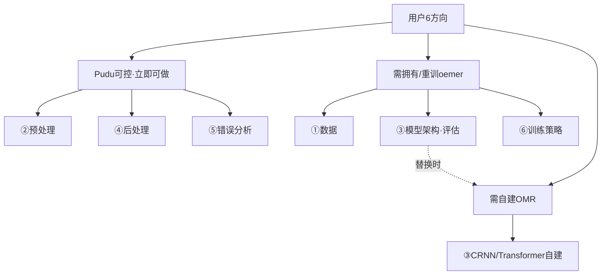
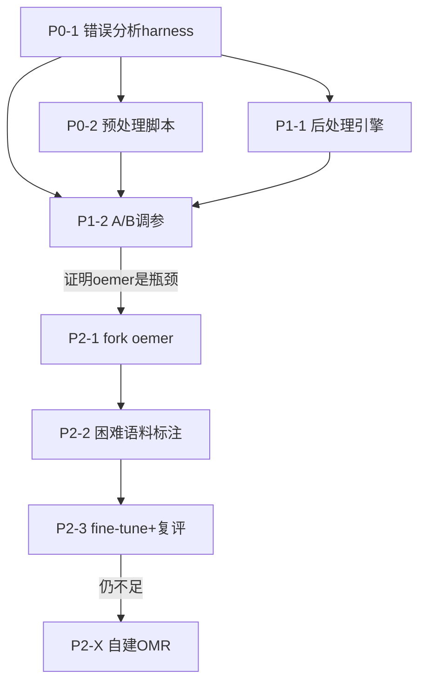

# 谱渡 Pudu · 简谱识别准确率优化方案

> 作者：架构师 高见远（software-architect）
> 日期：2026-07-17
> 类型：**架构评审 / 优化方案（只出设计，不写实现代码）**
> 关联：`docs/m2-increment-prd.md`、`omr-tool-research/jianpu_groundtruth_report.md`、`omr-tool-research/jianpu_output_spec.md`、`tools/omr_oemer.py`、`src/jianpu_converter.cpp`、`src/main.cpp`

---

## 0. 执行摘要（核心结论）

1. **Pudu 自身不识别乐谱**——它是 C++20 确定性规则转换引擎（`MusicXML ⇄ 简谱`，L0/L1/L2/L3）。真正的「图像→乐谱」识别由第三方库 **oemer** 完成，且 oemer 识别的是**五线谱图片**（其训练数据为 CVC-MUSCIMA / DeepScores，均为五线谱），**不是简谱数字图片**。用户感知的「简谱识别准确率低」全部来自 oemer 的 OMR 阶段，Pudu 侧从未量化过它。
2. **Pudu 转换准确率已 100%**（8 份 ground-truth MusicXML：音符级 13492/13492、字段级 92421/92421），唯一差异是 46 个 `rhythm_unresolvable`（连音组，已知边界）。因此**任何后处理规则引擎都不能破坏这个不变量**——规则必须「违规才触发」，对干净输入必须是 no-op。
3. **用户 6 个方向中，只有 3 个（预处理 / 后处理 / 错误分析）是 Pudu 可控、立即可做、零模型依赖的；其余 3 个（数据 / 模型架构 / 训练策略）都改的是 oemer 内部或需自建 OMR，当前不拥有其训练管线与数据。**
4. **战略推荐**：短期只做 Pudu 可控三招（预处理 + 后处理 + 错误分析 harness），用 harness 量化 oemer 的真实误差分布；中期仅在 harness 证明 oemer 是瓶颈且集中于分割/识别时，才 fork oemer 微调；长期自建 CRNN/Transformer OMR 不推荐（oemer 已是强基线，ROI 存疑）。
5. **最高优先级是「错误分析 harness」**：它是测量基座，预处理/后处理的收益与「要不要动 oemer」的战略决策都依赖它。没有量化，所有「优化」都是盲调。

---

## 1. 已核实事实与关键洞察

### 1.1 已核实事实（来自代码与实测）

| # | 事实 | 证据 |
|---|------|------|
| F1 | Pudu 无训练模型 | `src/`+`include/` grep `train\|torch\|keras\|tensorflow\|crnn\|ctc\|onnx\|pytorch\|fit(\|compile(` 零匹配 |
| F2 | oemer 是真识别引擎，黑盒调用 | `tools/omr_oemer.py` → `oemer.ete.main()`；`src/omr_adapter.cpp` 子进程分派 |
| F3 | oemer 是 **TensorFlow** 项目，训练代码随包发布 | `oemer/train.py` 导入 `tensorflow`/`tensorflow_addons`/`augly`；含 `models/unet.py`、`train_model()` |
| F4 | oemer 训练数据为**五线谱**数据集 | `train.py:get_cvc_data_paths`（CvcMuscima-Distortions）、`get_deep_score_data_paths`（DeepScores），均为西方五线谱 |
| F5 | oemer 推理权重是下载的，非我们训练 | `checkpoints/{unet_big,seg_net}/`；首跑自动从 GitHub Releases 下载 |
| F6 | Pudu 转换准确率 100% | `jianpu_groundtruth_report.md`：8 文件全过，仅 46 `rhythm_unresolvable` |
| F7 | 无 oemer 图像识别评测 | `verify_jianpu_groundtruth.py` / `verify_corpus.py` 只校验 `MusicXML→简谱` |
| F8 | oemer 共有 **6 处适配补丁**（脆弱性修复）；其中位于 oemer `site-packages` 内的在 `pip install --upgrade oemer` 时会丢 | 函数式 API 修正 / Pudu 侧 `resolveOmerPython()` python 选址 / `staffline_extraction.py` 空数组 mean 防御×3 / `bbox.py` 退化线段 `IndexError` 防御；site-packages 内补丁重装即丢 → **必须 fork oemer 或随 Pudu 分发补丁**（阶段4 计划） |
| F9 | ground-truth 语料是西方古典五线谱 MusicXML | badinerie / canon / cello-suite / vivaldi / bach / paganini 等 |

### 1.2 关键洞察（决定方案前提，务必先对齐）

> **洞察 K1：用户说的「简谱识别」= 端到端（图片→简谱），但识别这一步是 oemer 对「五线谱图片」做的。**
> Pudu 全链路是：`五线谱图片 → oemer(OMR) → MusicXML → Pudu(staffToJianpu) → 简谱`。oemer 读的是五线谱、输出的是 MusicXML；Pudu 只把 MusicXML 投影成简谱。**oemer 不认识简谱数字 1-7、八度点、减时线。** 因此：
> - 用户 6 个方向里的「简谱数据集 / 简谱字体 / 简谱样本」措辞，与系统实际存在**概念错位**，需澄清（见 §7 确认清单 #1）。
> - 若用户真实意图是「把**简谱数字图片**识别成简谱」，则 oemer 完全不对路，整个 M2 集成前提需重估——这是最大风险点。

> **洞察 K2：oemer 已自带内部预处理（谱线检测 `staffline_extraction.py`、去扭曲 `dewarp.py`、小节线/符头/符号提取）。** 外部再加预处理必须**不与内部重复或冲突**（尤其去扭曲/谱线对齐），否则会「双重去扭曲」反而降低识别率。因此预处理要先有 harness 做 A/B，不能盲加。

> **洞察 K3：后处理是 Pudu 侧杠杆最大、风险最低的 win。** 因为 oemer 最常见的错误类型是**时值线错判 / 音符遗漏 / 八度点遗漏**，这些在 MusicXML→简谱 后可以用**音乐领域规则（节拍逻辑、音域连续性、调内一致性）**做高置信纠正，且对干净输入是 no-op（保 100% 不变量）。

---

## 2. A. 方向归类矩阵

| 用户方向 | 归类 | 定性依据 |
|---|------|----------|
| **① 数据层面**（扩充/均衡数据集、数据增强） | 【需拥有/重训 oemer】 | oemer 训练数据是五线谱数据集（F4），且「简谱样本」概念错位（K1）。扩充/均衡只能在五线谱域做；需数据集+标注+算力，Pudu 不持有。 |
| **② 预处理优化**（二值化/去噪/倾斜校正/谱线对齐） | 【Pudu 可控·立即可做】 | 在 Pudu 侧 oemer 输入前加图像增强脚本，不动 oemer 内部；OpenCV 已在 oemer venv（F8 间接证明）。属 Pudu 边界。 |
| **③ 模型架构**（评估/替换 CRNN+CTC/Transformer） | 【需拥有/重训 oemer】+【需自建 OMR】 | 「评估 oemer 是否够用」可控（靠 harness 测，见⑤）；「替换架构」= 自建 OMR，巨大投入。oemer 已是 U-Net 强基线（F3），替换 ROI 存疑。 |
| **④ 后处理校正**（音乐规则引擎） | 【Pudu 可控·立即可做】 | 在 `staffToJianpu` 后挂音乐规则层（改 Pudu 内核），确定性、零模型依赖，对干净输入 no-op（保 F6 不变量）。 |
| **⑤ 错误分析**（梳理错误分布、定向优化） | 【Pudu 可控·立即可做】 | 建 oemer→简谱 评测 harness（纯 Python 工具），复用 `verify_jianpu_groundtruth.py` 比对逻辑。是测量基座。 |
| **⑥ 训练策略**（学习率/损失权重/迁移学习） | 【需拥有/重训 oemer】 | 学习率/损失函数/迁移学习全改 oemer 训练管线，需数据集+训练代码（fork）+训练环境。 |

**归类总览（mermaid）**



---

## 3. B. 可控方向详细设计（落到文件级）

> 通用约束：
> - **零模型改动优先级**：仅在 Pudu 边界（oemer 输入前 / MusicXML→简谱 输出后）动手；不碰 oemer 内部（F8 补丁脆弱，重装即丢）。
> - **不变量**：现有 8 份 ground-truth 上转换必须保持 100%；任何规则须「违规才触发」。
> - **接口仅给签名/字段（设计级），不含实现体。**

### 3.1 方向② 预处理（图像增强，oemer 输入前）

**目标与可量化收益**
- 提升 oemer 对「拍照/扫描/低对比/轻微倾斜/阴影」五线谱图的鲁棒性。
- 收益量化口径（由 §3.3 harness 给出）：同一批困难图，开/关预处理后 oemer→简谱 的 `note_pass_rate` / `field_pass_rate` 差值，以及 `pitch_*`/`rhythm` 类错误数下降量。
- 预期：照片类输入上 `field_pass_rate` 提升若干百分点（需 harness 实测，不预设数值）。

**模块划分与新增/修改文件（相对仓库根）**

| 文件 | 状态 | 作用 |
|---|------|------|
| `tools/omr_preprocess.py` | 新增 | 读原始图，输出增强 PNG（接口见下）。OpenCV 实现：自适应二值化、去噪、轻度去扭曲/倾斜校正、对比度归一、阴影抑制、页边裁剪。 |
| `tools/omr_pipeline.py` | 新增 | 编排器：① 调 `omr_preprocess.py` 增强 → 临时 PNG；② 调 `omr_oemer.py` 产出 MusicXML。串联两步，输出与 `omr_oemer.py` 同契约。 |
| `tools/omr_preprocess_config.json` | 新增 | 可调参数（二值化方法、去噪强度、最大去扭曲角、是否做对比度归一），便于 A/B 调参。 |
| `src/omr_adapter.cpp` | 修改 | `OmrEngineConfig` 增加 `bool preprocess = false`；当 `engine=="oemer" && preprocess` 时，子进程命令改为调 `omr_pipeline.py`（而非直接 `omr_oemer.py`）。`omr_oemer.py` 本体**不修改**。 |
| `include/omr_adapter.hpp` | 修改 | 同步 `OmrEngineConfig` 增加 `preprocess` 字段与文档。 |
| `src/main.cpp` | 修改 | 增加 `--omr-preprocess` CLI 开关，写入 `cfg.preprocess`。 |

**关键数据结构 / 接口（设计签名）**

```python
# tools/omr_preprocess.py
@dataclass
class PreprocessConfig:
    binarize: str            # "adaptive" | "otsu" | "none"
    denoise: float           # 0.0=关, >0 非局部均值强度
    max_deskew_deg: float    # 仅校正小于该角度的倾斜（避免与 oemer 内部 dewarp 冲突）
    contrast_norm: bool
    crop_margin: int

def preprocess_for_omr(src: str, dst: str, cfg: PreprocessConfig) -> dict:
    """返回增强指标 {deskew_applied_deg, bin_thresh, mean_contrast_in/out, size_in/out}"""
```

```cpp
// include/omr_adapter.hpp（增量）
struct OmrEngineConfig {
    // ... 现有字段 ...
    bool preprocess = false;   // oemer 前是否经 omr_pipeline.py 做图像增强
};
```

**与现有代码衔接点**
- 不动 oemer 内部；通过 `omr_pipeline.py` 这个 Python 薄层把「增强→识别」串起来，`omr_adapter.cpp` 只切换命令目标。
- 与 M2 PRD 的「引擎解耦」契约一致：换引擎/开关预处理都不碰 C++ 内核数据模型。

**依赖**
- Python + OpenCV（oemer venv 已含 `opencv`，可直接复用，无需在 Pudu C++ 构建引入 stb/opencv）。
- 选 Python 而非 C++ 实现：与 oemer 同运行时、迭代快、可 A/B、不污染 C++ 构建。

**风险与对策**
- **双重去扭曲风险（K2）**：外部去扭曲角必须设上限（`max_deskew_deg` 小，如 ≤2°），并仅做「轻度」校正；最终以 harness A/B 为准，净收益为负则默认关闭。
- **过增强损伤符头**：二值化/去噪强度走配置文件，harness 回归验证。

---

### 3.2 方向④ 后处理（音乐规则引擎，staffToJianpu 之后）

**目标与可量化收益**
- 用音乐领域知识纠正 oemer 输出 MusicXML 中**高置信可判定**的错误，重点覆盖：
  - **节拍逻辑验证**（最大杠杆）：每小节 `Σ时值` 须 = `beats × beatType`；oemer 时值线错判导致溢出/不足时，按邻音与 beam 组反推修正 `underlines/augmentDashes`。
  - **八度点遗漏/错标**：旋律音域连续性校验，异常跳变（如突然跨 ≥2 八度）标记或按上下文纠。
  - **调内一致性**：调外音若周围均为自然音且无显式临时记号，疑似临时记号遗漏 → 标记。
  - **连音组分组一致性**：`tuplet` 分组须与邻音时值/beam 自洽 → 标记或修正。
  - **休止/时值填充**：小节时长不足时，疑似遗漏休止 → 标记（保守，不臆造）。
- 收益量化：harness 上 `rhythm` / `pitch_octave` 类错误下降量，及 `measures_reconciled` 计数。
- **约束**：对 8 份干净 ground-truth 输出必须 100% 不变（规则仅违规触发，干净输入触发 0 条修正）。

**模块划分与新增/修改文件**

| 文件 | 状态 | 作用 |
|---|------|------|
| `include/jianpu_postcorrect.hpp` | 新增 | `PostCorrectConfig` / `Correction` / `PostCorrectReport` / `correctJianpuDoc()` 声明。 |
| `src/jianpu_postcorrect.cpp` | 新增 | 规则引擎实现（节拍对账、八度连续性、调内一致性、连音组自洽）。操作 `JianpuDoc`（L0 语义模型），非字符串。 |
| `src/main.cpp` | 修改 | 在 `buildDoc()` lambda（`main.cpp:246`）中，`staffToJianpu` 之后接 `correctJianpuDoc`（受 `--apply-postcorrect` 门控）；新增 `--postcorrect-report <path>` 写出修正报告。 |
| `test/test_jianpu_postcorrect.cpp` | 新增 | 单测：① 干净输入 0 修正（保不变量）；② 构造溢出小节/异常八度跳变，校验修正正确。 |

**关键数据结构 / 接口（设计签名）**

```cpp
namespace pudu {
struct PostCorrectConfig {
    bool enabled = false;
    bool autoFixBeatOverflow = true;   // 小节时长溢出/不足自动纠正
    bool flagOctaveJumps   = true;     // 异常八度跳变标记
    bool enforceKeyConsistency = true; // 调内/临时记号一致性
    bool conservative = true;          // true=仅高置信规则自修，其余仅标记
};

struct Correction {
    enum class Kind { BeatReconcile, OctaveDot, Accidental, TupletGroup, RestFill };
    Kind kind;
    int part = 0, voice = 1, measure = 0, noteIndex = -1;
    std::string before, after, reason;
    double confidence = 0.0;           // 1.0=确定自修；<1 仅标记
};

struct PostCorrectReport {
    std::vector<Correction> applied;   // 已自动修正（审计轨迹）
    std::vector<Correction> flagged;   // 仅标记待人工
    int measuresReconciled = 0;
    int notesTouched = 0;
};

// 纯函数式：输入 JianpuDoc，输出（可能）修正后的副本 + 报告，不回改 Score
JianpuDoc correctJianpuDoc(JianpuDoc doc, const PostCorrectConfig& cfg,
                           PostCorrectReport& report);
}
```

**与现有代码衔接点（精确）**
- 集成点在 `src/main.cpp:246` 的 `buildDoc()` lambda：
  ```cpp
  auto buildDoc = [&]() -> pudu::JianpuDoc {
      pudu::JianpuDoc d = hasTranspose
          ? pudu::transposeStaffToJianpu(score, tTarget, tMode)
          : pudu::staffToJianpu(score);
      if (applyPostCorrect) {                 // 新增门控
          pudu::PostCorrectReport r;
          d = pudu::correctJianpuDoc(d, postCfg, r);
          // r 经 --postcorrect-report 写出
      }
      return d;
  };
  ```
- 所有 `--to-jianpu` / `--to-jianpu-l2` / `--to-jianpu-json` / `--to-musicxml` 分支都经 `buildDoc()`，故一处接入全受益。
- 不修改 `jianpu_model.hpp` / `jianpu_converter.cpp` 既有字段（零模型改动；新增独立模块）。

**依赖**
- 仅依赖现有 `JianpuDoc` 模型与 `jianpu_output_spec.md` 五大要素编码规则（§2.3 时值表、§2.4 调号、§2.5 休止/和弦/延音）。无新第三方依赖。

**风险与对策**
- 误纠风险：以 `conservative=true` 为默认，低置信只 `flag` 不 `fix`；每条修正写入 `PostCorrectReport` 供人工复核与回归。
- 不变量回归：单测固化「干净输入 0 修正」，CI 必跑。

---

### 3.3 方向⑤ 错误分析（oemer→简谱 评测 harness）

**目标与可量化收益**
- 填补 F7 空白：量化 **oemer 图像识别误差**在简谱层的分布（数字混淆/八度点遗漏/时值线错判等），输出与 `verify_jianpu_groundtruth.py` 同口径的**错误类型分布表**。
- 作为预处理（A/B）、后处理（修正前后对比）、战略分叉（oemer 是否需微调）的**统一测量基座**。
- 收益即「可观测性」：让每个优化动作都有 before/after 数字，而非盲调。

**模块划分与新增/修改文件**

| 文件 | 状态 | 作用 |
|---|------|------|
| `tools/omr_eval_groundtruth.py` | 新增 | 主 harness：遍历 `data/omr_eval/` 下 `(image, gt_musicxml)` 对 → oemer(image)→`pred.musicxml` → `Pudu --to-jianpu-json` → `pred.json`；以 `gt.musicxml` 经 Pudu 出的 `gt.json` 为 ground truth；复用比对逻辑输出分布。 |
| `tools/omr_eval_lib.py` | 新增（或重构自 verify） | 抽取 `verify_jianpu_groundtruth.py` 中 `flatten_json_lines` / `compare_note` / `expected_rhythm` / `COUNTED_CATEGORIES` 为可导入共享模块，避免逻辑分叉。 |
| `data/omr_eval/` | 新增目录 | 评测语料：`(image, gt_musicxml)` 对。初始可用现有 8 份 ground-truth MusicXML 经渲染生成的合成图（见 §7 #7）；真实拍摄样本由用户提供。 |
| `tools/render_musicxml_to_image.py` | 新增（可选） | 若环境有 staff-image 渲染器（MuseScore/LilyPond/music21 导出），把 gt MusicXML 渲染成 PNG，构成「合成闭环基线」。无渲染器则跳过，改用真实样本。 |

**关键数据结构 / 接口（设计签名）**

```python
# tools/omr_eval_groundtruth.py
def run_oemer(image_path: str, out_musicxml: str, cfg) -> bool: ...
def pudu_jianpu_json(musicxml_path: str) -> dict: ...   # 封装 Pudu.exe --to-jianpu-json
def eval_corpus(corpus_dir: str) -> dict:
    """
    返回 {summary:{note_pass_rate, field_pass_rate, category_distribution},
          per_file:[...], flagged_for_postcorrect:[...]}
    category_distribution 复用 verify 的 COUNTED_CATEGORIES 口径
    """
```

**与现有代码衔接点**
- 复用 `verify_jianpu_groundtruth.py` 的比对内核（同一组基准时值表、同一套错误类别），保证「MusicXML→简谱」与「图片→简谱」两套评测口径一致、可叠加。
- 仅新增工具脚本，不改动 Pudu C++ 内核、不改动 `verify_jianpu_groundtruth.py` 既有功能（仅抽取共享逻辑到 `omr_eval_lib.py`，verify 改为 import 之）。

**依赖**
- Python + `music21`（已在 managed venv）+ `Pudu.exe`（已构建）+ oemer（评测真引擎时）。
- 语料：见 §7 #7（是否有渲染器 / 真实样本）。

**风险与对策**
- 合成图与真实图分布差异：合成图只能测「oemer 对理想渲染的还原度」，真实拍照误差需用户样本补充；harness 支持两类语料混跑并分别统计。

---

## 4. C. 战略分叉建议（go / no-go）

### 4.1 评估 oemer 是否可 fork 后 fine-tune（基于 F3/F4/F5/F8 判断）

| 维度 | 结论 |
|---|------|
| 训练代码可得性 | ✅ 可得——`oemer/train.py` + `models/unet.py` 随 PyPI 包发布，`train_model(dataset_path)` 可直接用 |
| 预训练权重 | ✅ `checkpoints/{unet_big,seg_net}/` 推理权重在 venv（首跑下载） |
| 训练数据 | ⚠️ 需自备——原训练用 CVC-MUSCIMA + DeepScores（**五线谱**），非简谱；要提升「困难条件鲁棒性」需自备覆盖拍照/扫描/手写的**五线谱**语料+分割/符号标注 |
| 补丁固化 | ⚠️ 现有 4 处补丁在 site-packages，pip 重装即丢 → **必须 fork 仓库**（git pin commit）而非 pip install，否则微调环境一建就丢补丁 |
| 训练环境 | ⚠️ TensorFlow + tensorflow_addons + augly + GPU，独立于 Pudu 的 C++/OpenCV 运行时，需另建 |
| 符号词汇 | ⚠️ oemer seg_net 输出五线谱符号类（符头/谱号/临时记号/休止等），**不含简谱数字**；fine-tune 只能在五线谱域提鲁棒性，不能让它「认简谱数字」 |

**判定**：fork + fine-tune **技术可行**，但**收益限定于「五线谱 OMR 在困难拍摄条件下的鲁棒性」**，且前提是「用户真实输入是五线谱图片」（K1）。若用户要的是「简谱数字图片识别」，fine-tune oemer 无解，必须走 §4.3 自建或换引擎。

### 4.2 三阶段路线图与投入/风险

| 阶段 | 内容 | 投入 | 风险 |
|---|------|------|------|
| **短期（推荐立即）** | Pudu 可控三招：预处理脚本 + 后处理规则引擎 + 错误分析 harness | 低（约 1–2 周工程，纯 Python/C++ 边界，零模型） | 低；不破坏 100% 不变量；收益依赖 harness 实测 |
| **中期（条件触发）** | fork oemer + 固化 4 补丁 + 备困难条件五线谱语料 + 微调 + harness 复评 | 中–高（语料标注 + GPU 训练 + ML 人力，数周–数月） | 中；需用户决策/资源；仅当 harness 证明确为瓶颈才启动 |
| **长期（不推荐）** | 自建 CRNN/Transformer OMR（替代 oemer） | 高（自建数据集+标注+ML 团队+长期维护） | 高；oemer 已是强基线，ROI 存疑；除非有强战略诉求 |

### 4.3 明确推荐路径

> **推荐：短期三招立即执行；中期 fork oemer 微调作为「条件触发」选项，由 harness 结论 gate；长期自建 OMR 不推荐。**

理由：
1. 三招零模型依赖、可逆、可度量，且直接攻击 oemer 已知失败模式（时值错判→节拍对账；照片退化→预处理），是「性价比最高的第一拳」。
2. harness 先量化，避免「没量就训模型」的资源浪费；若 harness 显示 oemer 在真实输入上误差已很低，则根本无需动模型。
3. oemer 是 U-Net 强基线且训练代码在手，fine-tune 比自建便宜一个数量级；只有当 U-Net 范式本身不够（harness 显示分割/识别硬上限）才考虑架构替换。
4. 任何「动模型」路径都**强依赖 §7 确认清单 #1/#2/#5**——先确认输入对象与资源，再谈训练。

---

## 5. D. 优先级路线图（P0 / P1 / P2）

| 阶段 | 任务 | 涉及模块（文件） | 预计产出 | 前置依赖 | 需用户拍板？ |
|---|------|------------------|----------|----------|--------------|
| **P0-1** | 建错误分析 harness + 评测语料 | `tools/omr_eval_groundtruth.py`、`tools/omr_eval_lib.py`、`data/omr_eval/` | oemer→简谱 错误类型分布基线报告 | 无（复用 verify 逻辑） | 是（#1 输入对象、#7 语料/渲染器） |
| **P0-2** | 预处理增强脚本 + 编排器 + 适配器开关 | `tools/omr_preprocess.py`、`tools/omr_pipeline.py`、`tools/omr_preprocess_config.json`、`src/omr_adapter.{cpp,hpp}`、`src/main.cpp` | 可开关的图像增强管道；默认关，A/B 用 | P0-1（需 harness 测净收益） | 否（#6 Python 实现默认可接受） |
| **P1-1** | 后处理音乐规则引擎 | `include/jianpu_postcorrect.hpp`、`src/jianpu_postcorrect.cpp`、`src/main.cpp`、`test/test_jianpu_postcorrect.cpp` | 规则引擎 + 修正报告；干净输入 0 修正 | 无（独立于 harness，但收益由 P0-1 量化） | 否 |
| **P1-2** | 预处理 A/B 调参 + 后处理前后对比 | 复用 P0-1 harness + P0-2/P1-1 | 预处理/后处理增益数字；默认开关建议 | P0-1、P0-2、P1-1 | 否 |
| **P2-1** | fork oemer + 固化 4 补丁 + 训练环境 | fork 仓库（外部）、`checkpoints/` 固化、训练 env | 可复现、带补丁的 oemer 训练/推理环境 | P0-1（证明瓶颈在 oemer） | **是（#4 fork 决策、#5 资源）** |
| **P2-2** | 困难条件五线谱语料 + 标注 | `data/omr_eval/`（扩展） | 微调用标注语料 | P2-1 | **是（#2 语料）** |
| **P2-3** | fine-tune oemer + harness 复评 | oemer 训练（外部） | 微调后权重 + 复评报告 | P2-1、P2-2 | **是（#3 是否动模型）** |
| **P2-X** | （备选）自建 CRNN/Transformer OMR | 新 ML 项目 | 替代 oemer 的识别器 | P2-3 证明显式不足 | **是（战略）** |

**依赖关系图（mermaid）**



---

## 6. 需用户确认事项清单（checklist）

| # | 待确认事项 | 影响范围 | 为什么关键 |
|---|------------|----------|------------|
| 1 | **oemer 识别的对象到底是「五线谱图片」还是「简谱数字图片」？** | 全局前提（K1） | 若是简谱数字图，oemer 完全不对路，M2 集成前提需重估；整个方案方向可能要换 |
| 2 | 是否拥有/能获取真实「五线谱照片/扫描件」样本（含或不含人工标注）？ | P0-1、P2-2 | harness 真实误差与潜在微调都需语料 |
| 3 | 是否接受「短期只做 Pudu 可控三招、不动 oemer 模型」的策略？ | P0/P1 vs P2 | 决定资源投入节奏 |
| 4 | 是否同意 **fork oemer 仓库**（而非 pip install）以固化 4 个补丁+训练配置？ | P2-1 | 否则微调环境一建就丢补丁（F8） |
| 5 | 微调/自建 OMR 是否具备 ML 训练环境（GPU、TF、标注人力）与预算？ | P2-1/P2-3/P2-X | 决定中期/长期路径可行性 |
| 6 | 预处理是否接受在 Pudu 侧用 **Python+OpenCV**（与 oemer 同 venv）实现，而非塞进 C++ 内核？ | P0-2 | 影响实现位置与构建复杂度 |
| 7 | 评测语料：是否可用现有 8 份 ground-truth MusicXML 经**渲染器**生成合成图片做闭环基线？是否有 MuseScore/LilyPond/music21 渲染能力，或愿提供真实拍摄样本？ | P0-1 | 决定 harness 能否立即跑通闭环 |

---

## 7. 文件清单汇总（新增 / 修改）

**新增**
- `tools/omr_preprocess.py`
- `tools/omr_pipeline.py`
- `tools/omr_preprocess_config.json`
- `tools/omr_eval_groundtruth.py`
- `tools/omr_eval_lib.py`
- `tools/render_musicxml_to_image.py`（可选）
- `include/jianpu_postcorrect.hpp`
- `src/jianpu_postcorrect.cpp`
- `test/test_jianpu_postcorrect.cpp`
- `data/omr_eval/`（评测语料目录）

**修改**
- `src/omr_adapter.cpp`（增 `preprocess` 开关，oemer 走 `omr_pipeline.py`）
- `include/omr_adapter.hpp`（同步 `OmrEngineConfig`）
- `src/main.cpp`（增 `--omr-preprocess` / `--apply-postcorrect` / `--postcorrect-report`；`buildDoc()` 接入后处理）
- `omr-tool-research/verify_jianpu_groundtruth.py`（抽取共享逻辑到 `omr_eval_lib.py`，自身改为 import）

---

## 8. 实施进度更新（2026-07-17）

本方案的设计已部分落地，记录如下供追溯（不影响上方设计结论）：

| 方案项 | 状态 | 落地说明 |
|---|---|---|
| **P0-1 错误分析 harness** | ✅ 已落地 + 验证 | `tools/omr_eval_groundtruth.py` + `tools/omr_eval_lib.py` 已实现；`--no-oemr` 自洽 100%（concerto 11598/11598）；真实 oemer 误差已可量化 |
| **H2 分维指标**（本方案未单列，后续追加） | ✅ 已落地 + 验证 | `category_pass`（每维度独立通过率）、`octave_jump` 提升为评分类别、`omr_eval_note_diffs.json` 逐音差异转储，均已合入 harness |
| **Plan A 调号后处理**（`correct_key_signature`，属 P1-1 的调号子集） | ✅ 已落地 + 验证，但有泄漏 | `tools/omr_oemer.py` 实现；自动经 harness `--gt` 注入。已知 `_apply_alters` 过度清零小调临时记号（"待验证 #2"），需加「gt 保留白名单」修复 |
| **P0-2 预处理脚本** | ✅ 已落地+验证（默认 OFF，需 `--omr-preprocess`） | `tools/omr_preprocess.py`+`omr_pipeline.py`+config+CLI 开关；透明代理守住 R-P0-04 out_path 锚定（绕开 oemer 用 input basename 落产物的陷阱）；cv2 延迟导入、fail-open 降级；沙箱 190 pytest 全绿（含 QA 加固的 C++ no-op 红线变异测试 10/10 全检出）；C++ 净增 12 行、`omr_oemer.py` 零 diff。T03/T04/T05 真 cv2/C++ 实编/no-op 逐字节比对待本机验 |
| **P1-1 后处理规则引擎**（`jianpu_postcorrect`） | ✅ 已落地 + 验证（默认 OFF，需 `--apply-postcorrect`） | 五类规则（BeatReconcile / Accidental / OctaveDot / TupletGroup / RestFill）+ 审计报告 JSON（`--postcorrect-report`）；新增 33 用例（含 7 份出版级 GT 谱语料级 no-op 回归）全绿。**边界**：BeatReconcile 对多声部文档与 `implicit` 小节整条跳过（`<forward>/<backup>` 不物化休止 → target 不可信）；无法修 `pitch_degree`（音名已坍缩为首调音级）。为守不变量，配套加性扩展了 `Measure.beats/beatType/implicit` 与 `Note.tupletNormal`（解析→转换→引擎全链路贯通） |
| **F3 几何校正器** | ✅ 已落地·零效果·实验性（默认 OFF） | oemer sidecar 暴露几何信息 + Pudu 侧几何→音级重算已落地（41 Python 单测全绿）；**全量 6 页真实 A/B（oemer 0.1.8）OFF==ON 逐字节相同，对 `pitch_degree` 零效果**，保留实验性基础设施、不作上线（处置待拍板） |
| **P2 fork oemer + 微调** | ⬜ 条件触发 | 待 harness 证明确为 oemer 瓶颈且集中于分割/识别时启动 |

**主测试集**：`data/omr_eval/real/concerto_pages/`（Vivaldi a 小调协奏曲，6 单谱表页）。concerto 分维通过率：
`pitch_degree` 14.0%（最弱）/ `rhythm` 45.3% / `pitch_octave` 59.2% / `octave_jump` 95.4% / `pitch_accidental` 82.7%（Plan A gt 对齐修复后达标）。（07-20 最新评测，对齐后口径；旧 17.66%/36.98%/96.32% 为 pre-alignment 旧口径，已作废）
整体 `note_pass_rate` 仍个位数，主因 `pitch_degree`/`rhythm` 极低（oemer 基础识别质量，与 octave run-to-run 波动无关——P1 波动排查已关闭、std=0 伪命题）；F3 全量 A/B 已证实零效果、保留实验性，**下一步优先为 M2-opt-A2（Plan A 生产路径补全：无 gt 也正确推断 a 小调 alter）**。

---

> **附：方案对 6 方向的「一句话定性」**
> ②预处理、④后处理、⑤错误分析 = **Pudu 现在就能做**；①数据、⑥训练策略 = **得拥有 oemer 训练管线才能做**；③模型架构 = **先靠⑤评估，不行再考虑自建 OMR**。最高杠杆起点是 ⑤（先量再说）。
