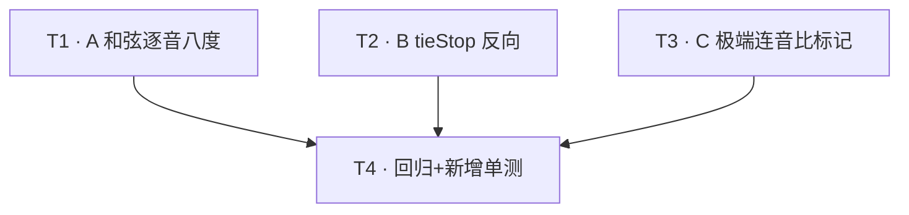
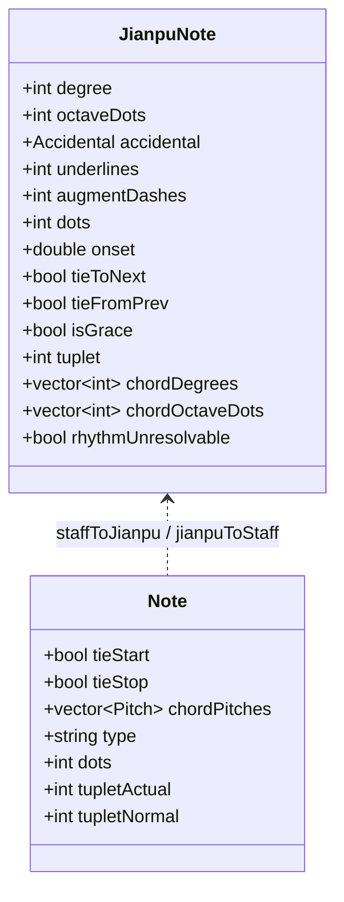
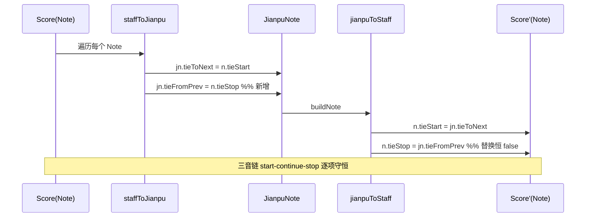

# 谱渡 Pudu · M1.5「边界硬化」增量架构设计 + 任务分解（轻量版）

| 项 | 内容 |
| --- | --- |
| 文档类型 | 增量架构设计 + 任务分解（设计师视角，不含实现代码） |
| 作者 | 高见远（架构师） |
| 日期 | 2025-07-16 |
| 关联 PRD | `docs/m1.5-increment-prd.md`（许清楚，轻量增量 PRD） |
| 代码基线 | 标签 `phase-3` + `phase-3.1`（MSVC 实测 **98/98** 单测全绿） |
| 约束 | 最小变更 · 模型扩展以最小新增字段 · 零回归（98 单测）· 不修改任何源代码（本设计文档仅描述，不含 diff） |

> 本文所有 `文件:行号` 均已**实际 `grep`/阅读源码核实**（非直接照搬 PRD 估计值）。结论：PRD 的现状行号（L2:159-172 / L2:176 / G1:71-76 / G1:84-85 / L2:88-98 / L2:72-81 / verify L336-339）与真实代码**完全吻合**；唯一差异是 PRD 未写 `verify` 脚本与报告 JSON 的真实路径——它们在 `omr-tool-research/` 目录下，不在仓库根。

---

## 1. 现状核实结论（A / B / C 逐项，以代码为准）

### 1.1 公共事实（先确认）

| 对象 | 真实位置 | 现状 |
| --- | --- | --- |
| `JianpuNote` 模型 | `include/jianpu_model.hpp:44-58` | 含 `tieToNext`(L54)、`chordDegrees`(L57)；**无** `tieFromPrev`、**无** `chordOctaveDots`、**无** `rhythmUnresolvable` |
| `Score::Note` 模型 | `include/score_model.hpp:102-103` | **同时具备** `bool tieStart` 与 `bool tieStop`（类型均为 `bool`） |
| MusicXML 序列化 | `src/musicxml_serializer.cpp:41-42` | `if(n.tieStart)` 写 `<tie type="start">`；`if(n.tieStop)` 写 `<tie type="stop">`（已双向就绪） |
| MusicXML 解析 | `src/musicxml_parser.cpp:279-280` | `t=="start" → note.tieStart=true`；`t=="stop" → note.tieStop=true`（已就绪） |
| JSON 输出 | `--to-jianpu-json`（`src/main.cpp:241`）→ `pudu::jianpuToJson`（`src/jianpu_converter.cpp:543`）→ `jsonNote`(L518) | 输出 `degree/octaveDots/.../tieToNext/tuplet/chordDegrees`；**无** `tieFromPrev`/`chordOctaveDots`/`rhythmUnresolvable` |
| verify 脚本 | `omr-tool-research/verify_jianpu_groundtruth.py` | 注意真实路径；报告 `omr-tool-research/jianpu_groundtruth_report.json` 含 `rhythm_unresolvable: 46` |

### 1.2 A — 和弦逐音八度点

| 消费方 | 真实位置 | 当前行为 | 与 PRD 差异 |
| --- | --- | --- | --- |
| 模型 | `include/jianpu_model.hpp:57` | `std::vector<int> chordDegrees;`（仅音级）；注释明示"逐音八度点后续扩展" | 无差异 |
| L2 填充（`staffToJianpu`） | `src/jianpu_converter.cpp:183-186` | 仅 `jn.chordDegrees.push_back(midiToDegree(cp, tonicPc))`；注释(L184)"当前仅存音级，逐音八度点(各自独立)为后续扩展点" | 无差异 |
| L1 渲染（`renderJianpuNote`） | `src/jianpu_converter.cpp:215-221`（组括号）+ `222-225`（八度点） | 组 `[主音 其余…]` 拼好后，**根音 `jn.octaveDots` 的 `'`/`,` 统一追加在整个 `]` 之后** → 整组和弦"共用根音八度" | 无差异（PRD 估 L1:215-225，精确） |
| L2 渲染（`l2NoteCell`） | `src/jianpu_converter.cpp:355,357-362` | `l2OctaveDots(jn.octaveDots)` 渲染在和弦列**之前**（位于整列上方）；组内各成员 `jp-num` 不带各自八度点 | 无差异 |
| 反向（`jianpuToStaff::chordMemberPitch`） | `src/jianpu_to_staff.cpp:71-76`（定义）、`98-99`（调用） | `memberMidi = rootMidi + diff`，`diff=(memberSemi-rootSemi+12)%12`（取"根音上方最近"八度）；丢失任何逐音偏移 | 无差异（PRD 估 G1:71-76，精确） |
| parse 端（`parseJianpuText`） | `src/jianpu_text_parser.cpp:134-155`（组解析）、`172-184`（修饰符） | `'`/`,` 在组括号**闭合后**统一作用于 `jn.octaveDots`（根音）。**当前 `[1' 3,]` 会直接解析失败**：`splitWs("1' 3,")` → `["1'","3,"]`，`parseDegree` 遇非数字字符报错（L70-74） | 无差异；但暴露 **R6 决策点**：解析端尚不支持逐音八度点 |
| verify 比对 | `omr-tool-research/verify_jianpu_groundtruth.py:320-328` | 仅比对 `conv_note["chordDegrees"]` vs 期望音级；无逐音八度点比对 | 无差异 |

**核实结论**：A 确为数据模型层缺失，必须最小扩展模型（与 PRD 根因一致）。构造 `[1' 3,]` 当前**在模型层不可表达、在解析端会报错**——双重确认。

### 1.3 B — tieStop 反向还原

| 消费方 | 真实位置 | 当前行为 | 与 PRD 差异 |
| --- | --- | --- | --- |
| 模型 | `include/jianpu_model.hpp:54` | 仅 `bool tieToNext = false;`；**无** `tieFromPrev` | 无差异 |
| `Score::Note` | `include/score_model.hpp:102-103` | `tieStart`/`tieStop` 均为 `bool`，齐备 | 无差异（PRD 未展开，本设计补齐确认） |
| L2→L0（`staffToJianpu`） | `src/jianpu_converter.cpp:176` | `jn.tieToNext = n.tieStart;` **仅写起点，忽略 `n.tieStop`** | 无差异（PRD 估 L2:176，精确） |
| L0→L2（`jianpuToStaff::buildNote`） | `src/jianpu_to_staff.cpp:84-85` | `n.tieStart = jn.tieToNext;` `n.tieStop = false;`（注释 L84"tieStop 为反向已知限制"） | 无差异（PRD 估 G1:84-85，精确） |
| 序列化 | `src/musicxml_serializer.cpp:41-42` | 已能据 `tieStop` 写 `<tie type="stop">` | 无差异 |
| verify 比对 | `omr-tool-research/verify_jianpu_groundtruth.py:336-339` | `gt_tie = (gt_event["tie"]=="start")`；仅比对 `conv_note["tieToNext"]`；**不校验 stop 端** | 无差异（PRD 估 L336-339，精确） |

**核实结论**：B 确为模型缺 `tieFromPrev` + 两处赋值缺失。`Score` 与 MusicXML 两端早已就绪，修复面极小。隐蔽回归确认（98 测试靠 verify 仅查 start 端而暴露不出）。

**连续多音 tie 链（start→continue→stop）**：`Score::Note` 用**每音符** `tieStart`/`tieStop` 布尔对即可完整表达三音链（note1 `start`, note2 `start+stop`, note3 `stop`），**无需新增枚举**。`music21` 侧 `el.tie.type` 对中间音返回 `"continue"`（见 `verify` L230），故 verifier 需把 `continue` 同时视为 start 与 stop（见 §4）。

### 1.4 C — 极端连音比 46 处

| 消费方 | 真实位置 | 当前行为 | 与 PRD 差异 |
| --- | --- | --- | --- |
| 回退判定 | `src/jianpu_converter.cpp:88-98`（`quarterLengthToRhythm` 返回 `false`）、`72-81`（`typeToDuration` 安全默认） | 数学上不抛异常/越界 | 无差异（PRD 估 L2:88-98 / L2:72-81，精确） |
| 回退执行 | `src/jianpu_converter.cpp:159-172` | `rhythmQl = ql*actual/normal`；`quarterLengthToRhythm` 失败则 `else` 分支(L167-171)回退 `typeToDuration(n.type)`，**静默无标记** | 无差异（PRD 估 L2:159-172，精确） |
| JSON 输出 | `src/jianpu_converter.cpp:518-539`（`jsonNote`） | **无** `rhythmUnresolvable` 字段；产物伪装为正常音 | 无差异 |
| verify 标记来源 | `omr-tool-research/verify_jianpu_groundtruth.py:383-384`（连音组）、`401-402`（常规） | `rhythm_unresolvable` 是 **verifier 据 ground-truth `expected_rhythm(ql) is None` 推断**的，**非** converter 提供；计入 `UNVALIDATED_CATEGORIES`（L99），不计分母 | 无差异（PRD 描述"verifier 推断"准确） |
| 计数 | `omr-tool-research/jianpu_groundtruth_report.json:12,117` | `rhythm_unresolvable: 46`（连音组极端比 7:8/7:4/9:4） | 无差异；精确值以**实际复跑**为准（R3） |

**核实结论**：C 的"未解析"口径**两端未对齐**——verifier 能单列 46 处，但 converter 侧无对应机读标记。AC-C4 须由 converter 在回退分支设标记并经 JSON 透出；AC-C5 要求 verifier 仍是计数权威（加固不改分母）。`staffToJianpu` 回退**逐音独立**（每个 `Note` 独立走 `else`），不污染邻居——AC-C3 已天然满足，仅需固化测试。

---

## 2. A 设计：和弦逐音八度点

### 2.1 最小模型扩展（推荐方案 = PRD 选项 1）

在 `JianpuNote` 新增**一个**字段（与 `chordDegrees` 严格等长、语义平行）：

```cpp
std::vector<int> chordOctaveDots;  // 与 chordDegrees 一一对应；
                                    // 第 i 个成员相对【根音】的八度偏移(+1=高八度,-1=低八度,0=同根音)
```

**语义约定（关键）**：`chordOctaveDots[i]` 是成员 i **相对根音**的八度偏移（非相对主音参考八度）。根音自身八度仍由 `jn.octaveDots` 表达。例 `[1' 3,]`：
- 根音 `1` 后 `'` → `jn.octaveDots = +1`
- 成员 `3` 后 `,` → `chordOctaveDots[0] = -1`（相对根音降八度）
- 绝对语义：根音=C5、成员=E4（根音上方最近 + (−1) 八度）。

> 采用"相对根音"而非"绝对主音参考八度"，是因为简谱 `[1' 3,]` 中每个数字的点就是相对该和弦基位的，最贴近记谱直觉，且往返计算最简（见 §2.3）。

### 2.2 各消费方改动点清单

| # | 消费方 / 位置 | 改动 | 零回归保障 |
| --- | --- | --- | --- |
| A-1 | `staffToJianpu` `src/jianpu_converter.cpp:185-186` | 组循环内改用 `midiToJianpu(cp,tonicPc,md,ma,mod)`：`jn.chordDegrees.push_back(md); jn.chordOctaveDots.push_back(mod - jn.octaveDots);`（根音 `jn.octaveDots` 已于 L152 算好） | 旧样本 `chordOctaveDots` 为空 → 偏移 0 → 行为与现"最近邻"一致 |
| A-2 | `renderJianpuNote` `src/jianpu_converter.cpp:215-221` | 组分支改为 `[` + `degree` + `rootOctaveDotsStr` + 空格 + 每个成员 `d` + `memberOctaveDotsStr(chordOctaveDots[i])` + `]`；**移除** L222-225 整组后置根音点 | `chordOctaveDots` 为空/全 0 时输出与现 `[1 3 5]` 完全一致 |
| A-3 | `l2NoteCell` `src/jianpu_converter.cpp:357-362` | 和弦列内每个成员 `jp-num` 后追加 `l2OctaveDots(chordOctaveDots[i])`（根音点仍由 L355 `l2OctaveDots(jn.octaveDots)` 负责） | 全 0 时渲染不变 |
| A-4 | `chordMemberPitch` `src/jianpu_to_staff.cpp:71-76` | 新增参数 `int memberOctaveDots=0`；`return midiToPitch(rootMidi + diff + 12*memberOctaveDots, preferSharp);` | 默认 0 → 现行为不变 |
| A-5 | `buildNote` 调用点 `src/jianpu_to_staff.cpp:98-99` | `for (size_t k=0;k<jn.chordDegrees.size();++k) n.chordPitches.push_back(chordMemberPitch(jn.chordDegrees[k], jn.degree, rootMidi, preferSharp, k<jn.chordOctaveDots.size()?jn.chordOctaveDots[k]:0));` | 长度不一致时以 0 兜底，绝不越界 |
| A-6 | `parseJianpuText` 组分支 `src/jianpu_text_parser.cpp:134-155` | 组 `parts` 逐个解析为 `(deg, od)`：`od` 来自数字后紧跟的 `'`/`,`（需在组 inner 解析内逐成员累计，而非组后统一累计）；`jn.chordDegrees.push_back(deg); jn.chordOctaveDots.push_back(od);` | 普通 `[1 3 5]`（无点）仍正常；`[1' 3,]` 现可解析（**R6 纳入则实现，否则留 TODO**） |
| A-7 | `jsonNote` `src/jianpu_converter.cpp:531-536` | 新增 `"chordOctaveDots":[ ... ]`（与 `chordDegrees` 同循环） | 新增键，Python `n.get(...)` 向后兼容 |
| A-8 | verify 比对 `omr-tool-research/verify_jianpu_groundtruth.py:320-328` | 在 `chordDegrees` 比对旁新增：若 `conv_note` 含 `chordOctaveDots`，逐元素比对 `conv_note["chordOctaveDots"]` vs 期望（期望由 ground-truth 成员音 `midiToJianpu` 的 `od - rootOd` 计算） | 旧样本无此键 → 跳过，不影响既有分母 |

### 2.3 往返守恒（AC-A3）论证

- `staffToJianpu`：成员绝对 `od` 由 `midiToJianpu(cp)` 得，`chordOctaveDots=od−rootOd`。
- `jianpuToStaff`：`memberMidi = rootMidi + diff + 12*chordOctaveDots`。
- `scoreToMusicXML`→重解析：MusicXML 存**绝对音高**（MIDI），重解析后 `staffToJianpu` 重新算 `od−rootOd`，因 MIDI 守恒，结果逐项相等。✅

---

## 3. B 设计：tieStop 反向还原

### 3.1 最小模型扩展（推荐 = PRD 建议）

```cpp
bool tieFromPrev = false;  // 本音是连音的 stop 端（与 tieToNext 对称）
```

### 3.2 改动点清单

| # | 位置 | 改动 | 零回归保障 |
| --- | --- | --- | --- |
| B-1 | `staffToJianpu` `src/jianpu_converter.cpp:176` | 在 `jn.tieToNext = n.tieStart;` 后追加 `jn.tieFromPrev = n.tieStop;` | 旧样本 `tieStop` 多为 false → `tieFromPrev` 默认 false，无变化 |
| B-2 | `jianpuToStaff::buildNote` `src/jianpu_to_staff.cpp:84-85` | `n.tieStop = jn.tieFromPrev;`（替换恒 `false`） | 旧样本 `tieFromPrev=false` → `tieStop=false`，行为不变 |
| B-3 | `jsonNote` `src/jianpu_converter.cpp:529` 附近 | 新增 `"tieFromPrev": true/false`（紧邻 `tieToNext`） | 新增键，向后兼容 |
| B-4 | `jianpuToL1`/`renderJianpuNote` | **不改动**（简谱中连音弧画在起点音 `~`，stop 端无需独立符号） | 避免影响现有 L1 文本测试 |
| B-5 | verify 止端校验 `omr-tool-research/verify_jianpu_groundtruth.py:335-339` | 见 §4 | — |

### 3.3 连续多音 tie 链处理（R2）

`Score::Note` 的 `tieStart`/`tieStop` 布尔对已足够：

| 音符 | MusicXML `<tie>` | `tieStart` | `tieStop` | → `JianpuNote` | → 回写 `Score` |
| --- | --- | --- | --- | --- | --- |
| 1（起） | `type="start"` | T | F | `tieToNext=T, tieFromPrev=F` | `tieStart=T, tieStop=F` |
| 2（中） | `type="stop"`+`type="start"` | T | T | `tieToNext=T, tieFromPrev=T` | `tieStart=T, tieStop=T` |
| 3（止） | `type="stop"` | F | T | `tieToNext=F, tieFromPrev=T` | `tieStart=F, tieStop=T` |

→ 模型布尔对天然守恒，**无需新增"middle/continue"枚举**。

---

## 4. B + verify 止端校验设计（AC-B4）

`verify` 的 ground-truth `tie` 字段来自 `el.tie.type`（`verify` L230），取值 `"start"|"stop"|"continue"|None`。中间音返回 `"continue"`。修改 L335-339 区块：

```python
# ---- 延音线（start + stop 双端）----
gt_tie = gt_event["tie"]
gt_start = gt_tie in ("start", "continue")      # continue 同时是下一音的起点
gt_stop  = gt_tie in ("stop",  "continue")      # continue 同时是上一音的止点
n_checked += 1
if conv_note.get("tieToNext", False) != gt_start:
    diffs.append(("tieToNext", gt_start, conv_note.get("tieToNext", False), "tie"))
if conv_note.get("tieFromPrev", False) != gt_stop:
    diffs.append(("tieFromPrev", gt_stop, conv_note.get("tieFromPrev", False), "tie"))
```

- 旧样本无 `tieFromPrev` 键 → `conv_note.get("tieFromPrev", False)` 默认 `False`；对 `"stop"`/`"continue"` 音若 converter 仍漏写则报错（**暴露隐蔽回归**，正是 AC-B4 目的）。
- 计入 `n_checked`，但属于 counted 字段；因强化后 converter 输出正确，通过率不降。

---

## 5. C 设计：极端连音比机读标记

### 5.1 最小模型扩展

```cpp
bool rhythmUnresolvable = false;  // 该音时值未能映射标准简谱时值（已由 quarterLengthToRhythm 回退）
```

### 5.2 改动点清单

| # | 位置 | 改动 | 零回归保障 |
| --- | --- | --- | --- |
| C-1 | `staffToJianpu` `src/jianpu_converter.cpp:167-171`（`else` 回退分支） | 在 `jn.dots = n.dots;` 后追加 `jn.rhythmUnresolvable = true;` | 仅回退分支置位；正常音保持 `false` |
| C-2 | `jsonNote` `src/jianpu_converter.cpp:531-536` | 新增 `"rhythmUnresolvable": true/false` | 新增键，向后兼容；不影响字段计数 |
| C-3 | verify 口径对齐 `omr-tool-research/verify_jianpu_groundtruth.py` | **保持** `rhythm_unresolvable` 由 verifier 推断（权威计数）；可选：在明细中附加 `conv_flag=conv_note.get("rhythmUnresolvable",False)` 做交叉核对（仅信息，不改分母 / 不新增 counted 缺陷） | 46 处计数口径不变（AC-C5） |

### 5.3 报告路径确认（R4 决策建议）

- **采用 JSON 字段方案**（机读、可聚合、零 API 变更）。替代方案"返回统计结构"需改 `staffToJianpu` 签名（破坏 98 测试调用），**不取**。
- 日志统计亦可并存（`std::cerr` 打印回退计数），但 JSON 字段为必做项。

### 5.4 不崩溃 / 不污染 / 可报告（AC-C1~C4）论证

- **不崩溃**：`quarterLengthToRhythm`/`typeToDuration` 均有安全默认（已核实），回退不抛异常 → 进程退出码 0。✅（现状已满足，固化测试）
- **产物合法**：回退产出合法 `type`（whole..64th）+ 非负 `dots`，可被本仓库解析器读回。✅
- **不污染邻居**：回退在每音符 `else` 分支内独立执行，不改相邻 `Note`。✅（固化"混合样本"测试）
- **明确报告**：`rhythmUnresolvable:true` 经 `--to-jianpu-json` 透出，verifier 可对齐。✅

---

## 6. 有序任务列表（实现顺序 · 依赖 · 验收关联）

> 任务按**功能模块**分组（A / B / C / 测试）。T1–T3 互不依赖（可并行由工程师实现），T4 依赖前三者完成后再跑全量回归。每个任务涉及文件 ≥3，满足最小粒度。
> 模型头 `include/jianpu_model.hpp` 为 A/B/C 三者共享基础，分别在各任务内以最小字段增量修改（不另立"基础设施"任务，因本项目无新增配置/依赖）。

### T1 — A：和弦逐音八度点（模型 + 全消费方）
- **涉及文件**：`include/jianpu_model.hpp`（+`chordOctaveDots`）、`src/jianpu_converter.cpp`（A-1/A-2/A-3/A-7）、`src/jianpu_to_staff.cpp`（A-4/A-5）、`src/jianpu_text_parser.cpp`（A-6，受 R6 门控）、`omr-tool-research/verify_jianpu_groundtruth.py`（A-8）
- **依赖**：无
- **验收关联**：AC-A1, AC-A2, AC-A3, AC-A4, AC-A5
- **交付物**：模型字段 + L2 填充 + L1/L2 渲染 + G1 反向 +（R6 确认后）parse 端 + verify 比对

### T2 — B：tieStop 反向还原（模型 + 双端赋值 + JSON + verify 止端）
- **涉及文件**：`include/jianpu_model.hpp`（+`tieFromPrev`）、`src/jianpu_converter.cpp`（B-1/B-3）、`src/jianpu_to_staff.cpp`（B-2）、`omr-tool-research/verify_jianpu_groundtruth.py`（B-5/§4）
- **依赖**：无
- **验收关联**：AC-B1, AC-B2, AC-B3, AC-B4

### T3 — C：极端连音比机读标记（模型 + 回退标记 + JSON + verify 口径）
- **涉及文件**：`include/jianpu_model.hpp`（+`rhythmUnresolvable`）、`src/jianpu_converter.cpp`（C-1/C-2）、`omr-tool-research/verify_jianpu_groundtruth.py`（C-3）
- **依赖**：无
- **验收关联**：AC-C4, AC-C5

### T4 — 回归 + 新增单测（固化 A/B/C，零回归 98 单测）
- **涉及文件**：`test/test_staff_to_jianpu.cpp`、`test/test_jianpu_to_staff.cpp`、`test/test_jianpu_text_parser.cpp`
- **依赖**：T1, T2, T3
- **验收关联**：AC-A6, AC-B5, AC-C6
- **新增用例要点**：
  - A：`[1' 3,]` 经 `staffToJianpu`→`jianpuToStaff` 与 `parseJianpuText`→`jianpuToStaff` 双向，`chordOctaveDots` 逐项相等（AC-A1/A-3）；L1 渲染 `[1' 3,]` 不串位（AC-A2）；`jianpuToL2` 成员点不串位（AC-A4）；JSON 含 `chordOctaveDots`（A-7）
  - B：含 `tieStart+tieStop` 配对 / 三音链 `start-continue-stop` 的 `Score` 跑 `staffToJianpu→jianpuToStaff`，`tieStart/tieStop` 逐项守恒（AC-B2）；`JianpuDoc` 带 `tieToNext/tieFromPrev` 往返 `jianpu→staff→jianpu` 守恒、时值不拆不并（AC-B3）
  - C：含 7:8/7:4/9:4 的混合样本 → 进程退出码 0、邻居时值不变、`jianpuToJson` 对应音 `rhythmUnresolvable:true`（AC-C1~C4）；复跑 `verify` 确认 46 处（或更正值）单列、分母不变（AC-C5/AC-C6）

### 任务依赖图



---

## 7. 依赖包 / 共享约定 / 待明确事项

### 7.1 依赖包
- **无新增第三方依赖**。本项目仅依赖 `pugixml`（vcpkg 已声明于 `vcpkg.json`）；M1.5 全部为模型字段 + 既有函数补丁，不引入新库。verify 脚本沿用现有 Python + `music21` 环境。

### 7.2 共享约定（跨文件必须遵守）
1. **`octaveDots` 符号语义**：`+1`=高八度 `'`、`-1`=低八度 `,`、`0`=本位（主音参考八度 = `tonicPc+60`）。
2. **`chordOctaveDots[i]` 语义**：成员 i **相对根音**的八度偏移；**长度必须与 `chordDegrees` 严格一致**。`staffToJianpu`(A-1) 与 `parseJianpuText`(A-6) 在**同一循环**内成对 `push_back`；`buildNote`(A-5) 以 `min`/兜底 0 防越界。
3. **`tieFromPrev` 默认值 `false`**，与 `tieToNext` 对称；`staffToJianpu` 据 `n.tieStop` 写入、`jianpuToStaff` 据其设 `n.tieStop`。
4. **`rhythmUnresolvable` 默认值 `false`**，仅在 `staffToJianpu` 回退 `else` 分支置位。
5. **JSON 新增键向后兼容**：`chordOctaveDots`/`tieFromPrev`/`rhythmUnresolvable` 均为新增可选键，Python `n.get(..., default)` 读取，旧报告/旧样本不破。
6. **零回归硬线**：新增字段均有默认值 → 现有 98 单测构造的 `JianpuNote` 不受影响；现有 `jianpu_to_staff_chord_pitchclass` 等用例因 `chordOctaveDots` 为空 → 偏移 0 → 行为不变。

### 7.3 待 PM / 团队拍板事项（对应 PRD 风险）
- **R1（模型容量）**：✅ 已由 `chordOctaveDots` 平行向量解决（最小新增字段）。
- **R2（连续 tie 链）**：✅ 模型布尔对已可表达 `start-continue-stop`，无需新枚举；verifier 把 `continue` 视双端（§4）。
- **R3（46 处计数）**：⚠️ 以**实际复跑** `verify` 产出的 `jianpu_groundtruth_report.json` 为准（样本集浮动，可能非精确 46）。
- **R4（报告口径）**：⚠️ 架构建议**采用 JSON 字段** `rhythmUnresolvable`（机读可聚合、零 API 变更）；日志统计并存可选。需 PM 确认。
- **R5（抽样人工核对）**：⚠️ 建议 QA 抽 3–5 处极端比回退记谱人工确认"可演奏/可读"（非完美映射，但可接受）。
- **R6（parse 端对称）**：⚠️ **建议纳入本增量**——`parseJianpuText` 支持 `[1' 3,]` 使"文本→五线谱"闭环可用，且与渲染/反向对称；若 PM 决定延后，则 T1 的 A-6 留 TODO（仅解析端不动，其余 A 项照常）。
- **R7（round-trip 粒度）**：⚠️ 建议 A/B **两者都覆盖**——既比内存 `Score`，也经 `scoreToMusicXML`→重解析回比，以暴露序列化丢失（AC-A3/AC-B2/AC-B3）。

---

## 8. 附：数据模型扩展（Mermaid classDiagram）



## 9. 附：B tie 往返调用流（Mermaid sequenceDiagram）


