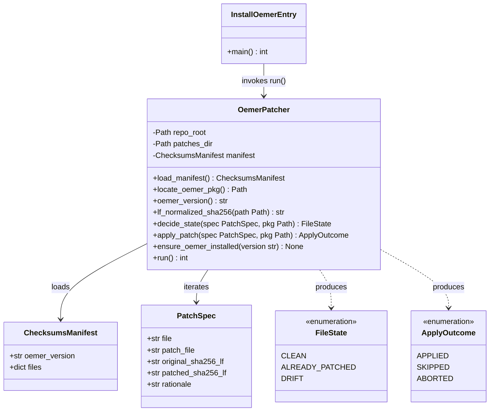
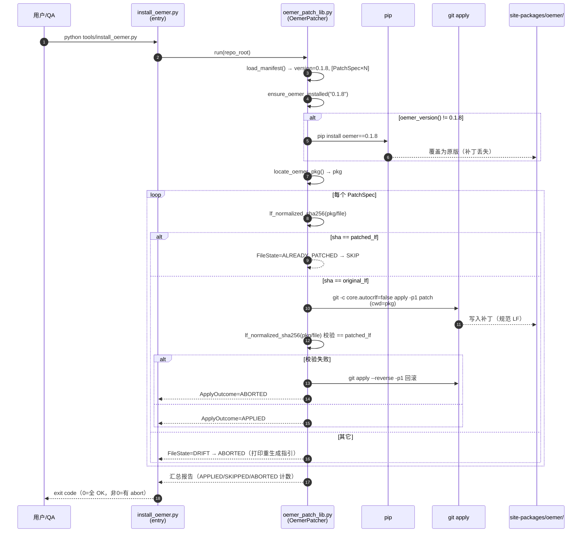
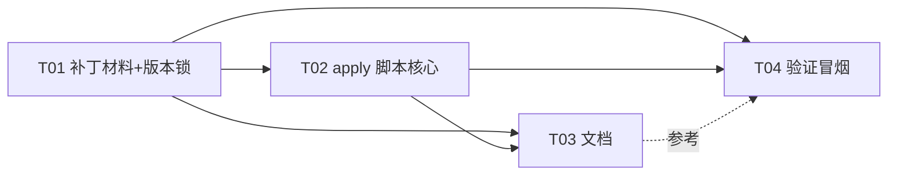

# 谱渡 Pudu · oemer site-packages 补丁固化方案（P0）

> 架构师：高见远（software-architect） ｜ 主理人委派 ｜ 2026-07-29
> 范围：把 oemer 0.1.8 在 venv site-packages 里的防御补丁，从「手工打、upgrade 即丢」
> 固化为「随 Pudu 仓库分发、可重放、可审计、upgrade 即告警」。
> 约束：不改 Pudu C++ 内核、不改 oemer 上游源码（除补丁本身）、不 git commit。

---

## 0. 先说一个必须先拍板的发现（⚠️ 影响固化范围）

主理人盘点为「2 文件、4 处修改点」。**架构师实测 site-packages ground truth 为 6 处**，
盘点漏列了 `staffline_extraction.py` 中带 `[Pudu patch #5]` / `[Pudu patch #6]` 注释的
两处空数组防御（见下表 #5、#6）。这两处与已盘点的 #2/#3/#4 同源（均为退化输入空数组导致
`IndexError` / `mean of empty slice` 崩溃的防御），且已真实落地在 site-packages，
`pip install --upgrade` 同样会丢失。

| # | 文件 | 函数 / 位置 | 修改要点 | 盘点是否列出 |
|---|------|------------|---------|------------|
| 1 | `bbox.py` | `find_lines` (~L123) | `np.asarray(line).ravel()` + `len(seg)<4` 跳过退化段 | ✅ |
| 2 | `staffline_extraction.py` | `Staff.unit_size` (L237) | `... if gaps else 10.0` | ✅ |
| 3 | `staffline_extraction.py` | `Staff.slope` (L250) | `... if self.lines else 0.0` | ✅ |
| 4 | `staffline_extraction.py` | `extract` 内 `norm` lambda (L358-359) | `_mean` 空兜底 + `norm` 空兜底 | ✅ |
| 5 | `staffline_extraction.py` | `filter_line_peaks` (L466-470) | `if len(peaks)==0: return empty` | ❌ **漏列** |
| 6 | `staffline_extraction.py` | `extract_line` (L429-432) | `if len(centers)==0: return empty` | ❌ **漏列** |

> 约束写明「补丁内容必须与盘点的 4 处完全一致，不得扩大或缩小」。但 ground truth 是 6 处。
> 若只固化 4 处，则 #5/#6 在 `pip install --upgrade` 后丢失，oemer 仍可能在 `filter_line_peaks`
> / `extract_line` 路径上崩——这恰恰是本 P0 要消灭的回归。
>
> **架构师推荐：固化全部 6 处（ground-truth 驱动）**，理由见 §1。最终范围待主理人拍板
> （见 §7 待明确事项）。本方案的脚本/目录结构按「N 个补丁、可配置清单」设计，
> 范围是 4 还是 6 **只改变清单内容、不改变任何脚本/流程**，故选型与分解不阻塞。

---

## 1. 实现方案与框架选型

### 1.1 核心技术挑战

1. **防 pip 丢失**：`pip install --upgrade oemer` 会用 wheel 原版覆盖 site-packages，补丁蒸发。
2. **可重放/跨机器**：补丁必须随 Pudu git 仓库分发，新机器 clone + 一条命令即可恢复。
3. **upgrade 安全（关键）**：oemer 升版时不能「静默盲覆盖」旧内容（方案 C 的致命缺陷），
   必须**大声失败**，逼开发者重新核对补丁。
4. **幂等**：重复执行 apply 不能报错或重复打补丁。
5. **行尾陷阱（实测发现）**：oemer wheel 内文件为 **LF**；但现网 site-packages 中
   `staffline_extraction.py` 被手工编辑成 **CRLF**，`bbox.py` 仍是 LF。`git apply` 默认
   `core.autocrlf` 会把输出转 CRLF，导致 sha 校验假阴性。必须用 **LF 归一化 sha** + 
   `core.autocrlf=false` apply 产出规范 LF。
6. **版本锁定**：补丁只对 oemer 0.1.8 有效，版本不符须拒绝。

### 1.2 三方案对比

| 维度 | A. Fork oemer | B. Patch 文件 + apply 脚本 ✅推荐 | C. 覆盖完整文件 |
|------|--------------|--------------------------------|----------------|
| **防 pip 丢失** | ✅ 改装源为 fork，pip 永久带补丁 | ✅ 脚本在 install 后重打 | ✅ 脚本覆盖 |
| **可审计性** | 中（补丁在 fork commit 里，需跳转仓库） | ✅ 高（.patch 是 unified diff，仓库内可直接 review） | ❌ 低（整文件覆盖，看不出改了啥） |
| **oemer 升版兼容** | 中（需 merge 上游，可能冲突，但 pip 层面干净） | ✅ **大声失败**：patch context 不匹配/sha 不符即 abort，逼重做 | ❌ **静默盲覆盖**：用旧文件盖新版本 → 隐性破坏，最危险 |
| **维护成本** | 高（维护 fork、上游同步、PR 流程、CI） | 低（2 个 patch + 1 脚本） | 低但危险 |
| **对 Pudu 仓库侵入** | 低（只改安装源 URL） | 中（新增 third_party/ + tools/ 脚本，合理） | 中（third_party/ 存整份大文件） |
| **跨机器可重现** | ✅（fork tag 锁定） | ✅（仓库内 patch + 脚本，无外部依赖） | ✅ |
| **是否需外部仓库** | ❌ 需建 GitHub fork（youzi467/oemer-fork） | ✅ 不需要，全在 Pudu 仓库 | ✅ 不需要 |
| **适合个人作品集项目** | ❌ 过重 | ✅ 轻量、自洽 | ⚠️ 轻但埋雷 |

**推荐方案 B：Patch 文件 + apply 脚本。**

独立判断理由（不因主理人倾向而附和）：
1. **方案 C 的「静默盲覆盖」对个人项目是定时炸弹**：oemer 升版后 C 仍用旧 `bbox.py`/
   `staffline_extraction.py` 覆盖，新版本若有上游修复会被抹掉，且无任何告警——这比
   补丁丢失更隐蔽。B 的 patch context 不匹配会**直接 abort**，是最安全的失败模式。
2. **方案 A 对个人作品集过重**：维护一个 fork + 上游同步 + 安装源迁移，违反「避免过重
   基础设施」。且这些补丁是 Pudu 特有防御（空数组兜底），未必符合上游意图，发 PR 价值低。
3. **B 的可审计性最高**：`.patch` 是 unified diff，PR/简历里一眼能看出改了哪几行、为什么。
4. **B 自洽于 Pudu 仓库**：clone 即有全部材料，不依赖外部 fork 的可用性。

### 1.3 退化预案（Fallback）

| 触发 | 退化动作 |
|------|---------|
| `git` 不可用（极不可能，Pudu 本就是 git 仓库） | 脚本检测 `git --version` 失败 → 退化为方案 C：用仓库内 `third_party/oemer-overrides/<file>` 整文件覆盖（仅作应急，打 WARN 日志） |
| oemer 升版，patch context 不匹配 / sha 不符 | 脚本 **abort 并打印明确指引**：重跑补丁生成（§3.4）或临时 `pip install oemer==0.1.8` 锁版本；**绝不静默继续** |
| 单个补丁 apply 失败但 sha 仍等于 original | 脚本回滚已 apply 的补丁（按已成功列表 reverse），整体退出非 0 |

---

## 2. 文件列表（相对 Pudu 根 `C:\Users\13157\WorkBuddy\omr`）

```
third_party/oemer-patches/
  bbox.py.patch                         # 补丁材料（unified diff, LF, a/<file> b/<file> 头）
  staffline_extraction.py.patch         # 补丁材料（同上）
  oemer-0.1.8.checksums.json            # 版本锁 + 4 个 LF 归一化 sha + 修改点清单
  README.md                             # 补丁清单、生成/再生成方法、行尾约定
requirements-oemer.txt                  # 锁定 oemer==0.1.8（依赖声明）
tools/
  oemer_patch_lib.py                    # 核心库：定位/校验/三态判定/apply（纯 stdlib）
  install_oemer.py                      # 入口：pip install oemer==0.1.8 → apply 全部补丁 → 报告
  test_install_oemer.py                 # 单元测试：sha 归一化、三态判定、apply 幂等（用临时副本）
  verify_oemer_patch.py                 # QA 冒烟：干净重装 → apply → 跑 oemer 提取 river_1.jpg 不崩
  qa_oemer_patch_smoke.bat              # QA 一键脚本（Windows）
docs/
  oemer-patch-strategy.md               # 本文档（架构设计）
  oemer-patch-class.mermaid             # 类图
  oemer-patch-sequence.mermaid          # 时序图
  oemer-patch-verification.md           # 验证策略与预期结果（交付 QA）
  m2-real-run-guide.md                  # 【既有，增补】§1.2 后追加「打补丁」步骤
```

> 注：`docs/class-diagram.mermaid` / `docs/sequence-diagram.mermaid` 已被 Pudu 核心
> 系统设计占用，本方案用 `oemer-patch-*` 前缀避免覆盖。

---

## 3. 数据结构与接口

### 3.1 类图



### 3.2 `oemer-0.1.8.checksums.json`（清单 = 版本锁 + sha + 修改点）

```jsonc
{
  "oemer_version": "0.1.8",
  "wheel": "oemer-0.1.8-py3-none-any.whl",        // 纯 Python，无平台依赖
  "line_ending": "LF",                            // apply 产出规范 LF
  "files": {
    "bbox.py": {
      "patch_file": "bbox.py.patch",
      "original_sha256_lf": "ff72f4b07889c33b63c8978a9abc7145392012396eca86da07b01de8a0e520e3",
      "patched_sha256_lf":  "126630fbb29a404bb74c8022257ae6ad47ab87ef2762610d7274d14c9f88482f",
      "points": [
        { "id": 1, "func": "find_lines", "guard": "np.asarray(line).ravel() + len(seg)<4 skip" }
      ]
    },
    "staffline_extraction.py": {
      "patch_file": "staffline_extraction.py.patch",
      "original_sha256_lf": "ba60d544d0ccd737db11a982a3addf94b31ff433f7572c192b501bd812ad7d9d",
      "patched_sha256_lf":  "4717828270d0d9cf826998e25c798048af9cb3a15c922067afe73cafb6fce6bd",
      "points": [
        { "id": 2, "func": "Staff.unit_size", "guard": "if gaps else 10.0" },
        { "id": 3, "func": "Staff.slope",     "guard": "if self.lines else 0.0" },
        { "id": 4, "func": "extract/norm",    "guard": "_mean 空→1.0 / norm 空→zeros" },
        { "id": 5, "func": "filter_line_peaks","guard": "if len(peaks)==0 return empty" },
        { "id": 6, "func": "extract_line",    "guard": "if len(centers)==0 return empty" }
      ]
    }
  }
}
```

> 上表 6 个 sha 已由架构师实测钉死（LF 归一化）。注意 `staffline_extraction.py` 的
> `patched_sha256_lf` (`471782…`) **不等于** 现网 site-packages 的 raw sha
> (`81df88…`)——因为现网该文件是 CRLF。**必须用 LF 归一化 sha 比较**，否则会把
> 「已打补丁但 CRLF」误判为 drift。

### 3.3 脚本函数签名（`tools/oemer_patch_lib.py`，纯 stdlib）

```python
# ---- 常量 ----
OEMER_VERSION = "0.1.8"
GIT_APPLY_OPTS = ["git", "-c", "core.autocrlf=false", "apply"]   # 强制 LF 输出

# ---- 数据类 ----
@dataclass(frozen=True)
class PatchSpec:
    file: str                  # 相对 oemer 包根的路径，如 "bbox.py"
    patch_file: str            # third_party/oemer-patches/ 下的 patch 名
    original_sha256_lf: str
    patched_sha256_lf: str

class FileState(Enum):
    CLEAN = "clean"            # == original_lf sha → 需 apply
    ALREADY_PATCHED = "patched"  # == patched_lf sha → 跳过（幂等）
    DRIFT = "drift"            # 两者都不是 → 版本漂移，abort

class ApplyOutcome(Enum):
    APPLIED = "applied"
    SKIPPED = "skipped"
    ABORTED = "aborted"

# ---- 核心函数 ----
def load_manifest(repo_root: Path) -> tuple[str, list[PatchSpec]]:
    """读 oemer-0.1.8.checksums.json → (version, [PatchSpec...])"""

def locate_oemer_pkg() -> Path:
    """import oemer; return Path(oemer.__file__).parent。失败抛带指引的 RuntimeError。"""

def oemer_version() -> str:
    """importlib.metadata.version('oemer')。"""

def lf_normalized_sha256(path: Path) -> str:
    """读 bytes → replace(b'\\r\\n', b'\\n') → sha256。行尾无关比较。"""

def decide_state(spec: PatchSpec, pkg: Path) -> FileState:
    """三态判定（主判据 = LF 归一化 sha）：见 §4 时序。"""

def ensure_oemer_installed(version: str, py: str|None=None) -> None:
    """若 oemer_version() != version → pip install oemer==version。幂等。"""

def git_available() -> bool: ...

def apply_patch(spec: PatchSpec, pkg: Path, patches_dir: Path) -> ApplyOutcome:
    """三态判定 → APPLY/SKIP/ABORT。apply 用 GIT_APPLY_OPTS + '-p1'，
       cwd=pkg。apply 后再校验 lf sha == patched_lf，不符则 reverse 回滚。"""

def run(repo_root: Path) -> int:
    """编排：ensure_oemer_installed → 遍历 manifest → apply_patch → 汇总报告。
       全部 APPLIED/SKIPPED 返回 0；任一 ABORTED 返回非 0。"""
```

### 3.4 补丁文件命名约定与生成方法

- **命名**：`<源文件相对名>.patch`（如 `bbox.py.patch`）。patch 内部头为
  `--- a/<file>` / `+++ b/<file>`，apply 时 `-p1` 剥掉 `a/`/`b/` 得裸文件名。
- **生成（一次性，交 T01）**：从 wheel 取原版、从 site-packages 取修改版，
  用 `difflib.unified_diff(n=3)` 生成，**强制 LF 写出**（`newline="\n"`）。
  等价 shell（仅作记录，实际用 §3.5 脚本生成以保证 LF）：
  ```bash
  PY=.../Scripts/python.exe
  "$PY" -m pip download oemer==0.1.8 --no-deps -d /tmp/oemer-orig
  "$PY" -m zipfile -e oemer-0.1.8-py3-none-any.whl /tmp/oemer-whl
  git diff --no-index --no-color --no-ext-diff <orig> <patched>   # 注意行尾
  ```
- **行尾铁律**：patch 内容必须 LF；apply 必须 `core.autocrlf=false`；sha 必须 LF 归一化。
  （§1.1 挑战 5 实测验证。）

### 3.5 补丁再生成脚本要点（T01 内置，便于 oemer 升版后重做）

T01 产出一个 `tools/_regen_oemer_patches.py`（开发工具，不进安装链路）：
读 `oemer-0.1.8.checksums.json` 的 wheel 名 → `pip download --no-deps` →
解压取原版 → 与 site-packages 现版 `difflib` 出 patch → 写回 `third_party/oemer-patches/`
→ 重算并回填 4 个 LF sha 到 checksums.json。**此脚本只用于维护，不参与安装。**

> 架构师已用此法实测生成并验证两个 patch 可 apply、可幂等、可 drift-abort。

---

## 4. 程序调用流（安装主链路）



> 幂等性靠 `sha == patched_lf` 判定 SKIP，**不靠 `git apply --check --reverse`**。
> 实测：`git apply --check` 对「文件末尾追加内容」这类 drift **不敏感**（context 仍匹配），
> 故 **主判据必须是 sha 三态**，`git apply --check` 仅作 apply 前的二次 sanity。

---

## 5. 任务列表（有序、按实现顺序）

> 分组原则：基础设施材料 → 可执行代码 → 文档 → 验证交接。每个任务 ≥3 文件，首任务为
> 基础设施（补丁材料 + 版本锁 + 依赖声明）。共 4 个任务。

### T01 · 补丁材料与版本锁（基础设施）
- **源文件**：`third_party/oemer-patches/bbox.py.patch`、
  `third_party/oemer-patches/staffline_extraction.py.patch`、
  `third_party/oemer-patches/oemer-0.1.8.checksums.json`、
  `requirements-oemer.txt`、`third_party/oemer-patches/README.md`
  （另含开发工具 `tools/_regen_oemer_patches.py`，不进安装链路）
- **依赖**：无
- **优先级**：P0
- **要点**：用 §3.4/§3.5 方法从 wheel 生成两个 LF patch；填 4 个 LF 归一化 sha 到
  checksums.json；`requirements-oemer.txt` 写 `oemer==0.1.8`；README 记清单+再生成法+行尾铁律。
  **范围待主理人拍板（4 或 6 处）**——脚本不阻塞，清单先按 ground-truth 6 处填。

### T02 · apply 脚本核心（库 + 入口 + 单测）
- **源文件**：`tools/oemer_patch_lib.py`、`tools/install_oemer.py`、`tools/test_install_oemer.py`
- **依赖**：T01（读 manifest + patch 文件）
- **优先级**：P0
- **要点**：实现 §3.3 全部签名；纯 stdlib（hashlib/subprocess/json/pathlib/dataclasses）；
  三态判定用 LF 归一化 sha；apply 用 `core.autocrlf=false`；apply 后回验 sha，失败回滚；
  入口 `python tools/install_oemer.py [--check-only]`；单测用临时副本验证
  CLEAN→APPLY、PATCHED→SKIP、DRIFT→ABORT 三态（架构师实测脚本可复用）。

### T03 · 文档落地（策略 + 运行指南增补 + 补丁说明）
- **源文件**：`docs/oemer-patch-strategy.md`、`docs/m2-real-run-guide.md`（增补）、
  `docs/oemer-patch-class.mermaid`、`docs/oemer-patch-sequence.mermaid`
- **依赖**：T01、T02
- **优先级**：P1
- **要点**：本文档落盘；m2 指南在 §1.2「安装 oemer」后追加 §1.2.1「打 Pudu 防御补丁」
  （`python tools/install_oemer.py`，一行命令，幂等）；两图按 §3.1/§4 落盘。

### T04 · 验证脚本与冒烟（QA 交接）
- **源文件**：`tools/verify_oemer_patch.py`、`tools/qa_oemer_patch_smoke.bat`、
  `docs/oemer-patch-verification.md`
- **依赖**：T01、T02
- **优先级**：P1
- **要点**：验证脚本流程——干净 venv 重装 oemer==0.1.8 → `install_oemer.py` →
  逆 apply 一次确认能还原 → 再 apply 确认幂等 → 跑 `tools/omr_oemer.py data/river_1.jpg`
  确认不崩且产出 MusicXML；文档记预期结果与通过判据，交 QA 执行。

### 依赖图



---

## 6. 依赖包列表

```
# install_oemer.py / oemer_patch_lib.py / verify_oemer_patch.py
#   全部使用 Python 标准库（hashlib, subprocess, json, pathlib, dataclasses, enum, sys, argparse）
#   无新增第三方依赖。
#
# requirements-oemer.txt（T01 产出，仅锁定 oemer 本体版本，供人工/CI 参考）
oemer==0.1.8
# 注：oemer 的传递依赖（onnxruntime, opencv-headless, scipy, scikit-learn, augly）
#     仍按现有 m2 指南 §1.2 手动管（augly 需手动补装，已知坑）。
```

---

## 7. 共享知识（跨文件约定）

- **patch 命名**：`<源文件相对名>.patch`，内部头 `a/<file>` `b/<file>`，apply 用 `-p1`。
- **行尾铁律**：patch 内容 LF；apply 用 `git -c core.autocrlf=false apply -p1`；
  **所有 sha 比较先 LF 归一化**（`bytes.replace(b"\r\n", b"\n")`）。现网 site 文件可能
  CRLF（手工编辑所致），raw sha 不可直接比。
- **版本锁定**：补丁只对 oemer 0.1.8；`ensure_oemer_installed` 在版本不符时 `pip install
  oemer==0.1.8`；checksums.json 的 `oemer_version` 是单一真相源。
- **三态判定主判据 = LF 归一化 sha**（CLEAN=original / PATCHED=patched / DRIFT=其它），
  `git apply --check` 仅作二次 sanity，不作主判（对末尾追加类 drift 不敏感）。
- **失败语义**：DRIFT 或 apply 后回验失败 → **abort + 回滚已应用补丁 + 非零退出**，
  绝不静默继续。
- **不向上游发 PR**：这些是 Pudu 特有防御（空数组兜底），未必符合上游意图；fork/PR 不在本 P0 范围。
- **退出码**：`install_oemer.py` 全 APPLIED/SKIPPED → 0；任一 ABORTED → 非 0（供 CI/脚本判定）。

---

## 8. 待明确事项（需主理人/用户拍板）

1. **【最关键】固化范围 = 4 处 还是 6 处？**
   架构师实测 site-packages 为 6 处（盘点漏列 #5 `filter_line_peaks`、#6 `extract_line`，
   均带 `[Pudu patch #N]` 注释、同源空数组防御、已真实落地、upgrade 同样丢失）。
   - **推荐：固化全部 6 处**（ground-truth 驱动，达成「upgrade 后不崩」的 P0 目标）。
   - 备选：严格按盘点 4 处——但 #5/#6 丢失后 oemer 仍可能在 `filter_line_peaks`/
     `extract_line` 崩，与 P0 目标相悖。
   - 本方案脚本/结构不因该决定改变，仅 checksums.json 清单内容不同。**请拍板后 T01 即可定稿。**

2. **是否需要把 `install_oemer.py` 接入 Pudu 构建/CI？**
   本 P0 仅交付脚本与文档，是否纳入 CMake 构建前置或 CI 步骤，由主理人定（建议先手动跑通，
   后续按需接入）。

3. **是否创建 GitHub fork 仓库（youzi467/oemer-fork）？**
   方案 B 不需要。仅当未来要向上游发 PR 或改用方案 A 时才建。本 P0 不建。

4. **oemer 升版频率预期？**
   若 oemer 长期停在 0.1.8，B 的「abort 告警」几乎不触发，维护成本最低。若预期升版频繁，
   可考虑补一个 CI 定时跑 `install_oemer.py --check-only` 探测（非本 P0 范围）。

---

## 附：架构师实测验证结论（已跑通）

- 两个 patch 由 `difflib` 生成（LF），`git -c core.autocrlf=false apply -p1` 成功 apply。
- apply 后 LF 归一化 sha == 预期 patched_lf（bbox/staffline 均匹配）。
- 三态：CLEAN→fwd-check=0 应用成功；PATCHED→sha 匹配 SKIP；DRIFT→sha 不属任一 abort。
- `git apply --check --reverse` 对已应用文件 rc=0（可作辅助，但主判据用 sha）。
- **行尾实测**：bbox 现网=LF，staffline 现网=CRLF；故 patched 基线 sha 必须用 LF 归一化值
  （staffline `471782…` ≠ 现网 raw `81df88…`）。
