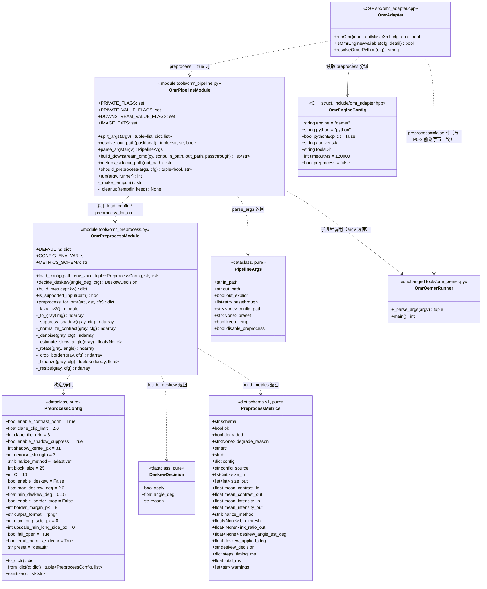
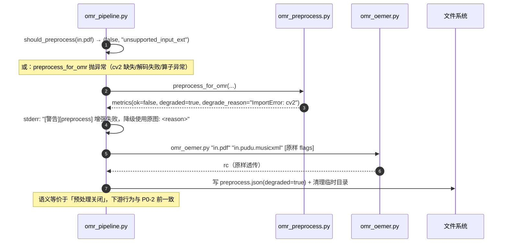
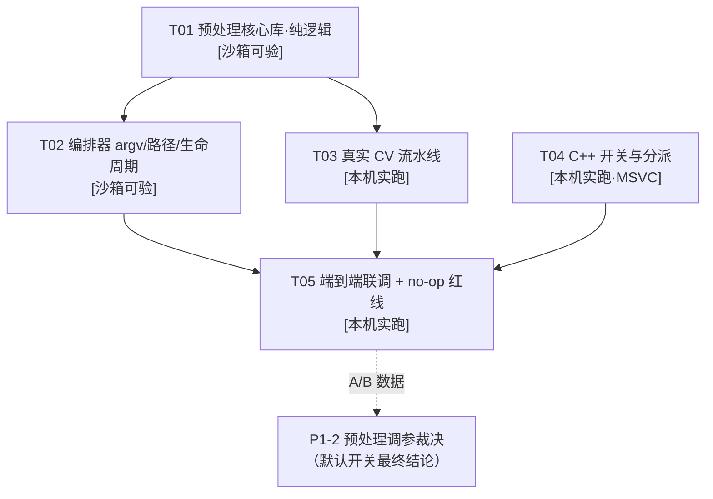

# 谱渡 Pudu · P0-2 图像预处理增强管道 · 系统设计与任务分解

> 版本：v1（2026-08-01） · 架构师：高见远 · 上游输入：许清楚《P0-2 PRD》
> 适用范围：`tools/omr_preprocess.py`、`tools/omr_pipeline.py`、`tools/omr_preprocess_config.json`、`include/omr_adapter.hpp`、`src/omr_adapter.cpp`、`src/main.cpp`
> 红线：默认关、no-op 等价、`tools/omr_oemer.py` 零修改、C++ 改动极小

---

## 1. 实现方案与框架选型

### 1.1 核心技术难点

| # | 难点 | 本设计的处置 |
|---|------|--------------|
| D1 | **不能碰 oemer 运行器**（`omr_oemer.py` 已承载 F3 sidecar monkeypatch、调号校正、produced/out_path 重命名等复杂逻辑，改动风险高） | 新增**透明代理** `omr_pipeline.py` 夹在 C++ 与 `omr_oemer.py` 之间，唯一副作用是「替换 input 像素来源」，其余 argv 原样转发 |
| D2 | **产出路径陷阱**：`omr_oemer.py:789-792` 用 **input basename** 推导 `produced`，用 **out_path dirname** 推导 `out_dir`。若上游把 input 换成临时目录里的随机名 PNG，且只传 1 个位置参数，则 `out_path` 会被推导到**临时目录**，产物随临时目录一起消失（R-P0-04） | 代理**始终**自行按**原始 input** 推导 `out_path`，并**显式作为第 2 位置参数**下传；下游 `os.replace(produced, out_path)` 自动把产物落回正确位置 |
| D3 | **沙箱无 cv2 / 无 MSVC**，绝大部分验证要在无 OpenCV 环境完成 | 分层：①**纯逻辑层**（配置解析、argv 转发、路径推导、deskew 决策、指标字典、降级决策、临时目录生命周期）零 cv2 依赖，pytest 全覆盖；②**像素层**（真实 CV 算子）`import cv2` 全部**函数内延迟导入**，仅本机 oemer venv 实跑 |
| D4 | **no-op 等价红线**（R-P0-02）：关开关时命令行必须与 P0-2 前**逐字节一致** | C++ 侧仅替换脚本文件名一个 token，`cfg.preprocess=false` 时命令字符串构造表达式与旧版完全相同；关闭路径**不会**进入 `omr_pipeline.py`，Python 侧改动天然不可见 |
| D5 | **增强可能帮倒忙**（二值化吃掉细符干、过度去噪抹掉符尾） | ①默认关；②`enable_deskew` 二次默认关（双重上限，R-P0-05）；③失败/异常一律 **fail-open 降级用原图**（R-P1-04）；④输出预处理指标 sidecar 供 P1-2 harness 裁决（R-P1-01） |
| D6 | 临时文件残留污染工作区（R-P0-10） | `tempfile.mkdtemp` + `try/finally` + `atexit` 双保险清理；`--keep-temp` 时保留并把路径打到 stderr；额外清理下游可能在 out_dir 留下的 `<stem>.pre.*` 中间物 |

### 1.2 选型结论

| 层 | 选型 | 理由 |
|---|------|------|
| 图像增强 | **Python 3 + OpenCV（opencv-python），与 oemer 同 venv** | ①oemer 本身即 Python，同 venv 零环境增量（oemer 依赖链已含 numpy/opencv）；②OpenCV 传统算子（CLAHE / adaptiveThreshold / medianBlur / morphologyEx / HoughLinesP / warpAffine）零模型依赖，满足「不引入新模型」约束；③调参迭代成本远低于 C++ |
| 编排 | **纯 Python 标准库**（`argparse` 不用，手写 `split_args`；`subprocess` / `tempfile` / `json` / `time`） | 手写解析可保证「未知 flag 原样透传、私有 flag 精确吸收」，`argparse` 的严格模式会破坏 R-P0-03 的转发契约 |
| C++ 侧 | **C++20，仅开关 + 分派**，零新增依赖、零新增第三方库 | 守住「不污染构建」；改动面 = 1 个结构体字段 + 1 处三目分派 + 1 个 CLI flag |
| 测试 | **pytest**（沿用 `tests/test_*.py` 约定）+ 既有 C++ `test/test_omr_adapter.cpp` | 纯逻辑层沙箱可全绿；像素层与 C++ 层本机实跑 |

### 1.3 为什么不在 C++ 做图像处理（回答优化计划 checklist #6）

1. **构建污染**：C++ 侧引入 OpenCV 需 vcpkg 新增 ~200MB 依赖、影响 CMake 预设与 CI，与「不污染 C++ 构建」直接冲突；而 Python 侧 OpenCV 在 oemer venv 中**已存在**，增量为 0。
2. **数据边界自然**：增强的唯一消费者是 oemer（Python 进程）。在 C++ 侧增强需把图像再落盘一次交给 Python，多一次 I/O 且路径管理更复杂；在 Python 侧增强天然与下游同进程语境。
3. **调参速度**：预处理是「实验-测量-回退」型工作（P1-2 A/B 裁决），Python 改一行即可重跑，C++ 需重编译。
4. **失败半径**：Python 侧异常可 fail-open 降级，不会带崩 Pudu 主进程；C++ 侧 OpenCV 崩溃会直接杀掉宿主。
5. **架构一致性**：Pudu 对 OMR 引擎的既有定位就是「黑盒子进程」（见 `omr_adapter.hpp` 头注释），预处理属于「引擎侧前置」，放在 Python 工具链符合既有分层。

---

## 2. 文件列表（相对仓库根）

### 2.1 新增

| 路径 | 用途 |
|---|---|
| `tools/omr_preprocess.py` | 预处理核心库：`PreprocessConfig` 数据类、配置加载与净化、`decide_deskew` 等纯函数、指标字典构造、`preprocess_for_omr` 像素流水线（cv2 延迟导入）、可独立运行的 `__main__` 调试 CLI |
| `tools/omr_pipeline.py` | 透明代理编排器：argv 拆分/转发、out_path 推导（R-P0-04）、临时目录生命周期、失败降级、调用 `omr_oemer.py`、写预处理指标 sidecar |
| `tools/omr_preprocess_config.json` | 默认配置（与代码 `DEFAULTS` 逐字段一致）+ `presets`（scan/photo/low_contrast，R-P2-01） |
| `tests/test_omr_preprocess_config.py` | R-P0-06/R-P0-08：默认值、缺字段、损坏 JSON、路径不存在、env 覆盖、净化钳制、默认 JSON 与代码默认值一致性、导入后 `cv2` 不在 `sys.modules` |
| `tests/test_omr_preprocess_pure.py` | R-P0-05/R-P1-01/R-P1-04：`decide_deskew` 全分支、指标字典 schema、降级决策纯函数 |
| `tests/test_omr_pipeline_argv.py` | R-P0-03/R-P0-04/R-P1-02/R-P1-03：flag 拆分与透传、私有 flag 吸收、out_path 推导、下游命令构造 |
| `tests/test_omr_pipeline_e2e_stub.py` | 注入假 runner + 假 preprocess，验证降级链路、临时目录清理/保留、sidecar 落点、退出码透传 |

### 2.2 修改

| 路径 | 改动 |
|---|---|
| `include/omr_adapter.hpp` | `OmrEngineConfig` 新增 `bool preprocess = false;`（含注释） |
| `src/omr_adapter.cpp` | `runOmr` 的 oemer 分支：`cfg.preprocess` 为真时目标脚本切 `omr_pipeline.py`，其余不变（`:179` 一处） |
| `src/main.cpp` | 新增 `--omr-preprocess` flag 解析（第一个 argv 循环，约 `:96-110`）+ `cfg.preprocess = omrPreprocess;`（约 `:116-125`） |
| `test/test_omr_adapter.cpp` | 追加：`preprocess=false` 行为不变回归；（可选）命令构造等价性用例 |
| `README.md` | 用法段落：`--omr-preprocess`、`PUDU_OMR_PREPROCESS_CONFIG`、`--preprocess-config`、`--keep-temp` |

### 2.3 明确不动

- `tools/omr_oemer.py`（**零修改**，红线）
- `tools/omr_eval_groundtruth.py` / `omr_eval_lib.py`（P1-2 才接入）
- 任何既有数据模型 / 转换链路

---

## 3. 数据结构与接口

### 3.1 类图



### 3.2 `PreprocessConfig` 字段定义（R-P0-06 对齐）

| 字段 | 类型 | 默认 | 含义 / 取值约束（`sanitize()` 钳制） |
|---|---|---|---|
| `enable_contrast_norm` | bool | `True` | CLAHE 局部对比度归一化开关 |
| `clahe_clip_limit` | float | `2.0` | CLAHE 对比度裁剪上限，钳制到 `[0.5, 8.0]` |
| `clahe_tile_grid` | int | `8` | CLAHE 网格边长，钳制到 `[2, 32]` |
| `enable_shadow_suppress` | bool | `True` | 形态学背景估计 + 除法归一，消除拍照阴影/光照梯度 |
| `shadow_kernel_px` | int | `31` | 背景估计结构元尺寸；强制奇数，钳制到 `[3, 201]` |
| `denoise_strength` | int | `3` | 中值滤波核；`0` 表示关；非 0 强制奇数，钳制到 `[3, 9]` |
| `binarize_method` | str | `"adaptive"` | `"adaptive"` / `"otsu"` / `"none"`（非法值回落 `"adaptive"` 并告警） |
| `block_size` | int | `25` | adaptive 邻域尺寸；强制奇数且 `>=3`，钳制到 `[3, 151]` |
| `C` | int | `10` | adaptive 常数项，钳制到 `[-50, 50]` |
| `enable_deskew` | bool | **`False`** | 去扭曲总开关（R-P0-05 双重上限之一，默认关） |
| `max_deskew_deg` | float | `2.0` | 允许校正的最大绝对角度；`|angle| > max` 一律放弃（双重上限之二）。钳制到 `(0, 15.0]` |
| `min_deskew_deg` | float | `0.15` | 低于该角度视为无需校正，避免无谓重采样。钳制到 `[0, max_deskew_deg)` |
| `enable_border_crop` | bool | `False` | 裁掉扫描黑边 / 旋转白边 |
| `border_margin_px` | int | `8` | 裁切后保留的安全边距，钳制到 `[0, 200]` |
| `output_format` | str | `"png"` | 临时增强图格式；仅允许无损 `"png"`（非法值回落 png） |
| `max_long_side_px` | int | `0` | `0`=不缩放；`>0` 时长边超限等比降采样，钳制到 `[0, 8000]` |
| `upscale_min_long_side_px` | int | `0` | `0`=不放大；低分辨率图放大到该长边（INTER_CUBIC），钳制到 `[0, 8000]` |
| `fail_open` | bool | `True` | R-P1-04：任一步异常时降级用原图；`False` 则直接返回非 0（仅调参时用） |
| `emit_metrics_sidecar` | bool | `True` | R-P1-01：是否写 `<out stem>.preprocess.json` |
| `preset` | str | `"default"` | 生效档位名（仅记录进指标，便于 A/B 归因） |

**加载契约（`load_config`）**

```
load_config(path: str | None,
            env_var: str = "PUDU_OMR_PREPROCESS_CONFIG"
           ) -> tuple[PreprocessConfig, str, list[str]]
    返回 (cfg, config_source, warnings)
```

优先级：`--preprocess-config <path>` > 环境变量 `PUDU_OMR_PREPROCESS_CONFIG` > `tools/omr_preprocess_config.json`（与脚本同目录）> 内置 `DEFAULTS`。
容错（R-P0-06，任何一条都**不得抛异常**）：

| 情况 | 行为 |
|---|---|
| 路径不存在 | 回落下一优先级，`warnings += ["config not found: <p>"]` |
| JSON 语法损坏 | 回落 `DEFAULTS`，`warnings += ["config parse error: ..."]` |
| 顶层不是 object | 同上 |
| 缺字段 | 该字段取默认值（静默） |
| 多余字段 | 忽略，`warnings += ["unknown key: x"]` |
| 类型不符 | 尝试安全转换（`"true"`/`1` → bool 等）；失败取默认值 + 告警 |
| 值越界 | `sanitize()` 钳制 + 告警 |

**配置文件两种形态**（loader 均接受）：
- **扁平**：顶层直接是字段字典 → `cfg = DEFAULTS ← json`
- **带档位**（R-P2-01）：顶层含 `"presets"` → `cfg = DEFAULTS ← json["default"] ← json["presets"][active]`，`active = --preprocess-preset` > `json["active_preset"]` > `"default"`；未知 preset 名回落 `"default"` + 告警

### 3.3 `preprocess_for_omr` 与指标字典

```
preprocess_for_omr(src: str, dst: str, cfg: PreprocessConfig) -> dict
    # 唯一会真正 import cv2 的入口（函数内 _lazy_cv2()）
    # 成功：把增强图写到 dst，返回 metrics（ok=True, degraded=False）
    # 失败且 cfg.fail_open：不写 dst（或删除半成品），返回 metrics（ok=False, degraded=True, degrade_reason=...）
    # 失败且 not cfg.fail_open：抛出异常，由调用方决定
```

**固定处理顺序**（配置只控开关，不控顺序 —— 保证可测、可复现）：

```
读图 → 灰度 → 阴影抑制 → 对比度归一 → 去噪
     → 测角(内部临时二值/Hough) → decide_deskew → 旋转
     → 边框裁切 → 二值化 → 缩放 → 转 3 通道 BGR → 写 PNG
```

**指标字典 schema（`pudu.omr.preprocess.metrics/v1`）**，由**纯函数** `build_metrics(**kw) -> dict` 构造，**不依赖 cv2/numpy**（所有数值以 Python `float/int/None` 传入）：

```json
{
  "schema": "pudu.omr.preprocess.metrics/v1",
  "ok": true,
  "degraded": false,
  "degrade_reason": null,
  "src": "data/river_1.jpg",
  "dst": "<tmp>/river_1.pre.png",
  "config": { "...effective PreprocessConfig.to_dict()..." },
  "config_source": "file:tools/omr_preprocess_config.json",
  "preset": "default",
  "size_in": [2480, 3508],
  "size_out": [2480, 3508],
  "mean_intensity_in": 187.4,
  "mean_intensity_out": 231.0,
  "mean_contrast_in": 42.1,
  "mean_contrast_out": 96.7,
  "binarize_method": "adaptive",
  "bin_thresh": null,
  "ink_ratio_out": 0.081,
  "deskew_angle_est_deg": 0.62,
  "deskew_applied_deg": 0.0,
  "deskew_decision": "disabled",
  "steps_timing_ms": {
    "read": 0.0, "gray": 0.0, "shadow": 0.0, "contrast": 0.0,
    "denoise": 0.0, "skew_estimate": 0.0, "deskew": 0.0,
    "crop": 0.0, "binarize": 0.0, "resize": 0.0, "write": 0.0
  },
  "total_ms": 0.0,
  "warnings": [],
  "tool_version": "p0-2/1"
}
```

字段语义：
- `mean_contrast_*` = 灰度图标准差（对比度代理）；`mean_intensity_*` = 灰度均值。
- `bin_thresh`：`otsu` 时为求得阈值，`adaptive`/`none` 时为 `null`。
- `ink_ratio_out`：输出图中「墨点」占比（二值化后暗像素比例），用于识别「二值化吃掉内容/糊成一片」两类失败模式（经验区间约 `0.02~0.25`，越界写入 `warnings`）。
- `deskew_decision` ∈ `{"disabled","no_angle","below_min","above_max","apply"}`，与 `decide_deskew().reason` 同源。
- 未执行的步骤在 `steps_timing_ms` 中值为 `0.0`（键恒存在，便于 harness 直接列化）。

**契约**：`build_metrics` 必须能在无 cv2 环境被单测直接调用并断言 schema 键集合、类型与默认值；`preprocess_for_omr` 只是往里填数。

### 3.4 `decide_deskew`（R-P0-05 纯函数）

```
decide_deskew(angle_deg: float | None, cfg: PreprocessConfig) -> DeskewDecision
```

| 输入条件 | 返回 |
|---|---|
| `cfg.enable_deskew is False` | `(apply=False, angle_deg=0.0, reason="disabled")` |
| `angle_deg is None`（测角失败 / 无足够直线） | `(False, 0.0, "no_angle")` |
| `not isfinite(angle_deg)`（NaN/inf） | `(False, 0.0, "no_angle")` |
| `abs(angle) < cfg.min_deskew_deg` | `(False, 0.0, "below_min")` |
| `abs(angle) > cfg.max_deskew_deg` | `(False, 0.0, "above_max")` ← **双重上限的第二重：超限放弃校正，绝不强扭** |
| 其余 | `(True, -angle_deg, "apply")`（返回值即待施加的旋转角，符号已取反） |

边界用例（单测必覆盖）：`angle = ±max`（含边界，`>` 才拒绝 → 恰等于上限**允许**）、`angle = ±min`（`<` 才拒绝 → 恰等于下限**允许**）、`0.0`、`None`、`NaN`、`enable_deskew=True` 与 `False` 交叉。

### 3.5 `omr_pipeline.py` argv 转发设计

**对上契约（被 C++ 调用）**

```
python omr_pipeline.py <input> [<output.musicxml>] \
       [--preprocess-config <path>|--preprocess-config=<path>] \
       [--preprocess-preset <name>] [--keep-temp] [--no-preprocess] \
       [--gt <gt>|--gt=<gt>] [--f3-geometric] [--no-f3-sidecar] [...其它]
```

**flag 分类表**

| 类别 | 成员 | 处理 |
|---|---|---|
| 私有·带值（吸收，**不转发**） | `--preprocess-config`、`--preprocess-preset`、`--preprocess-metrics` | 支持 `--x v` 与 `--x=v` 两种写法；缺值报错 rc=2 |
| 私有·布尔（吸收，**不转发**） | `--keep-temp`、`--no-preprocess` | R-P1-03 / 调试开关 |
| 下游·带值（**原样转发**，含其值） | `--gt` | 需登记在 `DOWNSTREAM_VALUE_FLAGS`，仅为了正确跳过取值 token，**不解析语义** |
| 下游·其它（**原样转发**） | `--gt=<v>`、`--f3-geometric`、`--no-f3-sidecar`、**任何未知 `-` 开头 token** | 顺序保持不变，前向兼容 `omr_oemer.py` 未来新增 flag |
| 位置参数 | 前两个非 flag token | `positional[0]=input`，`positional[1]=output`（可缺省） |

```
split_args(argv: list[str]) -> tuple[list[str], dict, list[str]]
    返回 (positional, private, passthrough)
```

**R-P0-04 输出路径推导（核心防坑）**

```
resolve_out_path(positional) -> (in_path, out_path, out_explicit)
    in_path = positional[0]
    if len(positional) >= 2:
        out_path, out_explicit = positional[1], True
    else:
        in_abs = os.path.abspath(in_path)
        stem   = os.path.splitext(os.path.basename(in_abs))[0]
        out_path, out_explicit = os.path.join(os.path.dirname(in_abs), stem + ".musicxml"), False
```

推导规则与 `omr_oemer.py:754-765` **逐字对齐**（同目录、同 stem、`.musicxml`），保证「代理接管推导」与「原生推导」结果完全相同。

**下游命令构造（无论是否降级，永远显式传 2 个位置参数）**

```
build_downstream_cmd(py, script, in_path, out_path, passthrough) -> list[str]
    -> [py, script, in_path, out_path, *passthrough]
```

其中 `in_path` = 增强临时 PNG（成功）或原始 input（降级/跳过）；`out_path` = 上面推导出的**锚定原始 input 的路径**。
如此一来 `omr_oemer.py` 内部：`out_dir = dirname(out_path)`（正确目录）、`produced = out_dir/<enhanced_stem>.musicxml` → `os.replace(produced, out_path)`（正确落位）、sidecar 同理重命名到 `<out stem>.geometry.json`。**临时目录里不会留下产物。**

**临时文件命名与清理（R-P0-10）**

- 临时目录：`tempfile.mkdtemp(prefix="pudu_omr_pre_")`
- 增强图名：`<原始 stem>.pre.png`（**不用随机名**，便于人工排查；`.pre` 后缀避免与 out_dir 中同 stem 既有文件冲突）
- 下游会在 `out_dir` 短暂产生 `<原始 stem>.pre.musicxml` / `.pre.geometry.json` 并自行 rename 走；pipeline 在 `finally` 中**兜底删除**这两个残留名（若存在）
- 清理：`try/finally` + `atexit` 双保险；`--keep-temp` 时跳过删除并向 **stderr** 打印 `[preprocess] keep-temp: <dir>`
- 异常/信号中断路径同样走 `finally`

**退出码契约**：pipeline 直接**透传** `omr_oemer.py` 的退出码；自身参数错误 → `2`；输入不存在 → `1`（与下游语义一致）。预处理失败**不影响**退出码（降级继续）。

**指标 sidecar 落点（R-P1-01）**：`metrics_sidecar_path(out_path)` = `out_path` 去掉 `.musicxml` 后缀 + `.preprocess.json`（与既有 `.geometry.json` 命名族一致），落在**最终输出目录**而非临时目录；`--preprocess-metrics <path>` 可显式覆盖。

### 3.6 C++ 增量

**`include/omr_adapter.hpp`**

```cpp
struct OmrEngineConfig {
    std::string engine = "oemer";
    std::string python = "python";
    bool pythonExplicit = false;
    std::string audiverisJar;
    std::string toolsDir;
    int timeoutMs = 120000;
    // P0-2：oemer 前置图像增强（默认关）。为 true 时 runOmr 改调
    // tools/omr_pipeline.py（透明代理，参数位置与 omr_oemer.py 完全一致）。
    bool preprocess = false;
};
```

**`src/omr_adapter.cpp::runOmr`（oemer 分支，伪代码）**

```cpp
if (cfg.engine == "oemer") {
    if (cfg.toolsDir.empty()) { err = "..."; return false; }
    // 唯一变化：脚本名 token。preprocess=false 时表达式与 P0-2 前逐字节一致。
    const char* script = cfg.preprocess ? "/omr_pipeline.py" : "/omr_oemer.py";
    cmd = "\"" + cfg.python + "\" \"" + cfg.toolsDir + script + "\" \"" +
          input + "\" \"" + outMusicXml + "\"";
}
// audiveris / fixture / outputLooksValid / runCommand 全部不动
```

**`src/main.cpp`**

```cpp
bool omrPreprocess = false;                       // 与 omrPythonExplicit 同域声明
...
} else if (a == "--omr-preprocess") {             // 第一个 argv 循环内追加分支
    omrPreprocess = true;
}
...
cfg.preprocess = omrPreprocess;                   // OmrEngineConfig 装配处追加一行
```

**刻意不做的事**（守「C++ 改动极小」）：
- 不新增 `--preprocess-config` 的 C++ 转发；C++ 路径通过**环境变量** `PUDU_OMR_PREPROCESS_CONFIG` 指定配置（Python 侧已支持），零 C++ 参数管道。
- `isOmrEngineAvailable` 不变（仍只测 `import oemer`）：cv2 缺失由 Python 侧 fail-open 降级兜底，不引入新的可用性判定分支。

---

## 4. 程序调用流程

### 4.1 主时序（预处理开启 + 成功）

```mermaid
sequenceDiagram
    autonumber
    participant U as 用户 CLI
    participant M as main.cpp
    participant A as omr_adapter::runOmr
    participant P as tools/omr_pipeline.py
    participant C as tools/omr_preprocess.py
    participant O as tools/omr_oemer.py (未改)
    participant E as oemer.ete
    participant FS as 文件系统

    U->>M: Pudu --from-omr in.jpg --omr-engine oemer --omr-preprocess
    M->>M: omrPreprocess=true → cfg.preprocess=true
    M->>A: runOmr(in.jpg, in.jpg.pudu.musicxml, cfg, err)
    A->>A: engine=="oemer" && preprocess → script="/omr_pipeline.py"
    A->>P: "<py>" "<tools>/omr_pipeline.py" "in.jpg" "in.jpg.pudu.musicxml"

    P->>P: split_args → positional / private / passthrough
    P->>P: resolve_out_path → out="in.jpg.pudu.musicxml"(显式)
    P->>C: load_config(--preprocess-config | env | tools/*.json | DEFAULTS)
    C-->>P: (cfg, config_source, warnings)
    P->>P: should_preprocess? (扩展名是图像 && !--no-preprocess)
    P->>FS: mkdtemp(pudu_omr_pre_*)
    P->>C: preprocess_for_omr(in.jpg, <tmp>/in.pre.png, cfg)
    C->>C: _lazy_cv2()  # 此刻才 import cv2
    C->>C: gray→shadow→contrast→denoise
    C->>C: _estimate_skew_angle → decide_deskew(angle,cfg)
    C->>C: (可选)rotate → crop → binarize → resize
    C->>FS: imwrite(<tmp>/in.pre.png)
    C-->>P: metrics(ok=true, degraded=false, ...)

    P->>O: "<py>" omr_oemer.py "<tmp>/in.pre.png" "in.jpg.pudu.musicxml" [--gt ... --f3-geometric ...]
    O->>O: _parse_args → positional=2 → out_path 用显式值
    O->>O: out_dir=dirname(out_path); produced=out_dir/in.pre.musicxml
    O->>E: sys.argv=["oemer", <tmp>/in.pre.png, "-o", out_dir]; ete.main()
    E->>FS: 写 out_dir/in.pre.musicxml (+ in.pre.geometry.json)
    O->>FS: os.replace(in.pre.geometry.json → in.jpg.pudu.geometry.json)
    O->>FS: os.replace(in.pre.musicxml → in.jpg.pudu.musicxml)
    O->>O: correct_key_signature(out_path, gt)
    O-->>P: rc=0

    P->>FS: 写 in.jpg.pudu.preprocess.json (metrics)
    P->>FS: finally: rmtree(<tmp>) + 清理 out_dir/*.pre.* 残留
    P-->>A: rc=0（透传下游退出码）
    A->>A: outputLooksValid(out) → 校验 score-partwise
    A-->>M: true
    M->>U: [OMR] 产出 MusicXML
```

### 4.2 降级时序（预处理失败 / 无 cv2 / 非图像输入，R-P1-04）



### 4.3 no-op 等价路径（预处理关闭，R-P0-02）

```mermaid
sequenceDiagram
    autonumber
    participant M as main.cpp
    participant A as omr_adapter::runOmr
    participant O as omr_oemer.py
    M->>A: cfg.preprocess=false（默认，未传 --omr-preprocess）
    A->>A: script="/omr_oemer.py"（与 P0-2 前完全相同的命令串）
    A->>O: "<py>" "<tools>/omr_oemer.py" "<input>" "<output>"
    Note over A,O: omr_pipeline.py / omr_preprocess.py 从不被加载；<br/>零临时文件、零 sidecar、零 stderr 增量
```



---

## 5. 任务分解

> **说明**：主理人建议的 T1–T11 细粒度步骤已按「功能模块 + 可验证边界」归并为 **5 个任务（硬上限）**，每个任务内含有序子步骤（可逐条勾选执行）。映射表见 §5.2。

### 5.1 任务列表（按依赖顺序）

---

#### **T01 · 预处理核心库：配置与纯逻辑层** — P0 — 依赖：无 — **[沙箱可验]**

**源文件**
- `tools/omr_preprocess.py`（新建；本任务只写配置 + 纯函数部分，像素层留空函数体 `raise NotImplementedError`）
- `tools/omr_preprocess_config.json`（新建）
- `tests/test_omr_preprocess_config.py`（新建）
- `tests/test_omr_preprocess_pure.py`（新建）

**子步骤**
1. 定义 `DEFAULTS`（单一真源）、`CONFIG_ENV_VAR`、`METRICS_SCHEMA`、`IMAGE_EXTS` 常量。
2. `PreprocessConfig` dataclass（§3.2 全字段）+ `to_dict()` / `from_dict()` / `sanitize()`（钳制 + 奇数化 + 非法枚举回落，返回 warnings）。
3. `load_config(path, env_var)`：四级优先级 + 扁平/presets 双形态 + 全容错（§3.2 容错表）。
4. `decide_deskew(angle_deg, cfg) -> DeskewDecision`（§3.4 全分支）。
5. `build_metrics(**kw) -> dict`（§3.3 schema；键集合恒定、零 cv2/numpy 依赖）。
6. `is_supported_input(path) -> bool`（扩展名白名单，PDF/未知类型返回 False）。
7. `_lazy_cv2()`：函数内 `import cv2`，失败抛带诊断的 `RuntimeError`；**模块顶层严禁 import cv2/numpy**。
8. `tools/omr_preprocess_config.json`：写出与 `DEFAULTS` 逐字段一致的 `default` 段 + `presets`（scan / photo / low_contrast，见 §7 建议值）。
9. 单测：默认值、缺字段、损坏 JSON、路径不存在、env 覆盖、未知键告警、越界钳制、preset 合并、**默认 JSON ≡ 代码 DEFAULTS**、`decide_deskew` 全分支与边界、metrics schema 键/类型、`import tools.omr_preprocess` 后断言 `"cv2" not in sys.modules`。

**验收**：`pytest tests/test_omr_preprocess_config.py tests/test_omr_preprocess_pure.py` 在**无 cv2** 沙箱全绿。

---

#### **T02 · 编排器 `omr_pipeline.py`：argv 转发 / 路径锚定 / 生命周期 / 降级** — P0 — 依赖：T01 — **[沙箱可验]**

**源文件**
- `tools/omr_pipeline.py`（新建）
- `tests/test_omr_pipeline_argv.py`（新建）
- `tests/test_omr_pipeline_e2e_stub.py`（新建）

**子步骤**
1. 常量：`PRIVATE_FLAGS` / `PRIVATE_VALUE_FLAGS` / `DOWNSTREAM_VALUE_FLAGS`（§3.5 分类表）。
2. `split_args(argv)`：私有 flag 精确吸收（`--x v` 与 `--x=v` 双写法）、下游带值 flag 成对透传、未知 flag 原样透传、位置参数收集；**保持 passthrough 原始顺序**。
3. `resolve_out_path(positional)`：R-P0-04 推导，与 `omr_oemer.py:754-765` 逐字对齐。
4. `parse_args(argv) -> PipelineArgs`（组合 2+3，参数错误抛 `ValueError` → rc=2）。
5. `build_downstream_cmd(...)`：**永远** `[py, script, in, out, *passthrough]`；解释器取 `sys.executable`，脚本取**本文件同目录**的 `omr_oemer.py`（不依赖 CWD）。
6. `should_preprocess(args, cfg) -> (bool, reason)`：`--no-preprocess` / 非图像扩展名 / 输入不存在 → False + reason。
7. 临时目录生命周期：`_make_tempdir()` + `finally` + `atexit`；`--keep-temp` 保留并 stderr 打印；兜底清理 out_dir 的 `<stem>.pre.musicxml` / `<stem>.pre.geometry.json` 残留。
8. `run(argv, runner=subprocess.call)`：**runner 可注入**（供单测替身）；串起「解析 → 载配置 → 增强/降级 → 调下游 → 写 metrics → 清理 → 透传 rc」。
9. `metrics_sidecar_path(out_path)` + `--preprocess-metrics` 覆盖；写 JSON（`ensure_ascii=False, indent=2`，与仓库既有 sidecar 风格一致）。
10. 所有预处理日志走 **stderr**（`[preprocess]` 前缀），**stdout 保持纯净**留给下游。
11. 单测（注入假 runner + monkeypatch 假 `preprocess_for_omr`，全程不碰 cv2）：
    - `--gt X` / `--gt=X` / `--f3-geometric` / `--no-f3-sidecar` / 未知 flag → 逐 token 出现在下游命令且顺序不变；
    - `--preprocess-config` / `--preprocess-preset` / `--keep-temp` / `--no-preprocess` → **绝不出现**在下游命令；
    - 1 参调用 → 下游命令含 2 个位置参数且 out 锚定原始 input 目录；2 参调用 → 原样；
    - 增强成功 → 下游 in 为临时 PNG；增强抛异常 → 下游 in 为原图 + stderr 告警 + metrics.degraded=true；
    - 临时目录默认被删除 / `--keep-temp` 保留；
    - 下游 rc=3 → pipeline rc=3。

**验收**：`pytest tests/test_omr_pipeline_*.py` 在**无 cv2** 沙箱全绿；`python tools/omr_pipeline.py`（无参）返回 2 并打印用法。

---

#### **T03 · 真实 CV 流水线（像素层）** — P0 — 依赖：T01 — **[本机实跑（oemer venv）]**

**源文件**
- `tools/omr_preprocess.py`（补齐像素层函数体 + `__main__` 调试 CLI）
- `tools/omr_preprocess_config.json`（依实测微调默认参数）
- `docs/p0-2-preprocess-tuning.md`（新建，记录实测参数与样张观察；可选但推荐）

**子步骤**
1. `_to_gray` / `_suppress_shadow`（`morphologyEx(MORPH_CLOSE)` 估背景 + `divide` 归一）/ `_normalize_contrast`（CLAHE）/ `_denoise`（`medianBlur`）。
2. `_estimate_skew_angle`：内部临时 Otsu + `HoughLinesP` 检长横线 → 角度中位数（限制 `[-45,45]`，样本不足返回 `None`）；**该临时二值仅用于测角，不进入主链**。
3. `_rotate`（`getRotationMatrix2D` + `warpAffine`，`INTER_LINEAR`，`borderValue=255`）→ 仅在 `decide_deskew().apply` 时调用。
4. `_crop_border`（投影/非零包围盒 + `border_margin_px`）、`_binarize`（`adaptive` / `otsu` / `none`，返回 `bin_thresh`）、`_resize`（长边上下限）。
5. `preprocess_for_omr`：固定顺序编排（§3.3）、逐步 `perf_counter` 计时、`cvtColor(GRAY2BGR)` 后 `imwrite` PNG、异常按 `fail_open` 决策、组装 `build_metrics(...)`。
6. `__main__` 调试 CLI：`python tools/omr_preprocess.py <src> <dst> [--preprocess-config p] [--preset name]` → 打印 metrics JSON（**不调用 oemer**，供独立调参）。
7. 本机实跑：对 `data/omr_eval/real/concerto_pages/` 至少 2 页 + 1 张拍照样张，肉眼核对增强图 + 检查 `ink_ratio_out ∈ [0.02, 0.25]`。

**验收**：本机 oemer venv 中 `python tools/omr_preprocess.py <样张> out.png` 成功产图并输出完整 metrics；沙箱内**仅**验证「未调用像素层时不 import cv2」。

---

#### **T04 · C++ 开关与分派** — P0 — 依赖：无（可与 T01/T02 并行；联调需 T02） — **[本机实跑（需 MSVC）]**

**源文件**
- `include/omr_adapter.hpp`（`OmrEngineConfig` 新增 `bool preprocess = false;`）
- `src/omr_adapter.cpp`（`runOmr` oemer 分支三目分派，`:179`）
- `src/main.cpp`（`--omr-preprocess` 解析 + `cfg.preprocess` 装配）
- `test/test_omr_adapter.cpp`（追加回归用例）
- `README.md`（用法段落）

**子步骤**
1. 头文件加字段 + 注释（默认 `false`，说明语义）。
2. `runOmr`：仅把脚本名抽成 `const char* script = cfg.preprocess ? "/omr_pipeline.py" : "/omr_oemer.py";`，命令拼接表达式其余部分**一字不改**；`audiveris` / `fixture` / 错误分支零改动。
3. `main.cpp`：`bool omrPreprocess = false;` 声明与 `omrPythonExplicit` 同域；第一个 argv 循环追加 `else if (a == "--omr-preprocess") omrPreprocess = true;`；`cfg` 装配块追加 `cfg.preprocess = omrPreprocess;`。
4. `test/test_omr_adapter.cpp`：①`engine=fixture` 时 `preprocess=true/false` 行为完全一致（证明分派不越界）；②（可选）若愿抽出 `buildEngineCommand()` 内部辅助，加一条「`preprocess=false` 命令串与硬编码期望逐字节相等」的用例。
5. `README.md`：`--omr-preprocess`、`PUDU_OMR_PREPROCESS_CONFIG`、独立调试 CLI 三段说明。

**验收**：本机 `cmake --build` 通过、`ctest` 全绿；`git diff` 中 C++ 净增 ≤ 15 行；不加 `--omr-preprocess` 时命令串与 P0-2 前逐字节相同。

---

#### **T05 · 端到端联调 + no-op 红线验证 + 移交 P1-2** — P0 — 依赖：T01、T02、T03、T04 — **[本机实跑]**

**源文件**
- `tools/omr_pipeline.py`（联调收尾修正）
- `tools/omr_preprocess_config.json`（最终默认值定档）
- `tests/`（补回归用例）
- `docs/p0-2-preprocess-design.md`（本文件，状态回填）+ `docs/next-steps.md`（进度更新）

**子步骤**
1. **no-op 红线**（R-P0-02）：同一样张分别跑「P0-2 前二进制/旧命令」与「不加 `--omr-preprocess`」，对比产出 MusicXML **逐字节相同**、工作区**零新增文件**。
2. **开启链路**：`Pudu --from-omr <样张> --omr-engine oemer --omr-preprocess` 跑通，确认：产物落在 `<input>.pudu.musicxml`、`.geometry.json` 正确落位、`.preprocess.json` 生成、临时目录已删。
3. **flag 透传实跑**：带 `--gt` / `--f3-geometric` / `--no-f3-sidecar` 各跑一次（直接调 `python tools/omr_pipeline.py`），确认下游行为与直调 `omr_oemer.py` 一致。
4. **降级实跑**：①故意给损坏图片；②在无 cv2 的解释器下运行；③给 PDF 输入 —— 三者均应降级成功产出且 stderr 有告警。
5. **`--keep-temp`** 保留临时目录且路径可见。
6. **A/B 数据移交**：对 concerto 6 页跑 ON/OFF 两轮，产出 `note_pass_rate` / 分维通过率对比，连同 `.preprocess.json` 一并交 P1-2 裁决默认开关。
7. 回填本文档「实施状态」小节 + 更新 `docs/next-steps.md`。

**验收**：上述 6 项全部通过；A/B 数据成文交付。**若净收益为负 → 保持默认关，不回滚代码**（基础设施留存，与 F3 处置方式一致）。

### 5.2 与主理人建议粒度的映射

| 主理人建议 | 归入 | 说明 |
|---|---|---|
| T1 配置加载 + 测试桩 | **T01** 子步骤 1-3、8-9 | |
| T2 argv 转发与 R-P0-04 路径推导 | **T02** 子步骤 1-5、11 | |
| T3 deskew 决策（纯逻辑） | **T01** 子步骤 4、9 | 与配置同模块，同批单测 |
| T4 指标字典（纯逻辑） | **T01** 子步骤 5、9 | |
| T5 失败降级（纯逻辑） | **T02** 子步骤 6、8、11 | 降级决策落在编排器，`fail_open` 开关在配置 |
| T6 预处理真实 CV 流水线 | **T03** 全部 | |
| T7 `omr_pipeline.py` 编排串联 | **T02** 子步骤 8 + **T05** 子步骤 1-5 | 骨架在 T02，实链在 T05 |
| T8 C++ `OmrEngineConfig` + `runOmr` | **T04** 子步骤 1-2 | |
| T9 `main.cpp` CLI | **T04** 子步骤 3 | |
| T10 配置 JSON 文件 | **T01** 子步骤 8（+ T03/T05 调参定档） | |
| T11 单测文件 | **T01** 子步骤 9 + **T02** 子步骤 11 + **T04** 子步骤 4 | 就近落在各任务，避免「测试孤岛」 |

### 5.3 任务依赖图



---

## 6. 依赖包

**Python（oemer venv，均已存在，`requirements-oemer.txt` 无需新增行）**

```
- opencv-python (cv2) : 图像增强算子（CLAHE / adaptiveThreshold / medianBlur / morphologyEx / HoughLinesP / warpAffine）；oemer 依赖链已含
- numpy               : 数组运算；oemer 依赖链已含
- (标准库) tempfile / subprocess / json / os / sys / time / atexit / dataclasses / typing
```

**测试**：`pytest`（仓库已在用，`tests/` 现有 6 个测试文件）。

**C++**：**零新增依赖**（不引入 OpenCV、不改 `vcpkg.json`、不改 `CMakeLists.txt`）。

> 注：沙箱内 `cv2` 不可用是**已知且被设计接纳**的事实 —— T01/T02 的全部单测在无 cv2 环境运行；T03/T05 在本机 oemer venv 运行。

---

## 7. 共享知识（跨文件约定，工程师必读）

1. **cv2 延迟导入铁律**：`tools/omr_preprocess.py` / `tools/omr_pipeline.py` **模块顶层禁止** `import cv2` 或 `import numpy`。统一走 `_lazy_cv2()`，且只能在像素层函数内调用。单测以 `sys.modules` 断言把关。
2. **常量单一真源**：所有默认值只在 `tools/omr_preprocess.py::DEFAULTS`（= `asdict(PreprocessConfig())`）定义一次；`tools/omr_preprocess_config.json` 的 `default` 段必须与之逐字段相等，并由单测强制校验。
3. **私有 flag 命名**：预处理相关私有参数一律 `--preprocess-*` 前缀（外加 `--keep-temp`、`--no-preprocess`）。新增私有 flag 必须**同时**登记进 `PRIVATE_FLAGS`/`PRIVATE_VALUE_FLAGS`，否则会被误透传给 `omr_oemer.py` 导致其当成位置参数（**严重**：会覆盖 out_path）。
4. **透传默认规则**：未登记的 `-` 开头 token 一律**原样透传**（前向兼容）；只有明确登记为私有的才吸收。
5. **out_path 锚定铁律**：调用 `omr_oemer.py` **永远传 2 个位置参数**，且 out_path 由**原始 input**（非增强图）推导。这是 R-P0-04 的唯一防线。
6. **临时目录约定**：`tempfile.mkdtemp(prefix="pudu_omr_pre_")`；增强图名 `<原始 stem>.pre.png`；`finally` + `atexit` 双清理；`--keep-temp` 保留并 stderr 打印；额外清理 out_dir 的 `<stem>.pre.musicxml` / `<stem>.pre.geometry.json`。
7. **sidecar 命名族**：`<out stem>.musicxml` / `<out stem>.geometry.json`（既有，oemer 侧）/ `<out stem>.preprocess.json`（新增，pipeline 侧）。三者同目录同 stem，便于 harness 批量关联。
8. **输出流分工**：pipeline/preprocess 的所有诊断走 **stderr**，前缀 `[preprocess]`（告警用 `[警告][preprocess]`）；**stdout 完全留给下游** `omr_oemer.py`（其 `[keysig]` 输出被 C++ 捕获展示）。
9. **退出码**：`0` 成功 / `1` 输入或下游失败 / `2` 参数错误。预处理自身失败**不改变**退出码（fail-open 降级）。
10. **fail-open 语义**：任何「预处理相关」异常（含 `cv2` 缺失、解码失败、算子异常、写盘失败）→ 降级用原图继续；异常**不得**逃逸到 C++ 层。
11. **JSON 写出风格**：`json.dump(..., ensure_ascii=False, indent=2)`，与既有 `.geometry.json` 一致。
12. **档位建议值（R-P2-01 初值，待 T03/T05 实测定档）**
    - `scan`（平板扫描）：`enable_shadow_suppress=false`、`binarize_method="otsu"`、`denoise_strength=3`、`enable_deskew=false`
    - `photo`（手机拍照）：`enable_shadow_suppress=true`、`shadow_kernel_px=41`、`binarize_method="adaptive"`、`block_size=31`、`C=12`、`enable_deskew=true`、`max_deskew_deg=2.0`
    - `low_contrast`（淡墨/复印件）：`enable_contrast_norm=true`、`clahe_clip_limit=3.0`、`binarize_method="adaptive"`、`block_size=21`、`C=6`
13. **红线自检清单**（提交前逐条打勾）：`omr_oemer.py` 零 diff ✔ / 不加 `--omr-preprocess` 命令串逐字节一致 ✔ / 沙箱 pytest 全绿且未 import cv2 ✔ / 工作区零残留 ✔ / C++ 净增 ≤ 15 行 ✔。

---

## 8. 待明确事项（Anything UNCLEAR）

| # | 事项 | 当前假设（不阻塞实现） | 谁来拍板 / 何时 |
|---|---|---|---|
| 1 | **默认开关最终结论** | 一律默认关（`preprocess=false`、`enable_deskew=false`）；若 P1-2 A/B 证明净收益显著为正，再单独提案改默认 | P1-2 数据 + 用户 |
| 2 | **PDF / 非图像输入策略** | **跳过预处理、原样转发**（等价降级路径），`degrade_reason="unsupported_input_ext"`。多页 PDF 逐页增强（R-P2-03）**不在 P0-2 范围** | 已按 PRD 待确认项取保守解，P2 再议 |
| 3 | **二值化输出是否会伤 oemer** | 未知：oemer 训练数据多为清晰印刷谱，纯二值图可能损失灰度线索。故 `binarize_method="none"` 保留为一等公民选项，T03 需实测对比 `adaptive` / `otsu` / `none` 三档 | T03 实测 + P1-2 |
| 4 | **增强图通道数** | 统一 `cvtColor(GRAY2BGR)` 写 3 通道 PNG，降低下游差异风险；若实测单通道无差异可简化 | T03 实测 |
| 5 | **测角算法选型** | `HoughLinesP` 检长横线取中位数；若五线谱线断裂导致不稳，备选 `minAreaRect(ink mask)` 或投影方差极大化 | T03 实测 |
| 6 | **C++ 是否需要传配置路径** | 不需要，用环境变量 `PUDU_OMR_PREPROCESS_CONFIG`。若后续 harness 要求同进程多档位并行 A/B，再评估加 `--omr-preprocess-config` | P1-2 |
| 7 | **`.preprocess.json` 是否纳入 harness 指标** | P0-2 只负责产出；是否入库/入报表由 P1-2 决定 | P1-2 |
| 8 | **超时预算** | 预处理增加的耗时计入 C++ `timeoutMs=120000` 总预算。大图（>4000px 长边）CLAHE + Hough 可能耗时数秒；若实测逼近上限，考虑用 `max_long_side_px` 降采样测角 | T03 实测 |
| 9 | **`--keep-temp` 的安全性** | 仅调试用；保留的临时目录由用户自行清理，不做自动 GC | 已定 |

---

## 9. 实施状态（由工程师/QA 回填）

| 任务 | 状态 | 备注 |
|---|---|---|
| T01 | ⬜ 未启动 | |
| T02 | ⬜ 未启动 | |
| T03 | ⬜ 未启动 | |
| T04 | ⬜ 未启动 | |
| T05 | ⬜ 未启动 | |
