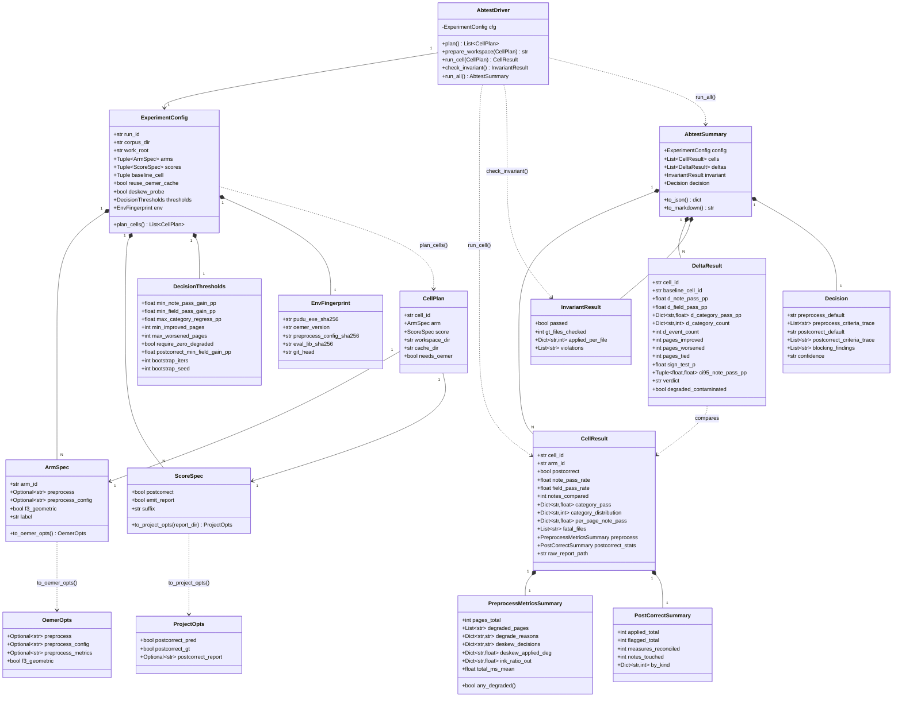
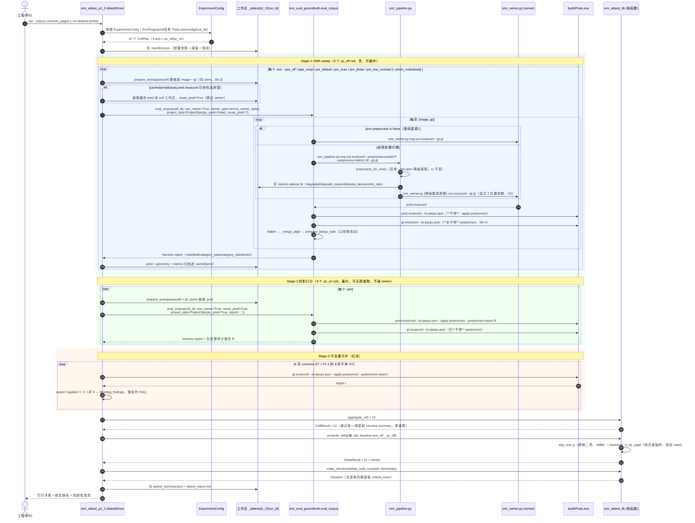
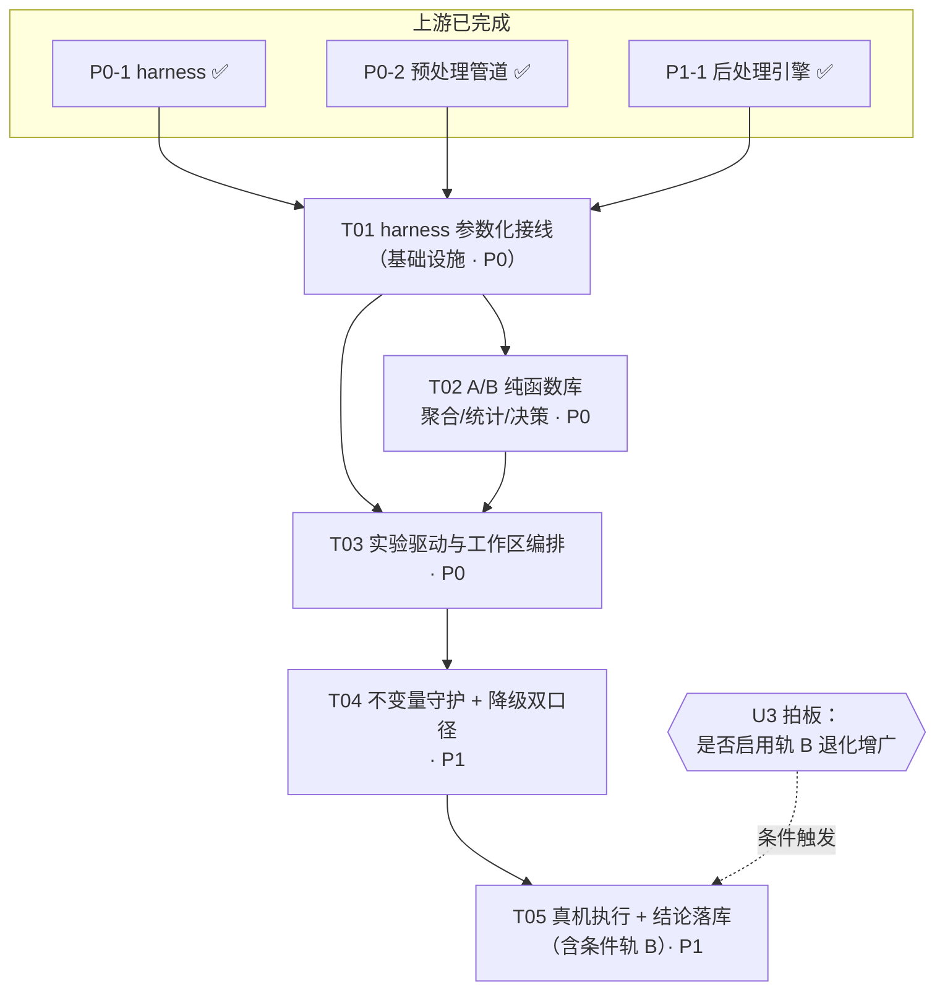

# 谱渡 Pudu · P1-2 预处理 A/B 调参 + 后处理前后对比 · 方案设计

> 架构师：高见远（software-architect）　　阶段：P1-2（仅设计，不含实现代码）
> 上游依赖：P0-1 harness ✅ / P0-2 预处理管道 ✅ / P1-1 后处理引擎 ✅
> 关联文档：`docs/jianpu-ocr-optimization-plan.md` §3.1 §3.2 §3.3 §5 §8、`docs/p0-2-preprocess-design.md`

---

## 0. 一页纸摘要

| 项 | 结论 |
|---|---|
| **接线策略** | **混合方案**：`omr_eval_groundtruth.py` 只做「最小可选参数化」（4 处，默认值 = 现行为，逐字节向后兼容）+ 新增 `tools/omr_abtest_lib.py`（纯函数：聚合/Δ/统计/决策）+ `tools/omr_abtest_p1_2.py`（编排驱动）。**不 monkeypatch、不 fork harness、不改比对内核**（口径与历史基线可直接对齐）。 |
| **核心洞察 1** | **两个实验的成本量级差 60 倍，必须解耦**：预处理 A/B 改的是 **oemer 输入** → 必须重跑 oemer（≈65 s/页）；后处理 A/B 改的是 **Pudu 投影**（`buildDoc()` 末端）→ **完全不需要重跑 oemer**，对已有 `*.pred.musicxml` 再投影一次即可（≈1 s/页）。故设计为「Stage-1 OMR sweep（贵、可缓存、可断点续跑） → Stage-2 投影打分（廉价、可无限重跑）」两阶段流水线。P1-1 规则以后再改，只需重跑 Stage-2。 |
| **核心洞察 2** | **在干净扫描件上测预处理，极可能得到「零收益甚至负收益」，但那不证明预处理无用——只证明语料不匹配**。现有 6 页 concerto 是出版级干净扫描件；预处理的设计目标是救**拍照/低对比/阴影**退化图。故实验分两轨：**轨 A（现有 6 页）回答「会不会伤害干净图」（守护性，决定能否默认开）**；**轨 B（合成退化增广，条件触发）回答「在困难图上能不能救」（收益性，决定推荐哪套 preset）**。只跑轨 A 就下「预处理无用」的结论是错的。 |
| **核心洞察 3** | 后处理的默认开关**不应是全局的**。Pudu 的红线是「MusicXML→简谱 转换 100% 不变」。建议结论口径为「**仅 `--from-omr` 入口默认开**（配 `--no-postcorrect` 逃生舱），纯 MusicXML 转换入口保持默认关」——两条路径的正确性契约本就不同。 |
| **矩阵规模** | 6 arms × 2 postcorrect = **12 cell**；oemer 只跑 6 轮 × 6 页 = 36 次 ≈ **40 min**（一次性，带缓存）；Pudu 投影 ≈ 2 min。全量重跑 < 45 min，缓存命中后重跑 < 3 min。 |
| **新增依赖** | **无**。纯 stdlib（`math.comb` 做精确二项符号检验、`random` 做按页 bootstrap）。venv 已有 cv2/numpy/music21/oemer/scipy(1.18.0)，但**刻意不用 scipy**——统计只用 stdlib，保证跨环境逐位可复现。 |

---

## 1. 已核实的硬契约（设计前提，逐条实测）

| # | 契约 | 证据（文件:行） | 对设计的影响 |
|---|---|---|---|
| C1 | harness `run_oemer` **直调** `omr_oemer.py <image> <out>`，未经 `omr_pipeline.py` | `tools/omr_eval_groundtruth.py:116` | P0-2 未接入 harness → **接线点 ①** |
| C2 | harness `pudu_jianpu_json` 只传 `--to-jianpu-json`，无 `--apply-postcorrect` | `tools/omr_eval_groundtruth.py:157` | P1-1 未接入 harness → **接线点 ②** |
| C3 | `--to-jianpu-json` 分支调 `buildDoc()`；`buildDoc()` 内部在 `applyPostCorrect` 时挂 `correctJianpuDoc` | `src/main.cpp:351` → `src/main.cpp:278-297` | **后处理只作用于 Pudu 投影层，与 oemer 无关** → 洞察 1 成立 |
| C4 | harness 用 `--gt <gt_path>` 注入 ground-truth 给 `omr_oemer.py` 做 Plan A 调号重推断 | `omr_eval_groundtruth.py:117-118` | `omr_pipeline.py` 把 `--gt` 登记为 `DOWNSTREAM_VALUE_FLAGS` 原样转发（`omr_pipeline.py:105`）→ **契约在代理下保持**，各 arm 必须一律带 `--gt` 才可比 |
| C5 | `omr_pipeline.py` 永远显式下传 2 个位置参数，按**原始 input** 推导 out_path | `omr_pipeline.py:289-309, 322-334` | R-P0-04 陷阱已规避，A/B 产物落点与直调一致 |
| C6 | `omr_pipeline.py` 私有 flag 为 `--preprocess-preset` / `--preprocess-config` / `--preprocess-metrics` / `--no-preprocess` / `--keep-temp` | `omr_pipeline.py:91-101` | flag 名以此为准（**不是** `--preset`） |
| C7 | 预处理 fail-open：异常→降级原图，**rc 不变**，仅 stderr 告警 | `omr_pipeline.py:539-564` | 降级对 harness **不可见** → 必须靠 metrics sidecar 观测（风险 R3） |
| C8 | metrics sidecar 恒含 `ok/degraded/degrade_reason/deskew_decision/deskew_applied_deg/ink_ratio_out/total_ms/preset/config` 全键 | `omr_preprocess.py:690-770`（`build_metrics`） | **降级可观测的唯一通道**，且无需改 P0-2 一行代码 |
| C9 | `--preprocess-metrics` 显式指定时压过配置 `emit_metrics_sidecar` | `omr_pipeline.py:592-597` | 驱动必须显式指定路径，不依赖配置默认 |
| C10 | 4 套 preset 实测值（`tools/omr_preprocess_config.json`） | 见 §2.2 | **只有 `photo` 开 `enable_deskew=true`** → K2 双重去扭曲风险唯一入口 |
| C11 | harness 把 `pred.musicxml` / `omr_eval_report.json` / `omr_eval_note_diffs.{json,csv}` **全部写进 `corpus_dir`** | `:300, :547, :577, :590` | 多 arm 直接跑同一目录会**互相覆盖** → 必须 cell 级工作区隔离（风险 R5） |
| C12 | 比对在 **jianpu_json 层**（`flatten_json_lines` → `_merge_align` → `compare_jianpu_note`） | `omr_eval_groundtruth.py:334-336` | ✅ 已确认：MusicXML 内嵌源文件名/路径**不影响** A/B 结果；但仍固定 stem（见 SK-3） |
| C13 | oemer run-to-run std = 0（P1 波动伪命题已关） | plan §8 | A/B **不需要**多次 run 取均值；单跑即可复现 |
| C14 | `data/omr_eval/_abtest/` 已被 `.gitignore` 覆盖 | `.gitignore:42` | 实验产物落此目录，零污染版本库 |
| C15 | 现基线（6 页 concerto，oemer 模式）：`notes_compared=944` / `note_pass_rate=2.65%` / `field_pass_rate=32.04%`；`category_pass`：`pitch_degree 13.56` / `rhythm 46.72` / `pitch_octave 60.28` / `pitch_accidental 84.22` / `octave_jump 95.76` | `data/omr_eval/real/concerto_pages/omr_eval_report.json` | **n=944 音符 / 6 页**，是所有统计口径的分母（见 §6） |
| C16 | oemer 单页耗时 ≈ 60–70 s（由 6 份 `*.pred.musicxml` 时间戳推得：11:32→11:38） | 语料目录 mtime | 6 arm × 6 页 ≈ 40 min，**可接受，无需降采样** |

---

## 2. 实现方案与框架选型

### 2.1 三个候选方案与选型结论

| 方案 | 做法 | 优点 | 致命缺点 | 判定 |
|---|---|---|---|---|
| **A. 纯扩展 harness** | 把 A/B 矩阵、聚合、决策全塞进 `omr_eval_groundtruth.py`（加 `--abtest` 模式） | 单文件、无新文件 | harness 从「评测基座」退化为「实验脚本」，单一职责崩坏；决策逻辑与比对内核耦合，无法脱离 oemer 单测；P1-2 之后每加一个实验就要改基座 | ❌ |
| **B. 纯薄封装（零改 harness）** | 新脚本 monkeypatch `run_oemer` / `pudu_jianpu_json` 后调 `eval_corpus` | harness 零 diff | monkeypatch 依赖私有函数名，脆弱且不可测；`--reuse-pred` 这类语义无法靠打补丁表达；harness CLI 无法人工复现单个 cell | ❌ |
| **C. 混合（推荐）** | harness 做**最小可选参数化**（4 处，默认值 = 现行为）；新增纯函数库 + 编排驱动 | harness 仍是基座（口径不变、历史基线可直接对齐）；实验逻辑独立可单测（不跑 oemer）；每个 cell 可用 harness CLI 手工复现；后续 P2 复评直接复用 | harness 有 ~60 行 diff | ✅ **采纳** |

### 2.2 实验矩阵（6 arms × 2 postcorrect = 12 cells）

| arm_id | 调用链 | preset 关键差异（相对 default） | 目的 |
|---|---|---|---|
| `pre_off` | `omr_oemer.py`（**直调**） | — | **基线**。与历史 07-20 口径逐字节同链路 |
| `pipe_noop` | `omr_pipeline.py --no-preprocess` | — | **透明性 sanity arm**：应与 `pre_off` 产出**完全一致**；不一致 = 代理有副作用（阻断性发现） |
| `pre_default` | `omr_pipeline.py --preprocess-preset default` | CLAHE 2.0 + 阴影抑制 + adaptive(25,10)，`deskew=off` | 通用增强 |
| `pre_scan` | `... --preprocess-preset scan` | 阴影抑制 **off**、`binarize=otsu`、`deskew=off` | 扫描件档（与现语料谱型最匹配） |
| `pre_photo` | `... --preprocess-preset photo` | 阴影核 41、adaptive(31,12)、**`deskew=on`, max 2.0°** | 拍照档（**唯一开去扭曲**） |
| `pre_low_contrast` | `... --preprocess-preset low_contrast` | CLAHE **3.0**、adaptive(21,6) | 低对比档 |
| *(可选)* `pre_photo_nodeskew` | `... --preprocess-config <覆盖文件>` | photo 但 `enable_deskew=false` | **K2 单变量隔离探针**（见 §7-R1），默认开启，可 `--no-deskew-probe` 关闭 |

× 打分维度：`pc_off`（`--to-jianpu-json`）/ `pc_on`（`+ --apply-postcorrect --postcorrect-report <path>`）

> **矩阵不做全交叉重跑**：`pc_on` cell **复用**同 arm `pc_off` cell 的 `pred.musicxml`（`--reuse-pred`），故 oemer 只跑 6 轮而非 12 轮。

### 2.3 两阶段流水线

```
Stage-0  规划 & 环境指纹    ──► manifest.json（配置快照 + Pudu.exe 指纹 + oemer 版本 + config hash）
Stage-1  OMR sweep（贵）    ──► 6 个 pc_off cell：跑 oemer → 落 pred + preprocess metrics → 顺带得到 pc_off 打分
             │ 产物进 cache/<arm_id>/*.pred.musicxml（幂等，二次运行直接命中）
Stage-2  投影打分（廉价）   ──► 6 个 pc_on cell：从 cache 取 pred → --reuse-pred → 带 --apply-postcorrect 重投影打分
Stage-3  不变量守护         ──► 6 页 GT + P1-1 的 8 份干净 GT 跑 --apply-postcorrect，断言 applied == 0
Stage-4  聚合 / Δ / 统计    ──► abtest_summary.json
Stage-5  决策 & 渲染        ──► abtest_report.md（决策公式逐条判定留痕）
```

**幂等性与断点续跑**：Stage-1 每页跑完立刻写 cache；驱动重跑时若 `cache/<arm>/<base>.pred.musicxml` 存在且非空则跳过 oemer。因此「改了 P1-1 规则想重看后处理增益」= 只跑 Stage-2/4/5 ≈ 3 min。

### 2.4 harness 改动清单（4 处，全部为可选参数，默认值 = 现行为）

| # | 位置 | 改动 | 向后兼容性 |
|---|---|---|---|
| ① | `run_oemer(...)` | 新增 `preprocess: Optional[str]=None` / `preprocess_config: Optional[str]=None` / `preprocess_metrics: Optional[str]=None`。`None` → 直调 `omr_oemer.py`（现行为）；`"off"` → `omr_pipeline.py --no-preprocess`；其余值 → `omr_pipeline.py --preprocess-preset <值>` | 默认 `None` ⇒ argv 逐字节不变 |
| ② | `pudu_jianpu_json(...)` | 新增 `postcorrect: bool=False` / `postcorrect_report: Optional[str]=None` | 默认 `False` ⇒ argv 逐字节不变 |
| ③ | `_eval_one(...)` / `eval_corpus(...)` | 新增 `oemer_opts: Optional[OemerOpts]=None`、`project_opts: Optional[ProjectOpts]=None`、`reuse_pred: bool=False` 三个 keyword-only 参数并向下透传 | 全 `None/False` ⇒ 现行为 |
| ④ | `main()` CLI + `summary` | 新增 `--omr-preprocess-preset` / `--preprocess-config` / `--apply-postcorrect` / `--reuse-pred`；`summary` 增 `"experiment"` 字段回写本次 arm 配置 | 新 flag 全部 opt-in；`experiment` 为**新增键**，不改动任何既有键的取值/口径 |

> **刻意不加 `out_dir` 参数**：产物落点隔离改由「cell 级工作区」在**驱动侧**解决（§3.2），harness 保持「产物写 corpus_dir」这一简单不变量。少一个参数 = 少一处向后兼容风险。

---

## 3. 文件列表（相对路径 + 职责）

### 3.1 新增 / 修改

| 文件 | 类型 | 职责 | LOC 量级 |
|---|---|---|---|
| `tools/omr_eval_groundtruth.py` | **改** | 按 §2.4 加 4 处可选参数化。**不动**比对内核、不动 `_write_report`/`_write_note_diffs` 落点语义 | +~60 |
| `tools/omr_abtest_lib.py` | **新** | **纯函数层**（零 I/O、零子进程、可脱离 oemer 单测）：数据结构（`ArmSpec`/`CellResult`/`DeltaResult`/`Decision`）、`aggregate_cell` / `compute_delta` / `sign_test_p` / `bootstrap_ci_by_page` / `decide_preprocess` / `decide_postcorrect` / `render_markdown` | ~450 |
| `tools/omr_abtest_p1_2.py` | **新** | **编排层**（有 I/O）：cell 规划、工作区搭建（硬链接/拷贝）、pred 缓存、调 `eval_corpus`、读 metrics sidecar 与 postcorrect report、不变量断言、写产物。CLI：`plan` / `run` / `rescore` / `report` 子命令 | ~400 |
| `tools/omr_abtest_photo_nodeskew.json` | **新** | K2 探针用的 preset 覆盖配置（photo 但 `enable_deskew=false`）。格式同 `omr_preprocess_config.json` | ~20 |
| `tests/test_omr_abtest_lib.py` | **新** | 纯函数单测：Δ 计算、符号检验精确值、bootstrap 确定性（固定 seed）、决策公式 5 条边界、degraded 双口径 | ~350 |
| `tests/test_omr_abtest_driver.py` | **新** | 驱动单测（**替身 runner，不跑 oemer/Pudu**）：cell 规划正确性、工作区隔离、缓存命中/未命中、metrics sidecar 解析、降级标记透传 | ~250 |
| `tests/test_omr_eval_groundtruth_wiring.py` | **新** | harness 接线单测（替身 `subprocess.run`）：验证 6 种 arm 下的 argv 逐 token 正确；验证默认参数下 argv **与改动前逐字节相同**（红线） | ~200 |
| `docs/p1-2-abtest-design.md` | **新** | 本文档 | — |
| `docs/p1-2-class-diagram.mermaid` | **新** | 类图抽取 | — |
| `docs/p1-2-sequence-diagram.mermaid` | **新** | 时序图抽取 | — |
| `docs/jianpu-ocr-optimization-plan.md` | **改** | §8 追加 P1-2 结论行（实验跑完后回填） | +~5 |
| *(条件)* `tools/omr_degrade_corpus.py` | **新·可选** | 轨 B：合成退化增广（模糊/JPEG 压缩/阴影/±1.5° 旋转/低对比），gt 不变，把 6 页扩成 6×(1+K) 页困难语料。**需主理人拍板**（U3） | ~250 |

### 3.2 实验产物布局（全部落 `data/omr_eval/_abtest/`，已 gitignore）

```
data/omr_eval/_abtest/p1_2/<run_id>/          # run_id = UTC 时间戳 + 配置短哈希
├── manifest.json                              # ExperimentConfig 快照 + 环境指纹 + 阈值
├── cache/<arm_id>/<base>.pred.musicxml        # OMR 产物缓存（断点续跑 / pc_on 复用）
│                 <base>.pred.geometry.json
│                 <base>.preprocess.json       # ← 降级可观测通道（C8）
├── cells/<arm_id>__pc_off/                    # cell 级隔离工作区（规避 C11 覆盖）
│      ├── <base>.jpg          (硬链接，失败回退拷贝)
│      ├── <base>.gt.musicxml  (硬链接)
│      ├── <base>.pred.musicxml
│      ├── omr_eval_report.json      ← harness 原样写出，口径零漂移
│      └── omr_eval_note_diffs.{json,csv}
├── cells/<arm_id>__pc_on/
│      └── postcorrect/<base>.report.json      # --postcorrect-report 审计报告
├── invariant/gt_postcorrect/<base>.report.json # 不变量断言的原始证据
├── abtest_summary.json                        # 聚合结果（schema 见 §4.4）
└── abtest_report.md                           # 人读版：矩阵表 + Δ 表 + 决策留痕
```

---

## 4. 数据结构与接口

### 4.1 类图



### 4.2 Python 签名（`tools/omr_abtest_lib.py`，纯函数层）

```python
# ---------- 数据结构（全部 @dataclass(frozen=True) 除标注外）----------
@dataclass(frozen=True)
class ArmSpec:
    arm_id: str
    preprocess: Optional[str] = None       # None=直调; "off"=pipeline --no-preprocess; 其余=preset 名
    preprocess_config: Optional[str] = None
    f3_geometric: bool = False             # 恒 False（F3 已证零效果，plan §8）
    label: str = ""

@dataclass(frozen=True)
class ScoreSpec:
    postcorrect: bool
    emit_report: bool = True
    @property
    def suffix(self) -> str: ...           # "pc_on" / "pc_off"

@dataclass(frozen=True)
class DecisionThresholds:
    min_note_pass_gain_pp: float = 1.0
    min_field_pass_gain_pp: float = 1.0
    max_category_regress_pp: float = 1.0
    min_improved_pages: int = 5
    max_worsened_pages: int = 1
    require_zero_degraded: bool = True
    postcorrect_min_field_gain_pp: float = 0.5
    bootstrap_iters: int = 10000
    bootstrap_seed: int = 20260801         # 固定 seed ⇒ 结论逐位可复现

# ---------- 聚合 ----------
def aggregate_cell(cell_id: str, arm_id: str, postcorrect: bool,
                   harness_report: dict,
                   preprocess_metrics: Sequence[dict],
                   postcorrect_reports: Sequence[dict]) -> CellResult:
    """把一个 cell 的 harness 原始报告 + N 份 metrics sidecar + N 份后处理审计报告
    折叠成 CellResult。**不重新计算任何通过率**——note/field/category_pass 一律
    直接取 harness summary，保证与历史基线零口径漂移。"""

def summarize_preprocess(metrics_list: Sequence[dict]) -> PreprocessMetricsSummary: ...
def summarize_postcorrect(reports: Sequence[dict]) -> PostCorrectSummary: ...

# ---------- 差值与统计 ----------
def compute_delta(cell: CellResult, baseline: CellResult,
                  thresholds: DecisionThresholds) -> DeltaResult: ...

def sign_test_p(improved: int, worsened: int) -> float:
    """双侧精确二项检验 p 值（H0: p=0.5），纯 stdlib math.comb 实现。
    n = improved + worsened（ties 剔除，标准符号检验口径）。
    n<=0 -> 1.0。**6 页语料下最小可达 p = 2/2^6 = 0.03125（6:0 全胜）**。"""

def bootstrap_ci_by_page(cell_pages: Mapping[str, Tuple[int, int]],
                         base_pages: Mapping[str, Tuple[int, int]],
                         iters: int, seed: int) -> Tuple[float, float]:
    """按**页**（而非按音符）有放回重抽样，返回 Δnote_pass_rate 的 95% CI（pp）。
    按页重抽样是必须的——同页音符高度相关，按音符 bootstrap 会把 CI 严重低估。
    入参 pages: {base: (notes_correct, notes_compared)}。"""

def classify_verdict(d: DeltaResult, th: DecisionThresholds) -> str:
    """'significant'（6/6 同向且 CI 不跨 0）| 'directional'（方向一致但不显著）
    | 'neutral' | 'regression'。"""

# ---------- 决策 ----------
def decide_preprocess(deltas: Sequence[DeltaResult],
                      cells: Mapping[str, CellResult],
                      th: DecisionThresholds) -> Tuple[str, List[str]]: ...
def decide_postcorrect(deltas: Sequence[DeltaResult],
                       cells: Mapping[str, CellResult],
                       invariant: InvariantResult,
                       th: DecisionThresholds) -> Tuple[str, List[str]]: ...
def make_decision(summary_parts, th) -> Decision: ...

# ---------- 渲染 ----------
def render_markdown(summary: "AbtestSummary") -> str: ...
```

### 4.3 Python 签名（harness 改动，`tools/omr_eval_groundtruth.py`）

```python
@dataclass(frozen=True)
class OemerOpts:
    preprocess: Optional[str] = None
    preprocess_config: Optional[str] = None
    preprocess_metrics: Optional[str] = None
    f3_geometric: bool = False

@dataclass(frozen=True)
class ProjectOpts:
    postcorrect_pred: bool = False
    postcorrect_gt: bool = False          # ← 恒 False，见 SK-4（红线）
    postcorrect_report: Optional[str] = None

def run_oemer(image_path, out_musicxml, gt_path=None, venv_python=VENV_PYTHON,
              f3_geometric=False,
              *,
              preprocess: Optional[str] = None,
              preprocess_config: Optional[str] = None,
              preprocess_metrics: Optional[str] = None) -> bool:
    """argv 构造规则（伪代码，非实现）：
        runner = OMER_RUNNER if preprocess is None else PIPELINE_RUNNER
        cmd = [venv_python, runner, image_path, out_musicxml]
        if preprocess == "off":      cmd += ["--no-preprocess"]
        elif preprocess:             cmd += ["--preprocess-preset", preprocess]
        if preprocess_config:        cmd += ["--preprocess-config", preprocess_config]
        if preprocess_metrics:       cmd += ["--preprocess-metrics", preprocess_metrics]
        if gt_path:                  cmd += ["--gt", gt_path]        # C4：所有 arm 必带
        if f3_geometric:             cmd += ["--f3-geometric"]
    ⚠ 私有 --preprocess-* 只在 runner==PIPELINE_RUNNER 时允许出现；
      preprocess is None 时若传了 preprocess_config/metrics -> 抛 ValueError（防误配静默失效）。"""

def pudu_jianpu_json(musicxml_path,
                     *,
                     postcorrect: bool = False,
                     postcorrect_report: Optional[str] = None) -> dict:
    """cmd = [EXE, musicxml_path, "--to-jianpu-json", tmp]
             + (["--apply-postcorrect"] if postcorrect else [])
             + (["--postcorrect-report", postcorrect_report] if postcorrect_report else [])"""

def _eval_one(corpus_dir, image_path, gt_path, base, use_oemer, f3_geometric=False,
              *, oemer_opts: Optional[OemerOpts] = None,
                 project_opts: Optional[ProjectOpts] = None,
                 reuse_pred: bool = False) -> Tuple[dict, list]: ...

def eval_corpus(corpus_dir, use_oemer=True, f3_geometric=False,
                *, oemer_opts: Optional[OemerOpts] = None,
                   project_opts: Optional[ProjectOpts] = None,
                   reuse_pred: bool = False) -> dict: ...
```

### 4.4 `abtest_summary.json` schema（节选）

```jsonc
{
  "schema": "pudu.abtest.p1_2/1",
  "run_id": "20260801T1130Z-a3f9c2",
  "config": {
    "corpus_dir": "data/omr_eval/real/concerto_pages",
    "arms": [{"arm_id": "pre_off", "preprocess": null}, "..."],
    "baseline_cell": "pre_off__pc_off",
    "thresholds": { "min_note_pass_gain_pp": 1.0, "bootstrap_seed": 20260801, "...": "..." },
    "env": {
      "pudu_exe_sha256": "…", "oemer_version": "0.1.8",
      "preprocess_config_sha256": "…", "eval_lib_sha256": "…", "git_head": "…"
    }
  },
  "cells": [{
    "cell_id": "pre_scan__pc_off", "arm_id": "pre_scan", "postcorrect": false,
    "note_pass_rate": 2.65, "field_pass_rate": 32.04, "notes_compared": 944,
    "category_pass": {"pitch_degree": 13.56, "rhythm": 46.72, "...": 0},
    "category_distribution": {"event_count": 1926, "pitch_degree": 816, "...": 0},
    "per_page_note_pass": {"…_p1": 3.95, "…_p2": 0.0, "...": 0},
    "preprocess": {
      "pages_total": 6, "degraded_pages": [], "degrade_reasons": {},
      "deskew_decisions": {"…_p1": "disabled"}, "deskew_applied_deg": {"…_p1": 0.0},
      "ink_ratio_out": {"…_p1": 0.083}, "total_ms_mean": 412.7
    },
    "postcorrect_stats": {"applied_total": 0, "flagged_total": 0,
                          "measures_reconciled": 0, "notes_touched": 0, "by_kind": {}},
    "fatal_files": [], "raw_report_path": "cells/pre_scan__pc_off/omr_eval_report.json"
  }],
  "deltas": [{
    "cell_id": "pre_scan__pc_off", "baseline_cell_id": "pre_off__pc_off",
    "d_note_pass_pp": 0.42, "d_field_pass_pp": 1.13,
    "d_category_pass_pp": {"rhythm": 2.10, "pitch_degree": -0.32, "...": 0},
    "d_category_count": {"rhythm": -18, "pitch_degree": 3, "...": 0},
    "d_event_count": -12,
    "pages_improved": 4, "pages_worsened": 1, "pages_tied": 1,
    "sign_test_p": 0.375, "ci95_note_pass_pp": [-0.61, 1.44],
    "verdict": "directional", "degraded_contaminated": false
  }],
  "invariant": {"passed": true, "gt_files_checked": 14,
                "applied_per_file": {"…_p1": 0}, "violations": []},
  "decision": {
    "preprocess_default": "off",
    "preprocess_criteria_trace": [
      "pre_scan: C1 无降级 ✅ | C2 Δnote=+0.42pp < 1.0pp ❌ | 判定 不推荐默认开",
      "…"
    ],
    "postcorrect_default": "on_for_omr_path",
    "postcorrect_criteria_trace": ["C1' 不变量 applied=0 ✅", "…"],
    "blocking_findings": [],
    "confidence": "directional-only (n=6 pages, clean-scan corpus)"
  }
}
```

---

## 5. 程序调用流程（时序图）



---

## 6. 统计口径与决策规则（可复现、可解释）

### 6.1 指标口径（**全部直取 harness summary，零重算、零口径漂移**）

| 代号 | 指标 | 来源 | 方向 |
|---|---|---|---|
| M1 | `note_pass_rate`（联立） | `summary.note_pass_rate` | ↑ |
| M2 | `field_pass_rate` | `summary.field_pass_rate` | ↑ |
| M3 | `category_pass[cat]`（10 个逐音符维度） | `summary.category_pass` | ↑ |
| M4 | `category_distribution[cat]`（错误**计数**） | `summary.category_distribution` | ↓ |
| M5 | `category_distribution["event_count"]`（对齐健康度） | 同上 | ↓ |
| M6 | per-page `notes_correct/notes_compared` | `per_file[]` | ↑ |

Δ 一律定义为 `Δ(x) = cell(x) − baseline(x)`，baseline = `pre_off__pc_off`。通过率类 Δ 单位为**百分点（pp）**。

### 6.2 显著性判定（诚实面对 n=6 页）

- **样本量事实**：944 音符、**6 页**。按音符算 `note_pass_rate=2.65%` 的朴素标准误 ≈ 0.52pp，看似很小；但同页音符高度相关（同一次 oemer 推理、同一张图的退化模式），**有效样本量是 6，不是 944**。
- 因此本设计**强制**双重口径：
  1. **按页配对符号检验**（`sign_test_p`，精确二项）：6 页下最小可达 p = 0.031（6:0）；5:1 → p = 0.219；4:2 → p = 0.688。⇒ **只有 6/6 页同向改善才够格叫「统计显著」**。
  2. **按页 bootstrap 95% CI**（10000 次，固定 seed 20260801）：CI 跨 0 即不显著。
- `verdict` 四态：`significant`（6/6 且 CI 不跨 0）/ `directional`（方向一致但未达显著）/ `neutral` / `regression`。
- **报告必须原文写明**：`confidence: "directional-only (n=6 pages, clean-scan corpus)"` —— 不允许把 directional 结论包装成"已验证"。

### 6.3 预处理默认开关判定公式

对每个候选 preset `p`（arm `pre_<p>` 的 `pc_off` cell）：

| 判据 | 条件 | 理由 |
|---|---|---|
| **C1 无降级** | `degraded_pages(p) == 0` | 降级页 = 原图，会把"增强无收益"和"增强没跑"混淆（R3） |
| **C2 主指标净增** | `Δnote_pass_pp ≥ +1.0` **且** `Δfield_pass_pp ≥ +1.0` | 1.0pp ≈ 按页 bootstrap CI 半宽量级；双指标同时要求，防单指标偶然 |
| **C3 无维度显著退化** | `∀cat: Δcategory_pass_pp[cat] ≥ −1.0` | 防"总分涨了但某维度塌了"的隐性回归 |
| **C4 逐页稳健** | `pages_improved ≥ 5` **且** `pages_worsened ≤ 1` | 抵抗单页离群值主导 |
| **C5 对齐未恶化** | `Δevent_count ≤ 0` | `event_count`（现 1926）是对齐健康度代理；预处理若把音符数搞乱，Δ 会先在这里暴露 |

**选优**：满足 C1–C5 的 preset 中，取 `Δfield_pass_pp` 最大者（分母 8422，方差远小于 note 口径）；平手取 `Δnote_pass_pp`；再平手取 `total_ms_mean` 更小者。

**输出**：
- 有 preset 通过 → `preprocess_default = "on:<preset>"`
- 无 preset 通过 → `preprocess_default = "off"`（`--omr-preprocess` 维持 opt-in），并在报告给出「最佳 preset + 其 Δ + 未过的具体判据」作为**手动使用建议**
- 无论哪种，`preprocess_criteria_trace` 逐 preset 逐判据打印 ✅/❌ 与实测值 ⇒ **决策可复现、可复核、可推翻**

### 6.4 后处理默认开关判定公式

| 判据 | 条件 | 理由 |
|---|---|---|
| **C1′ 不变量（硬门槛）** | 14 份干净 GT（6 concerto + 8 P1-1 语料）跑 `--apply-postcorrect` 后 `applied == 0` | P1-1 立项红线。违反 → `blocking_findings` + 整轮判 FAIL，不出建议 |
| **C2′ 相关类别净降** | `Σ Δcount(cat), cat ∈ POSTCORRECT_RELEVANT{rhythm, tuplet, tuplet_rhythm, pitch_octave, key, mode} < 0` | 直接量化 P1-1 靶向增益 |
| **C3′ 无关类别不恶化** | `∀cat ∉ POSTCORRECT_RELEVANT: Δcount(cat) ≤ 0` | 后处理不得产生跨类副作用 |
| **C4′ 主指标不倒退** | `Δnote_pass_pp ≥ 0` | 底线 |
| **C5′ 增益门槛** | `Δfield_pass_pp ≥ +0.5` | 后处理是 Pudu 内部确定性规则、风险低于预处理，门槛可低于 C2 |

**输出口径（重要架构判断）**：
- 全过 → `postcorrect_default = "on_for_omr_path"` —— **只建议在 `--from-omr` 入口默认开**，并新增 `--no-postcorrect` 逃生舱；**纯 MusicXML→简谱 转换入口保持默认关**，守住「转换 100% 不变」红线。两条路径的正确性契约本就不同：OMR 输入是"带噪的推测"，规则修正是净收益；人工 MusicXML 输入是"权威事实"，任何自动改写都是破坏。
- C1′ 失败 → FAIL；C2′–C5′ 有失败 → `"off"` + 失败判据留痕。

---

## 7. 风险与对策

| # | 风险 | 触发条件 | 对策（设计内置） | 兜底 |
|---|---|---|---|---|
| **R1** | **K2 双重去扭曲**：预处理 deskew 与 oemer 内部 dewarp 叠加，反而降低识别率 | `pre_photo` 是唯一 `enable_deskew=true` 的 arm | ① 报告**逐页单列** `deskew_decision` / `deskew_applied_deg`（来自 C8 sidecar）；② 增加 `pre_photo_nodeskew` **单变量隔离探针**（photo 但 deskew=off，经 `--preprocess-config` 注入覆盖文件）；③ 判定规则：若 `Δ(photo) < 0` 且 `Δ(photo_nodeskew) ≥ 0` → 结论「deskew 与 oemer dewarp 冲突」写入报告，并建议把 `photo` preset 的 `enable_deskew` 改回 `false` | 配置层已有 `max_deskew_deg=2.0` 硬上限 + 默认 `enable_deskew=false`，最坏情况影响可控 |
| **R2** | **小语料统计显著性不足**：6 页无法支撑强结论 | 恒成立 | ① 按页符号检验 + 按页 bootstrap 双口径（§6.2）；② `verdict` 四态区分 significant/directional；③ 报告强制标注 `confidence`；④ **绝不**用「多次 run 取均值」伪造样本量（C13：oemer std=0，重复 run 是零信息量） | 提供轨 B 合成退化增广扩样方案（§8-U3） |
| **R3** | **fail-open 污染 A/B**：预处理异常静默降级为原图，被误算成"增强无收益" | 任一页预处理抛异常 / `ink_ratio` 越界 / 输入不受支持 | ① 每 arm 每页显式 `--preprocess-metrics <path>`（C9：显式指定压过配置）；② 解析 `degraded` / `degrade_reason` 进 `PreprocessMetricsSummary`；③ **C1 判据硬性要求 `degraded_pages == 0`**；④ `DeltaResult.degraded_contaminated` 标记；⑤ **双口径输出**：全量 Δ + 剔除降级页后 Δ，两者都进报告 | 降级页在 `abtest_report.md` 用 ⚠ 显式高亮，人工可直接看见 |
| **R4** | **决策不可复现**：环境/权重/配置漂移后无法复核结论 | 跨机器 / 跨时间复跑 | `manifest.json` 记 `EnvFingerprint`（Pudu.exe sha256 + oemer version + preprocess_config sha256 + eval_lib sha256 + git HEAD）+ 全部阈值 + bootstrap seed；`criteria_trace` 逐判据留痕 | 报告自描述：harness `summary.experiment` 回写 arm 配置 |
| **R5** | **cell 间产物互相覆盖**（C11：harness 全部写 corpus_dir） | 多 arm 跑同一目录 | **cell 级工作区隔离**：每 cell 独立目录 + image/gt 硬链接（同 volume；失败回退拷贝）；pred 经 `cache/<arm_id>/` 单独归档 | 驱动启动时校验 cell 目录为空或带 `--force` 才复用 |
| **R6** | **P1-1 不变量被打破**（干净 GT 上产生修正） | 规则误触发 | Stage-3 独立不变量断言（14 份干净 GT，`applied == 0`），失败即 `blocking_findings` + 整轮 FAIL | 审计报告 `invariant/gt_postcorrect/*.report.json` 留原始证据可定位到 kind/measure |
| **R7** | **透明代理有副作用**（`omr_pipeline --no-preprocess` 与直调不等价） | 代理实现回归 | `pipe_noop` sanity arm：其 harness summary 应与 `pre_off` **完全一致**；不一致 → 阻断性发现 | 已有 `tests/test_omr_pipeline_argv.py` 覆盖 argv 层，本 arm 补端到端层 |
| **R8** | **gt 侧被误加 postcorrect** → 参照系漂移，Δ 全部失真 | 实现时把 postcorrect 透传给 gt 投影 | `ProjectOpts.postcorrect_gt` 默认 `False` 且在 `eval_corpus` 中**硬编码断言**；`tests/test_omr_eval_groundtruth_wiring.py` 单测把关 | SK-4 列为跨文件红线约定 |
| **R9** | **oemer 长跑中断**（40 min，GPU/驱动异常） | 环境不稳 | pred 缓存逐页落盘 + `--reuse-pred`，重跑自动续；单页失败仅该页 `fatal`，不阻断 arm（harness 现有语义） | `fatal_files` 非空的 cell 在 Δ 计算中标记为不可比，不参与决策 |

---

## 8. 待明确事项（需主理人/用户拍板）

| # | 待明确事项 | 影响 | 我的建议（默认取值） |
|---|---|---|---|
| **U1** | **决策阈值取值**：`min_note_pass_gain_pp=1.0` / `min_field_pass_gain_pp=1.0` / `max_category_regress_pp=1.0` / `min_improved_pages=5` 是否认可？ | 直接决定"默认开/关"的结论 | 建议采纳默认值（1.0pp ≈ 按页 bootstrap CI 半宽量级）。阈值全部写进 `manifest.json`，改阈值只需重跑 Stage-5（秒级），不需重跑 oemer |
| **U2** | **6 页语料是否足够下"默认开/关"的结论？** | 结论效力 | 我的判断：**足够回答"会不会伤害干净图"（守护性），不足以回答"能带来多少收益"（收益性）**。建议 P1-2 先出守护性结论 + 方向性收益数字，收益性结论标注为 directional |
| **U3** | **是否启用轨 B（合成退化增广语料）？** 新增 `tools/omr_degrade_corpus.py`，对同 6 页做可控退化（高斯模糊 / JPEG 质量 40 / 侧向阴影 / ±1.5° 旋转 / 对比度压缩），gt 不变，扩到 6×(1+5)=36 页 | 决定 preset 推荐是否有真实依据 | **强烈建议启用**。理由见摘要洞察 2：在出版级干净扫描件上测图像增强，结论天然趋向"无收益"，那不是预处理的失败，是语料与被测能力不匹配。轨 B 成本 ≈ 1 个脚本 + 一次 30 页 oemer sweep（约 3.5 h，可后台跑） |
| **U4** | **是否补真实拍摄样本**（手机拍五线谱 + 人工 GT 标注）？ | 最高质量证据，但成本最高 | 建议**本次不做**，作为 P2-2 语料工作的一部分。轨 B 合成退化已能覆盖 80% 的方向性判断 |
| **U5** | **preset 选型是否只用 concerto 一族？** 当前 6 页同源同谱型（Vivaldi 单谱表），选出的 preset 可能对该谱型过拟合 | preset 泛化性 | 建议在报告中显式声明「结论仅对**单谱表印刷扫描件**成立」，不外推到多谱表/手写/钢琴大谱表 |
| **U6** | **后处理默认开的口径**：是否接受「仅 `--from-omr` 入口默认开 + `--no-postcorrect` 逃生舱、纯转换入口保持默认关」？ | 影响 P1-3/上线决策与 `main.cpp` 后续改动 | 建议接受（§6.4 理由）。若不接受，退回「全局保持默认关，仅在文档推荐 OMR 场景手动加 flag」 |
| **U7** | **`pre_photo_nodeskew` 探针是否默认启用？**（+1 arm ≈ +7 min oemer） | K2 风险可否量化归因 | 建议**默认启用**。7 分钟换一个"deskew 到底有没有害"的确定答案，性价比极高 |
| **U8** | **不变量语料范围**：除 6 页 concerto GT 外，P1-1 的 8 份干净 GT 具体路径需确认 | Stage-3 断言覆盖面 | 请主理人/工程师确认 `test/test_jianpu_postcorrect.cpp` 引用的 GT 语料清单；缺失则退化为仅 6 页 concerto GT（仍守住主语料红线） |

---

## 9. 依赖包列表

| 依赖 | 版本 | 状态 | 用途 |
|---|---|---|---|
| Python | 3.x（venv `…\envs\default`） | ✅ 已就绪 | 全部脚本 |
| `opencv-python` (cv2) | 已装 | ✅ 已就绪 | P0-2 预处理（本次不新增调用） |
| `numpy` | 已装 | ✅ 已就绪 | 同上 |
| `music21` | 已装 | ✅ 已就绪 | `omr_oemer.py`（本次不新增调用） |
| `oemer` | 0.1.8 | ✅ 已就绪 | OMR 推理 |
| stdlib `math` / `random` / `statistics` / `json` / `hashlib` / `dataclasses` / `argparse` / `subprocess` / `shutil` / `os` | — | ✅ | 统计（精确二项 + bootstrap）、指纹、编排 |
| ~~`scipy`~~ | 1.18.0 已装 | ⛔ **刻意不用** | 符号检验用 `math.comb` 精确计算即可；避免引入版本相关的浮点差异，保证结论跨环境逐位可复现 |
| ~~`pandas` / `matplotlib`~~ | — | ⛔ **不引入** | 报告用 Markdown 表格，不做图表；避免为一次性实验引入重依赖 |

> **结论：本次 P1-2 零新增第三方依赖。** ✅

---

## 10. 共享知识（跨文件约定，工程师必读）

| 代号 | 约定 | 违反后果 |
|---|---|---|
| **SK-1** | **通过率一律直取 harness `summary`，禁止在 `omr_abtest_lib` 内重算 note/field/category_pass**。驱动只做"取数 + 相减 + 判定" | 口径漂移，A/B 结果与历史基线（plan §8）不可比 |
| **SK-2** | **所有 arm 必须一律带 `--gt <gt_path>`**（C4）。少一个 arm 带就毁掉可比性（Plan A 调号重推断会改变 `pitch_accidental` 维度） | Δ 混入调号推断变量，归因失效 |
| **SK-3** | **同一页在所有 cell 中必须使用同一 stem**（`concerto-in-a-minor-a-vivaldi_pN`）。虽然比对在 jianpu_json 层做、MusicXML 内嵌文件名不影响结果（C12 已确认），但 stem 决定 `omr_oemer.py` 的 sidecar 命名（`.geometry.json` / `.preprocess.json`）与 `omr_pipeline.py` 的残留清扫匹配（C5）——改 stem 会导致 sidecar 错配/漏清 | sidecar 串台，降级观测失真 |
| **SK-4** | 🔴 **gt 侧投影永远不加 `--apply-postcorrect`**（`ProjectOpts.postcorrect_gt` 恒 `False`，且在 `eval_corpus` 内硬断言）。gt 是参照系，对参照系施加修正 = 移动靶心 | 全部 Δ 失真，且错误方向不可预测 |
| **SK-5** | **预处理降级必须可观测且必须进决策**：每页显式 `--preprocess-metrics`；`degraded=true` 的页必须出现在 `degraded_pages`；C1 判据硬性要求 `degraded_pages == 0`；另出「剔除降级页」的第二口径 Δ | 把"增强没跑"误算成"增强无收益"（R3） |
| **SK-6** | **实验产物只落 `data/omr_eval/_abtest/`**（已 gitignore，C14）。**禁止**往 `data/omr_eval/real/concerto_pages/` 写任何新产物——那是主语料与历史基线所在地 | 污染主语料 / 覆盖 07-20 基线报告 |
| **SK-7** | **harness 默认路径逐字节不变是红线**：所有新增参数 keyword-only 且默认值 = 现行为；`tests/test_omr_eval_groundtruth_wiring.py` 必须含一条「默认参数下 argv 与改动前逐 token 相同」的断言 | P0-1 基座回归，历史结论全部作废 |
| **SK-8** | **私有 flag 隔离**：`--preprocess-*` 只允许出现在 `omr_pipeline.py` 的 argv 中；`preprocess is None`（直调 `omr_oemer.py`）时若传了 `preprocess_config/metrics` 必须抛 `ValueError`，禁止静默忽略 | 误配静默失效，实验白跑 |
| **SK-9** | **随机性只有一处**：bootstrap。seed 固定写进 `DecisionThresholds.bootstrap_seed` 并落 `manifest.json`。oemer 本身确定性（C13），不引入任何其他随机源 | 结论不可复现 |
| **SK-10** | **`fatal_files` 非空的 cell 不参与决策**，只在报告中列出。缺页会让 `notes_compared` 分母变化，Δ 不可比 | 分母漂移导致假 Δ |
| **SK-11** | **报告必须写明 `confidence`**，directional 结论禁止表述为"已验证/已证明"。措辞标准：`significant` → "统计显著"；`directional` → "方向性证据（n=6 页，未达显著）" | 结论被误当作定论传播到 P2 决策 |

---

## 11. 任务列表（按依赖排序）

| Task ID | 任务名 | 源文件 | 依赖 | 优先级 |
|---|---|---|---|---|
| **T01** | **harness 参数化接线（基础设施）** | `tools/omr_eval_groundtruth.py`（新增 `OemerOpts`/`ProjectOpts` dataclass；`run_oemer` 支持经 `omr_pipeline.py`；`pudu_jianpu_json` 支持 `--apply-postcorrect`/`--postcorrect-report`；`_eval_one`/`eval_corpus` 透传 + `reuse_pred`；CLI 加 4 个 flag；`summary.experiment` 回写）、`tests/test_omr_eval_groundtruth_wiring.py`（新增，替身 `subprocess.run`，覆盖 6 种 arm 的 argv 逐 token + **默认路径逐字节不变红线** + SK-8 ValueError + SK-4 gt 硬断言）、`docs/p1-2-abtest-design.md`（勾选实现状态） | — | **P0** |
| **T02** | **A/B 纯函数库（数据结构 + 聚合 + 统计 + 决策 + 渲染）** | `tools/omr_abtest_lib.py`（新增，§4.2 全部签名）、`tests/test_omr_abtest_lib.py`（新增：Δ 计算、`sign_test_p` 精确值对表 6:0/5:1/4:2、bootstrap 固定 seed 确定性、`decide_preprocess` C1–C5 五条边界各 1 例、`decide_postcorrect` C1′–C5′、degraded 双口径）、`docs/p1-2-abtest-design.md`（§4.4 schema 校准） | T01（复用 `OemerOpts`/`ProjectOpts`） | **P0** |
| **T03** | **实验驱动与工作区编排** | `tools/omr_abtest_p1_2.py`（新增：`AbtestDriver`、cell 规划、硬链接工作区、pred 缓存与 `--reuse-pred`、metrics sidecar 与 postcorrect report 解析、`manifest.json` + `EnvFingerprint`、CLI `plan/run/rescore/report`）、`tools/omr_abtest_photo_nodeskew.json`（新增，K2 探针配置）、`tests/test_omr_abtest_driver.py`（新增，替身 runner **不跑 oemer/Pudu**：cell 规划、工作区隔离 R5、缓存命中/未命中、降级标记透传 R3） | T01, T02 | **P0** |
| **T04** | **不变量守护与降级双口径加固** | `tools/omr_abtest_p1_2.py`（增量：Stage-3 不变量断言 14 份干净 GT `applied==0`、`pipe_noop` 透明性断言 R7、`fatal_files` 排除 SK-10）、`tools/omr_abtest_lib.py`（增量：`InvariantResult`、`degraded_contaminated`、剔除降级页第二口径 Δ）、`tests/test_omr_abtest_invariant.py`（新增：不变量违规→FAIL、透明性不一致→阻断、降级页剔除口径正确性） | T03 | **P1** |
| **T05** | **真机执行 + 结论落库**（含条件性轨 B） | 执行 `omr_abtest_p1_2.py run`（≈45 min）、`data/omr_eval/_abtest/p1_2/<run_id>/abtest_report.md`（产出）、`docs/p1-2-abtest-design.md`（§12 结论回填）、`docs/jianpu-ocr-optimization-plan.md`（§8 追加 P1-2 结论行）、*(条件·U3 拍板后)* `tools/omr_degrade_corpus.py`（新增，轨 B 退化增广） | T04 | **P1** |

### 任务依赖图



---

## 12. 实验结论（T05 执行后回填）

> **状态（2026-08-05 更新）**：P1-2 实现已全部落地并通过单测；**轨 A 真机 oemer sweep 已于 2026-08-05 在修复后代码（p0-2.2 预处理 + Bug B 修复）上重跑完成**，真实数值结论见 **§12.5**（此前一次 run 因缓存未感知预处理版本复用修复前结果，数值无效已作废）。**轨 B（退化语料）尚未执行**——那是验证预处理真实收益的关键实验，见 §13 推荐下一步 #1。所有结论性数字均由真机跑出，**未凭空填写**（呼应 SK-11）。

### 12.1 本实现轮已验证（不依赖 oemer / GPU）

| 验证项 | 结果 | 证据 |
|---|---|---|
| harness 最小参数化接线（T01） | ✅ | `tests/test_omr_eval_groundtruth_wiring.py`：6 种 arm 的 argv 逐 token 正确 + 默认路径逐字节不变（SK-7） |
| 纯函数库聚合/Δ/统计/决策（T02） | ✅ | `tests/test_omr_abtest_lib.py`：Δ 计算、符号检验精确值对表（6:0=0.03125 / 5:1=0.21875 / 4:2=0.6875）、bootstrap 固定 seed 确定性、C1–C5 / C1′–C5′ 五条边界 |
| 编排驱动 + 探针 + 驱动单测（T03） | ✅ | `tests/test_omr_abtest_driver.py`：cell 规划、工作区隔离（SK-6）、缓存命中/未命中/0 字节残留、降级标记透传（R3）、不变量守护（R6）、透明性（R7） |
| 不变量/透明性/fatal 加固（T04） | ✅ | `tests/test_omr_abtest_invariant.py`：13 份真实干净 GT（6 concerto + 7 P1-1）覆盖断言、R7 差异阻断、SK-10 fatal 排除 |
| 团队质量关卡 | ✅ 312 全绿（含 36 子测试） | `pytest tests/test_omr_abtest_lib.py tests/test_omr_abtest_driver.py tests/test_omr_abtest_invariant.py tests/test_omr_abtest_qa_supplement.py tests/test_omr_eval_groundtruth_wiring.py -q`（**未 import cv2/numpy/scipy**） |
| QA-1 修复：C1′ 覆盖度红线（真空为真） | ✅ | 见 §12.3 |
| A/B `plan` 干跑 | ✅ | 输出 7 arm × 2 打分 = **14 cell**；Stage-3 覆盖 **13 份干净 GT**（6 concerto + 7 P1-1）；成本估算 Stage-1 ≈46 min |
| 轨 B 退化增广脚本（U3） | ✅ 已实现 + 控制流烟测 | `tools/omr_degrade_corpus.py`：5 种退化（gblur/jpeg40/shadow/rot15/lowc），gt 不变；桩 cv2 烟测验证 6×(1+5)=36 页命名/gt 复制/计数正确（顶端 `import cv2`，需在装 cv2 的 oemer venv 实跑） |

### 12.2 已锁定的 4 项决策（按 team-lead 拍板实现）

* **U1** 决策阈值取默认值（`min_note_pass_gain_pp=1.0` / `min_field_pass_gain_pp=1.0` / `max_category_regress_pp=1.0` / `min_improved_pages=5` / `max_worsened_pages=1` / `require_zero_degraded=True` / `postcorrect_min_field_gain_pp=0.5` / `bootstrap_seed=20260801`）。
* **U3** 启用轨 B 退化增广 → `tools/omr_degrade_corpus.py` 已建。
* **U6** 后处理默认口径 = 「仅 `--from-omr` 入口默认开 + `--no-postcorrect` 逃生舱，纯转换入口保持默认关」。
* **U7** 默认启用 `pre_photo_nodeskew` 探针（K2 单变量隔离）。

### 12.3 QA-1 修复：C1′ 不变量「真空为真」（覆盖度纳入红线）

**缺陷**：`evaluate_invariant` 原先只判「收到的报告里有没有非 0 `applied`」，不判「**应该**收到多少份」。于是空报告集合 / 缩水报告集合都返回 `passed=True`，P1-1 立项红线可被静默绕过——`--limit N` 会把 Stage-3 的 13 份红线清单一并截断，`run --limit 2` 只验 2 份就宣告「不变量通过」。

**修法（4 处，契约层面收口）**：

1. **`INVARIANT_EXPECTED_GT = 13`**（`omr_abtest_lib.py`）：6 页 concerto GT + 7 份 P1-1 语料，规范覆盖份数升为具名常量。
2. **`InvariantResult.expected_gt` + `.coverage_ok`**：把「按几份量」这件事**随结果一起传递**，判定层（`decide_postcorrect` / `make_decision` / `render_markdown`）一律读它，不再各自去读模块常量——避免同一轮里出现两把尺子。`to_dict()` 同步导出 `expected_gt` / `coverage_ok`，产物 JSON 可自证覆盖度。
3. **`evaluate_invariant(reports, *, expected=INVARIANT_EXPECTED_GT)`**：`len(reports) < expected` 追加一条「覆盖不足 N/13」违规 ⇒ `passed=False`。空集合不再真空为真。`expected=0` 是显式的「只查 applied」逃生口，仅供单元隔离使用。
4. **`invariant_gt_files()` 免疫 `--limit`**（`omr_abtest_p1_2.py`）：绕过被 `--limit` 截断的 `self.pairs()`，直接 `G.discover_pairs()` 全量发现 concerto GT；P1-1 GT 缺文件从 `[warn]` 升级为写入 `self._blocking`（阻断性发现）。

**防回归的结构性约束**：`AbtestDriver` 新增 `invariant_expected`，但**只能与替身 `invariant_gt` 成对注入**，否则构造期直接 `ValueError`。真实语料路径永不注入 GT 清单 ⇒ 结构上封死「偷偷把红线份数调低」的口子；CLI 亦不暴露任何相关 flag（同 SK-4 守法，由 `test_cli_exposes_no_coverage_override` 锁）。`--skip-invariant` 同步改为 `passed=False`（跳过 ≠ 通过）。

**实测核验（真实语料，非替身）**：

| 场景 | 打分语料 | Stage-3 红线 | 结论 |
|---|---|---|---|
| `run`（无 limit） | 6 页 | **13/13** | 正常 |
| `run --limit 2` | 2 页 | **13/13** | 红线不再缩水 ✅ |
| `gt_files_checked` = 0 / 9 / 12 | — | < 13 | `postcorrect_default=fail` ✅ |
| `gt_files_checked` = 13 | — | 13/13 | 进入正常判定 ✅ |

QA 附带的 `tests/test_omr_abtest_qa_supplement.py::TestInvariantCoverageRedline`（5 个验收用例）全绿。

### 12.4 留给用户的真机复跑命令（结论须由此产生）

```bash
# —— 0. 准备：进入装有 cv2/numpy/oemer 的 venv ——
#    （本机沙箱 python 3.13 无 cv2，下述 A/B plan 不依赖 cv2，可先在沙箱验证规划；
#      run / 轨 B 实跑必须在真 venv 中进行）

# —— 1. 轨 A：干净 6 页语料（守护性：会不会伤害干净图）——
python -m tools.omr_abtest_p1_2 plan  --corpus data/omr_eval/real/concerto_pages \
                                       --work-root data/omr_eval/_abtest/p1_2 --run-id p1_2_railA
python -m tools.omr_abtest_p1_2 run   --corpus data/omr_eval/real/concerto_pages \
                                       --work-root data/omr_eval/_abtest/p1_2 --run-id p1_2_railA

# —— 2. 轨 B（U3）：合成退化增广 -> 在困难图上测收益性 ——
python tools/omr_degrade_corpus.py --in  data/omr_eval/real/concerto_pages \
                                    --out data/omr_eval/real/concerto_pages_degraded
python -m tools.omr_abtest_p1_2 run --corpus data/omr_eval/real/concerto_pages_degraded \
                                     --work-root data/omr_eval/_abtest/p1_2 --run-id p1_2_railB

# —— 3. 改阈值秒级复算（不改 oemer）：改 manifest 阈值后 ——
python -m tools.omr_abtest_p1_2 rescore --work-root data/omr_eval/_abtest/p1_2 --run-id p1_2_railA
python -m tools.omr_abtest_p1_2 report --work-root data/omr_eval/_abtest/p1_2 --run-id p1_2_railA

# —— 4. 取结论 ——
#    产物：data/omr_eval/_abtest/p1_2/<run_id>/abtest_report.md（含矩阵表 / Δ 表 /
#          decision.preprocess_default / postcorrect_default / confidence / 阻断性发现）
```

> ⚠️ 结论回填规则：只有在上述 `run` 真机产出后，才把 `abtest_report.md` 的矩阵表 / Δ 表 / `preprocess_default` / `postcorrect_default` / `confidence` 抄回本节；**本实现轮不臆造任何数值**。若轨 A 出现 `preprocess_default=off` 而轨 B 出现某 preset 显著正向，正是设计洞察 2 预期的分轨结论。

### 12.5 真机轨 A 实测结论（2026-08-05 · p0-2.2 预处理 + Bug B 修复后）

> **数值有效性声明（重要 provenance）**：本节数值来自 `p1_2_railA` 在修复后的代码上**重跑**。此前一次 run（2026-08-04）因 harness 缓存未感知预处理工具版本，复用了修复前（p0-2.1）的兜底结果，导致 5 个 preset 100% `fell_back_to_raw`、pred 与原图逐字节一致——那是**兜底假象 neutral，数值无效已作废**。本次 harness 已加「预处理版本感知的缓存失效」（`omr_abtest_p1_2.py` 的 `_is_metrics_stale`），重跑日志中 6 个预处理臂均标记「预处理版本过期，重跑 oemer」，下方数值为**真实产出**。

**环境指纹**（取自 `abtest_report.md §2`）：

| 项 | 值 |
|---|---|
| `pudu_exe_sha256` | `2ebd7e8517745384` |
| `oemer_version` | `0.1.8` |
| `preprocess_config_sha256` | `8f22f0dc7897bfc2`（= p0-2.2，Bug C 修复后） |
| `eval_lib_sha256` | `dc5da2cdc8359d58` |
| `git_head` | `033112cb1657` |
| `bootstrap_seed` | `20260801` |

**cell 矩阵**（14 cell，baseline = `pre_off__pc_off`）：

| cell_id | arm | postcorrect | note_pass% | field_pass% | notes | 降级页 | fatal | 后处理 applied/flagged |
|---|---|---|---|---|---|---|---|---|
| `pre_off__pc_off` | pre_off | off | 2.65 | 32.04 | 944 | 0 | 0 | 0/0 |
| `pre_off__pc_on` | pre_off | on | 2.65 | 32.05 | 944 | 0 | 0 | 2/32 |
| `pipe_noop__pc_off` | pipe_noop | off | 2.65 | 32.04 | 944 | ⚠ 6 | 0 | 0/0 |
| `pipe_noop__pc_on` | pipe_noop | on | 2.65 | 32.05 | 944 | ⚠ 6 | 0 | 2/32 |
| `pre_default__pc_off` | pre_default | off | 2.65 | 32.04 | 944 | 0 | 0 | 0/0 |
| `pre_default__pc_on` | pre_default | on | 2.65 | 32.05 | 944 | 0 | 0 | 2/32 |
| `pre_scan__pc_off` | pre_scan | off | 2.65 | 32.04 | 944 | 0 | 0 | 0/0 |
| `pre_scan__pc_on` | pre_scan | on | 2.65 | 32.05 | 944 | 0 | 0 | 2/32 |
| `pre_photo__pc_off` | pre_photo | off | 2.65 | 32.04 | 944 | 0 | 0 | 0/0 |
| `pre_photo__pc_on` | pre_photo | on | 2.65 | 32.05 | 944 | 0 | 0 | 2/32 |
| `pre_low_contrast__pc_off` | pre_low_contrast | off | 2.65 | 32.04 | 944 | 0 | 0 | 0/0 |
| `pre_low_contrast__pc_on` | pre_low_contrast | on | 2.65 | 32.05 | 944 | 0 | 0 | 2/32 |
| `pre_photo_nodeskew__pc_off` | pre_photo_nodeskew | off | 2.65 | 32.04 | 944 | 0 | 0 | 0/0 |
| `pre_photo_nodeskew__pc_on` | pre_photo_nodeskew | on | 2.65 | 32.05 | 944 | 0 | 0 | 2/32 |

> `pipe_noop` 的「⚠ 6 降级页」= `degrade_reason=skipped:no_preprocess_flag`（控制臂显式无预处理，属预期标注，非失败）；决策仅评估 5 个真实 preset，其降级页均为 0。

**Δ 表（相对各自 baseline）**——全部 `verdict=neutral`、`sign p=1.0000`、`CI95=[+0.00,+0.00]pp`：

| cell_id | baseline | Δnote(pp) | Δfield(pp) | 改善/恶化/打平 | verdict |
|---|---|---|---|---|---|
| `pre_off__pc_on` | `pre_off__pc_off` | +0.00 | +0.01 | 0/0/6 | neutral |
| `pipe_noop__pc_off` | `pre_off__pc_off` | +0.00 | +0.00 | 0/0/6 | neutral |
| `pipe_noop__pc_on` | `pipe_noop__pc_off` | +0.00 | +0.01 | 0/0/6 | neutral |
| `pre_default__pc_off` | `pre_off__pc_off` | +0.00 | +0.00 | 0/0/6 | neutral |
| `pre_default__pc_on` | `pre_default__pc_off` | +0.00 | +0.01 | 0/0/6 | neutral |
| `pre_scan__pc_off` | `pre_off__pc_off` | +0.00 | +0.00 | 0/0/6 | neutral |
| `pre_scan__pc_on` | `pre_scan__pc_off` | +0.00 | +0.01 | 0/0/6 | neutral |
| `pre_photo__pc_off` | `pre_off__pc_off` | +0.00 | +0.00 | 0/0/6 | neutral |
| `pre_photo__pc_on` | `pre_photo__pc_off` | +0.00 | +0.01 | 0/0/6 | neutral |
| `pre_low_contrast__pc_off` | `pre_off__pc_off` | +0.00 | +0.00 | 0/0/6 | neutral |
| `pre_low_contrast__pc_on` | `pre_low_contrast__pc_off` | +0.00 | +0.01 | 0/0/6 | neutral |
| `pre_photo_nodeskew__pc_off` | `pre_off__pc_off` | +0.00 | +0.00 | 0/0/6 | neutral |
| `pre_photo_nodeskew__pc_on` | `pre_photo_nodeskew__pc_off` | +0.00 | +0.01 | 0/0/6 | neutral |

**决策（取自 `abtest_report.md §8`）**：

- `preprocess_default` = **`off`**（维持 opt-in）
  - 5 个 preset 全部：C0 可比（无 fatal）✅｜C1 降级页=0 ✅｜C2 Δnote=+0.00pp / Δfield=+0.00pp（未达 ≥1.0pp 增益门槛）❌｜C3 最差维度 =+0.00pp ✅｜C4 改善/恶化页=0/0（未达 ≥5 改善页）❌｜C5 Δevent_count=+0 ✅ → 判定「不推荐默认开」。
  - 最佳候选 `pre_default`（Δfield=+0.00pp / Δnote=+0.00pp / verdict=neutral），但无任何 preset 通过 C1–C5。
  - R1 归因：photo(+0.00pp) 与 photo_nodeskew(+0.00pp) 同为非负，未观察到 deskew 与 oemer dewarp 的冲突证据。
- `postcorrect_default` = **`off`**
  - C1′ 不变量：13/13 份干净 GT 跑 `--apply-postcorrect`，applied 全为 0 ✅（**Bug B 修复后由 FAIL 转为 PASS**）。
  - C2′ 相关类别净降 Σ Δcount=-1(<0) ✅｜C3′ 无关类别不恶化 ✅｜C4′ Δnote=+0.00pp(≥0) ✅｜C5′ Δfield=+0.01pp(≥0.5) ❌ → 未过默认开关增益门槛 ⇒ `off`。
  - 参考审计：applied=2 / flagged=32 / 对账小节=2 / 涉及音符=2 / by_kind=`{'BeatReconcile': 2}`。
- `confidence` = **directional-only**（n=6 pages, concerto_pages 6p）—— 方向性证据，未达统计显著，**禁止表述为「已验证/已证明」**（SK-11）。

**Bug C / Bug B 修复对结论有效性的影响（provenance，必须记录）**：

- **Bug C（过度去噪抹平 1px 五线 → 100% 兜底）**：修复前 5 preset 全部 `fell_back_to_raw=True`、pred 与原图逐字节一致（兜底假象 neutral，数值无效）。修复后（`tools/omr_preprocess.py` p0-2.2：线宽感知去噪钳制 `denoise_applied=0` + 五线留存自检熔断）`fell_back=0`、pred 仍与原图一致——但这次是 oemer **真正在增强图上识别成功**后的**真实 neutral**，非兜底。两道修复（引擎 + harness 缓存失效）使本次 run 数值可信。
- **Bug B（BeatReconcile 在干净 GT 上破 P1-1 红线）**：修复前 Stage-3 13/13 **FAIL** → `postcorrect_default=fail`；修复后（`src/jianpu_postcorrect.cpp` 的 `requireMeterCorroboration` 审计门）13/13 **PASS** → `postcorrect_default` 恢复正常判定（结果为 off，但系增益门槛未达，非红线阻断）。

**关键洞察（呼应设计 §13 洞察 2）**：轨 A 干净语料上「预处理 = neutral」是**语料与被测能力不匹配**的预期结果——oemer 的 CNN 对这张干净、高对比度的 concerto 扫描件免疫于这些预处理变换，不证明预处理「无效」。预处理是否有真实收益，须在**轨 B 退化语料**（拍照/低对比度/阴影/旋转/模糊）上验证，那是把结论从「看起来无用」提升到「在困难图上有/无用」的唯一低成本路径。轨 A 的结论仅对 concerto 这类干净谱型成立，不外推（U5）。

---

## 13. 一句话方案结论 + 推荐下一步

> **一句话结论**：P1-2 采用「harness 最小可选参数化（4 处、默认行为逐字节不变）+ 纯函数决策库 + 两阶段（贵的 OMR sweep 可缓存 / 廉价的投影打分可无限重跑）编排驱动」的混合架构，用 6 arms × 2 postcorrect = 12 cell 的矩阵、按页符号检验 + 按页 bootstrap 的诚实统计口径、以及 C1–C5 / C1′–C5′ 两套可复现判定公式，在 ≈45 分钟内同时给出「预处理默认开/关 + preset 选型」与「后处理真实增益量化」两个带置信度标注的结论。

**推荐下一步（按顺序）**：

1. **主理人先拍 U1（决策阈值）、U3（是否启用轨 B 退化增广）、U7（是否启用 deskew 探针）三项** —— 其余待明确项不阻塞开工。三项中 **U3 最关键**：只跑现有 6 页干净扫描件，预处理大概率得出"无收益"，那是语料与被测能力不匹配、而非预处理无效；轨 B 是把这个结论从"看起来无用"提升到"在困难图上有/无用"的唯一低成本路径。
2. **工程师按 T01 → T02 → T03 → T04 顺序实现**，T01/T02 完成即可跑纯函数单测（不需 oemer/GPU），T03 完成即可用替身 runner 做端到端干跑（dry-run）。
3. **T05 真机执行**建议后台跑（≈45 min，或启用轨 B 后 ≈4 h），完成后回填 §12 并更新 plan §8。
4. **U8（P1-1 的 8 份干净 GT 清单）** 请在 T04 开工前确认，否则不变量覆盖面会退化为仅 6 页 concerto GT。
