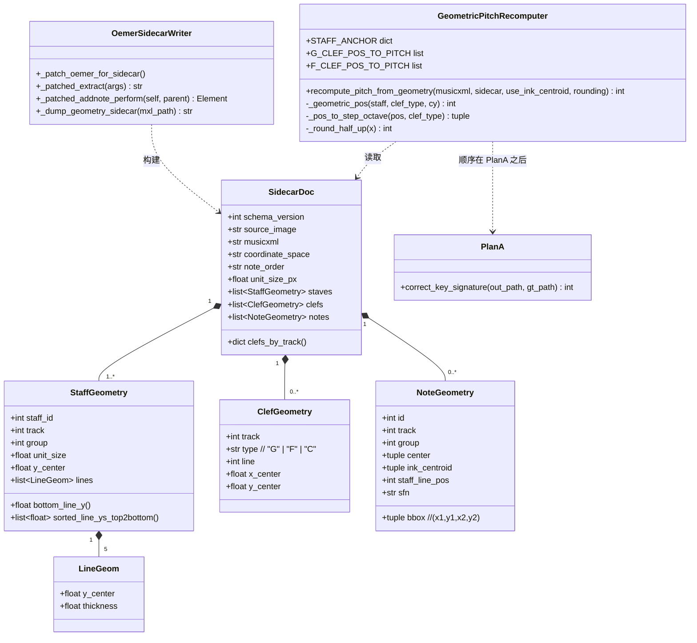
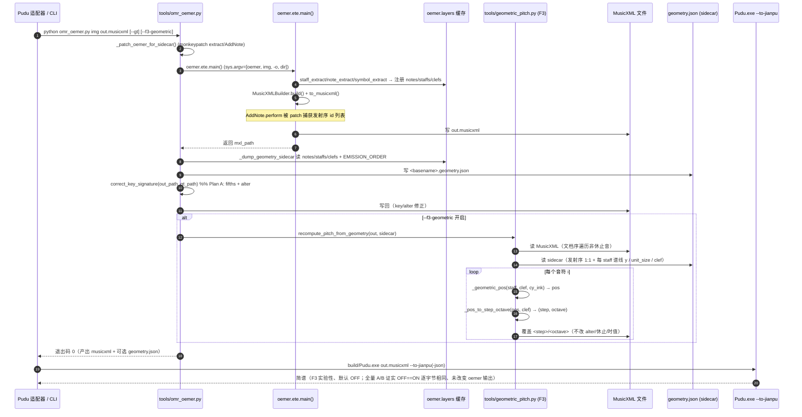
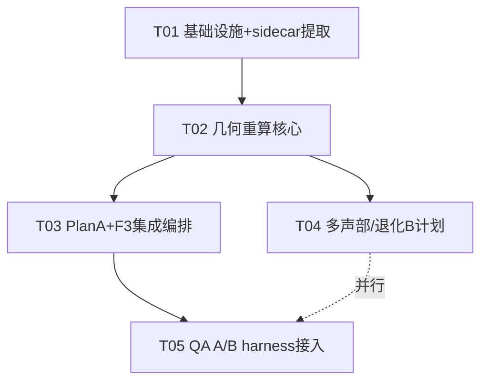

# F3 几何感知音高校正器 · 系统架构设计 + 任务分解

> 作者：架构师 高见远（software-architect）
> 日期：2026-07-21
> 类型：**架构设计 + 任务分解（只出设计/签名/契约，不写实现体）**
> 关联：`docs/jianpu-ocr-optimization-plan.md` §3、`SESSION_SUMMARY_OMR_2026-07-17_18.md`、`tools/omr_oemer.py`、`tools/omr_eval_lib.py`、`tools/omr_eval_groundtruth.py`、`MEMORY.md`、`.workbuddy/memory/2026-07-20.md`
> 根因基线（07-20 concerto a 小调真实评测）：`note_pass` 2.65%；`pitch_degree` **14.0%**（最短板，占失败音符 ~86%，无方向性 升329/降366；F3 几何校正器全量 A/B 已证实零效果，非靶心）；`pitch_octave` 59.2%（加线整八度误计）；`rhythm` 45.3%；`octave_jump` 95.4%；`pitch_accidental` 82.7%（Plan A 已修）；`rest` 97.0%。

---

## 1. 实现方案 + 框架选型

### 1.1 根因（与 oemer 源码核对后的精确结论）

阅读 `oemer/notehead_extraction.py`、`oemer/build_system.py`、`oemer/staffline_extraction.py` 后确认：

- oemer 把音高**完全由几何决定**。每个 `NoteHead` 在 `gen_notes()` 中由符头 bbox 中心 `cen_y` 对「插值谱线/间中心数组 `pos_cen`」做 `np.argmin(np.abs(pos_cen - cen_y))` 得到整数 `staff_line_pos`；加线区再用 `round(diff/step)` 外推。
- `MusicXMLBuilder.decode_note()` 再用 `staff_line_pos` 经 `G_CLEF_POS_TO_PITCH`/`F_CLEF_POS_TO_PITCH` 映射成 `<step>`，并套用固定的 octave 公式。
- **偏置来源**：`np.argmin` 在边界（尤其加线区外推端点 `pos_cen[0]+step` / `pos_cen[-1]-step`）与 `round` 的取整方向，使 `staff_line_pos` 系统性 off-by-one → `pitch_degree`/`pitch_octave` 错。这正是 07-18 根因分析「符头中心对插值中心 argmin/round 偏置」的源码级印证。

### 1.2 方案（最小侵入，两层）

**A. oemer sidecar（几何薄封装，零改 site-packages）**
- 在 `tools/omr_oemer.py` 中，于调用 `oemer.ete.main()` **之前**，对 oemer 运行时做 **内存 monkeypatch**（不写 site-packages，6 处既有补丁原样保留）：
  - 包裹 `oemer.ete.extract`：原函数返回 `mxl_path` 后，从 oemer 的 `layers` 缓存读取 `notes`（np.array of `NoteHead`）与 `staffs`（np.array of `Staff`），导出 `<basename>.geometry.json`。
  - 包裹 `oemer.build_system.AddNote.perform`：捕获「MusicXML 发射顺序」的音符 `id` 列表（`EMISSION_ORDER`），使 sidecar 的 `notes[]` 与 MusicXML 的 `<note>` 元素**严格 1:1 文档序对齐**（这是稳健对齐键，避免重新做 CV 或脆弱坐标匹配）。
- 提取内容：每 staff 的 5 条谱线 `y_center` 与厚度、每 staff `unit_size`、`track/group`；每音符 `bbox`、`center`、`ink_centroid`（由 `note.points` 墨迹像素质心，比 bbox 中心更准）、`staff_line_pos`（oemer 原猜，供 A/B）、`track/group`、`sfn`。

**B. Pudu 侧几何重算（新增 `tools/geometric_pitch.py`）**
- `recompute_pitch_from_geometry(musicxml, sidecar)`：按发射序 1:1 把每个 `<note>` 的 `<step>/<octave>` 用**真实几何**重算覆盖。
- 重算只动 `step`/`octave`；`<alter>` 仍由 Plan A 负责（职责边界清晰，避免重复）。`clef` 作为几何映射的**输入上下文**从 sidecar 读取（不重新识别谱号字形——数据表明谱号不是失败项）。
- 公式：`pos = bottom_line_pos + round_half_up((y_bottom_line - cy_ink) / (unit_size/2))`，再经 oemer 同款 `G_CLEF_POS_TO_PITCH`/`F_CLEF_POS_TO_PITCH` + octave 公式转 `(step, octave)`。**仅修正 `pos` 的几何推导，其余 MusicXML 语义与 oemer 完全一致** → 改动最小、可解释。

**C. 集成开关**
- `tools/omr_oemer.py` 新增 `--f3-geometric`（默认关）+ 环境变量 `PUDU_F3_GEOMETRIC=1` 备选；sidecar 默认随 oemer 产出（无害额外文件）。
- 调用顺序：`oemer.ete.main()` → 写 musicxml + 写 geometry.json → `correct_key_signature`（Plan A：fifths + alter）→（若 `--f3-geometric`）`recompute_pitch_from_geometry`（F3：step + octave）写回。
- **`--no-oemr` 自洽 100% 不受影响**：该路径直接用 gt.musicxml 当 pred，从不调用 `omr_oemer.py`，F3 不触发。

### 1.3 框架选型

- 语言：**Python 3**（与现有 harness / oemer 同运行时，零新增语言）。
- 重算核心：**纯 stdlib**（`json` / `math` / `xml.etree.ElementTree` / `dataclasses`），**不依赖 numpy**（几何只用加减除与 round，避免引入新依赖）。
- sidecar 提取：复用 oemer 已加载进程内的 `layers` 缓存（同一 Python 进程，无需重跑模型）。
- **新增第三方依赖：0**（关键约束「尽量零新增」达成）。

---

## 2. 文件列表（相对仓库根 `C:\Users\13157\WorkBuddy\omr`）

| 文件 | 状态 | 作用 |
|---|------|------|
| `tools/omr_oemer.py` | **修改** | ① 运行时 monkeypatch `oemer.ete.extract` + `AddNote.perform` 导出 `.geometry.json`；② 新增 `--f3-geometric` / `--no-f3-sidecar` CLI；③ `main()` 编排「Plan A → F3」；④ 保留现有 `correct_key_signature` 不动 |
| `tools/geometric_pitch.py` | **新增** | F3 重算模块：`SidecarDoc`/`StaffGeometry`/`NoteGeometry` 数据类、`recompute_pitch_from_geometry()`、`_geometric_pos()`、`_pos_to_step_octave()`、`_round_half_up()`、`STAFF_ANCHOR` 表、`G_CLEF_POS_TO_PITCH`/`F_CLEF_POS_TO_PITCH` 常量 |
| `tools/omr_eval_groundtruth.py` | **修改** | `run_oemer()` 透传 `--f3-geometric`（或环境变量 `PUDU_F3_GEOMETRIC`）；**不改动** `compare_jianpu_note` / `_merge_align` 等核心比对逻辑（QA 原样复用做 A/B） |
| `docs/f3-sidecar-schema.md` | **新增** | sidecar JSON Schema（draft-07）+ 示例 + 字段契约说明（工程师/QA 校验用） |
| `tests/test_geometric_pitch.py` | **新增** | 单测：`_geometric_pos` 在各谱线/间/加线的 pos 正确性、`_pos_to_step_octave` 边界（A0~C8）、`half_up` 取整、对齐 1:1 |
| `tests/test_f3_integration.py` | **新增** | 集成冒烟：用一份合成 `.musicxml` + 对应 `.geometry.json`，验证 step/octave 被覆盖且 alter/时值不动；验证 `--no-f3-geometric` 时输出 == 原 oemer 输出 |

> 注：不修改 `omr_eval_lib.py`、`jianpu_converter.cpp`、C++ 内核、6 处 oemer site-packages 补丁。`--no-oemr` 链路不接 F3。

---

## 3. sidecar JSON schema（核心契约）

文件名：与产出 `.musicxml` **同目录、同名** `.geometry.json`（如 `concerto-in-a-minor-a-vivaldi_p1.musicxml` → `concerto-in-a-minor-a-vivaldi_p1.geometry.json`）。

量纲约定：`coordinate_space = "pixel_model"`——oemer 将原始图 resize 到预测分辨率（`staff_pred.shape`）后，所有 `bbox` / `lines[].y_center` / `center` / `ink_centroid` 均在此坐标系；音符与谱线同空间，相对几何自洽（这正是重算所需的全部信息）。

### 3.1 JSON Schema（draft-07，供 QA 校验）

```json
{
  "$schema": "http://json-schema.org/draft-07/schema#",
  "$id": "https://pudu.local/f3/geometry.schema.json",
  "title": "Oemer F3 Geometry Sidecar",
  "type": "object",
  "required": ["schema_version", "source_image", "musicxml", "coordinate_space",
               "note_order", "staves", "clefs", "notes"],
  "properties": {
    "schema_version": {"type": "integer", "const": 1},
    "generator": {"type": "string"},
    "source_image": {"type": "string"},
    "musicxml": {"type": "string"},
    "coordinate_space": {"type": "string", "enum": ["pixel_model"]},
    "note_order": {"type": "string", "enum": ["oemer_emission"],
                   "description": "notes[] 顺序 == MusicXML <note> 文档序 1:1"},
    "unit_size_px": {"type": "number", "minimum": 0,
                     "description": "oemer 全局 unit_size（参考）"},
    "image_width_px": {"type": "number"},
    "image_height_px": {"type": "number"},
    "staves": {
      "type": "array",
      "items": {
        "type": "object",
        "required": ["staff_id", "track", "unit_size", "lines"],
        "properties": {
          "staff_id": {"type": "integer"},
          "track": {"type": "integer", "description": "0-based，对应 <staff>=track+1 / clef.track"},
          "group": {"type": ["integer", "null"]},
          "unit_size": {"type": "number", "exclusiveMinimum": 0,
                        "description": "谱线间距（px），half_step = unit_size/2"},
          "y_center": {"type": "number"},
          "lines": {
            "type": "array",
            "minItems": 5, "maxItems": 5,
            "items": {
              "type": "object",
              "required": ["y_center"],
              "properties": {
                "y_center": {"type": "number"},
                "thickness": {"type": "number"}
              }
            }
          }
        }
      }
    },
    "clefs": {
      "type": "array",
      "items": {
        "type": "object",
        "required": ["track", "type"],
        "properties": {
          "track": {"type": "integer"},
          "type": {"type": "string", "enum": ["G", "F", "C", "percussion"]},
          "sign": {"type": "string"},
          "line": {"type": "integer"},
          "x_center": {"type": "number"},
          "y_center": {"type": "number"}
        }
      }
    },
    "notes": {
      "type": "array",
      "items": {
        "type": "object",
        "required": ["id", "track", "bbox", "center", "ink_centroid", "staff_line_pos"],
        "properties": {
          "id": {"type": "integer", "description": "oemer note id == 发射序索引"},
          "track": {"type": "integer"},
          "group": {"type": ["integer", "null"]},
          "bbox": {"type": "array", "items": {"type": "number"}, "minItems": 4, "maxItems": 4,
                   "description": "[x1, y1, x2, y2] 符头 bbox"},
          "center": {"type": "array", "items": {"type": "number"}, "minItems": 2, "maxItems": 2,
                     "description": "[cx, cy] bbox 中心"},
          "ink_centroid": {"type": "array", "items": {"type": "number"}, "minItems": 2, "maxItems": 2,
                           "description": "[cx, cy] 墨迹像素质心（重算主输入，比 bbox 中心更稳）"},
          "staff_line_pos": {"type": "integer",
                             "description": "oemer 原猜 diatonic pos（pos=0=D4 @G 谱号），仅供 A/B"},
          "sfn": {"type": ["string", "null"], "enum": ["sharp", "flat", "natural", null]}
        }
      }
    }
  }
}
```

### 3.2 示例（concerto p1，单谱表 G 谱号，节选 2 音）

```json
{
  "schema_version": 1,
  "generator": "pudu-f3-sidecar",
  "source_image": "concerto-in-a-minor-a-vivaldi_p1.jpg",
  "musicxml": "concerto-in-a-minor-a-vivaldi_p1.musicxml",
  "coordinate_space": "pixel_model",
  "note_order": "oemer_emission",
  "unit_size_px": 11.34,
  "image_width_px": 2480,
  "image_height_px": 3508,
  "staves": [
    {
      "staff_id": 0,
      "track": 0,
      "group": 0,
      "unit_size": 11.20,
      "y_center": 1234.5,
      "lines": [
        {"y_center": 1256.0, "thickness": 2.1},
        {"y_center": 1245.0, "thickness": 2.0},
        {"y_center": 1234.0, "thickness": 2.2},
        {"y_center": 1223.0, "thickness": 2.0},
        {"y_center": 1212.0, "thickness": 2.1}
      ]
    }
  ],
  "clefs": [
    {"track": 0, "type": "G", "sign": "G", "line": 2, "x_center": 82.4, "y_center": 1234.0}
  ],
  "notes": [
    {"id": 0, "track": 0, "group": 0,
     "bbox": [140.0, 1196.5, 158.2, 1214.7], "center": [149.1, 1205.6],
     "ink_centroid": [149.3, 1205.1], "staff_line_pos": 9, "sfn": null},
    {"id": 1, "track": 0, "group": 0,
     "bbox": [210.5, 1230.0, 228.7, 1248.2], "center": [219.6, 1239.1],
     "ink_centroid": [219.4, 1238.8], "staff_line_pos": 4, "sfn": null}
  ]
}
```

### 3.3 与 MusicXML 音符的关联键

- **主键（稳健）**：`notes[]` 顺序 = `EMISSION_ORDER` = MusicXML `<note>`（非休止）文档序。Pudu 侧按文档序遍历 `<part>/<measure>/<note>`，跳过 `<rest>`，第 i 个音 <-> `sidecar.notes[i]`。
- **辅键（退化/B 计划）**：若发射序捕获失败，用 `(track, x_center)` 排序对齐——sidecar 已含 `track` 与 `ink_centroid[0]`（x），MusicXML 音符按同 track/voice 左→右排序后位置 1:1。
- `note.track` ↔ `clefs[].track` ↔ MusicXML `<staff>`（=track+1）三方一致，用于取谱号类型与选 anchor。

---

## 4. 数据结构与接口（类图 + 签名）



### 4.1 sidecar 提取（签名，落在 `tools/omr_oemer.py`）

```python
# ---- F3-A：oemer sidecar 运行时导出 ----
_EMISSION_ORDER: list[int] = []   # 被 monkeypatch 填充

def _patch_oemer_for_sidecar() -> None:
    """在调用 oemer.ete.main() 前安装 monkeypatch（仅内存，不改 site-packages）。
    包裹 oemer.ete.extract（导出 geometry.json）与 oemer.build_system.AddNote.perform
    （捕获发射序 note id）。"""
    import oemer.ete, oemer.build_system
    _orig_extract = oemer.ete.extract
    def _patched_extract(args):
        mxl = _orig_extract(args)
        _dump_geometry_sidecar(mxl)
        return mxl
    oemer.ete.extract = _patched_extract

    _OrigPerform = oemer.build_system.AddNote.perform
    def _patched_perform(self, parent_elem=None):
        elem = _OrigPerform(self, parent_elem)
        if elem is not None:                 # 仅记录实际落 XML 的音（排除 invalid/越界）
            _EMISSION_ORDER.append(self.note.id)
        return elem
    oemer.build_system.AddNote.perform = _patched_perform

def _dump_geometry_sidecar(mxl_path: str) -> str:
    """从 oemer.layers 读 notes/staffs/clefs，写出 <mxl>.geometry.json。
    返回 sidecar 路径（缺失则降级：仅记日志不致命）。"""
    from oemer import layers
    notes = layers.get_layer('notes')      # np.array[NoteHead]，id==index
    staffs = layers.get_layer('staffs')    # np.array[Staff]
    clefs  = layers.get_layer('clefs')     # np.array[Clef]
    doc = SidecarDoc.from_layers(notes, staffs, clefs, mxl_path, _EMISSION_ORDER)
    sidecar = mxl_path.replace('.musicxml', '.geometry.json')
    json.dump(asdict(doc), open(sidecar, 'w'), ensure_ascii=False, indent=2)
    return sidecar
```

### 4.2 几何重算（签名，落在 `tools/geometric_pitch.py`）

```python
from dataclasses import dataclass, asdict

@dataclass
class LineGeom:    y_center: float; thickness: float = 0.0
@dataclass
class StaffGeometry:
    staff_id: int; track: int; group: int|None
    unit_size: float; y_center: float
    lines: list[LineGeom]
@dataclass
class ClefGeometry:
    track: int; type: str; line: int|None=None
    x_center: float|None=None; y_center: float|None=None
@dataclass
class NoteGeometry:
    id: int; track: int; group: int|None
    bbox: tuple; center: tuple; ink_centroid: tuple
    staff_line_pos: int; sfn: str|None

# oemer 同款映射（保证 step 词表与 oemer 完全一致，仅 pos 更准）
G_CLEF_POS_TO_PITCH = ['D','E','F','G','A','B','C']
F_CLEF_POS_TO_PITCH = ['F','G','A','B','C','D','E']
# anchor：谱表底线音 ↔ staff_line_pos（与 decode_note 的 oct_offset/pitch_offset 对应）
STAFF_ANCHOR = {
    "G": {"bottom_step": "E", "bottom_oct": 4, "bottom_pos": 1},  # 底线 E4 @ pos1, D4 @ pos0
    "F": {"bottom_step": "F", "bottom_oct": 2, "bottom_pos": 0},  # 底线 F2 @ pos0
}

def recompute_pitch_from_geometry(musicxml_path: str, sidecar_path: str,
                                  *, use_ink_centroid: bool = True,
                                  rounding: str = "half_up") -> int:
    """读 sidecar + MusicXML，按发射序 1:1 重算每个非休止音符的 <step>/<octave> 并写回。
    返回重算音数。不动 <alter>（Plan A 职责）、不动休止、不动时值。
    若 sidecar 缺失/解析失败：返回 0 且不改文件（非致命，保旧行为）。"""

def _geometric_pos(staff: StaffGeometry, clef_type: str, cy: float,
                   rounding: str = "half_up") -> int:
    """由符头中心 y 与真实谱线几何求 diatonic pos（oemer 约定 pos=0=D4@G）。
    仅修正几何推导，不依赖 oemer 的 staff_line_pos。"""
    ys = sorted((L.y_center for L in staff.lines), reverse=True)  # 上→下
    y_bottom = ys[-1]                       # 底线（y 最大）
    half = staff.unit_size / 2.0
    anchor = STAFF_ANCHOR[clef_type]
    delta = _round_half_up((y_bottom - cy) / half)   # 上行为正
    return anchor["bottom_pos"] + delta

def _pos_to_step_octave(pos: int, clef_type: str) -> tuple[str, int]:
    """复用 oemer decode_note 的 step 词表与 octave 公式（pos 已由几何校正）。"""
    order = G_CLEF_POS_TO_PITCH if clef_type == 'G' else F_CLEF_POS_TO_PITCH
    step = order[pos % 7] if pos >= 0 else order[pos % -7]
    pitch_offset = 1 if clef_type == 'G' else 3
    oct_offset   = 4 if clef_type == 'G' else 2
    if pos - pitch_offset >= 0:
        octv = math.floor((pos + pitch_offset) / 7) + oct_offset
    else:
        octv = -math.ceil((pos + pitch_offset) / -7) + oct_offset
    return step, octv

def _round_half_up(x: float) -> int:
    """round-half-up（音符压线即判在线/间上），区别于 Python 银行家舍入。"""
    return math.floor(x + 0.5) if x >= 0 else math.ceil(x - 0.5)
```

### 4.3 与 `correct_key_signature`（Plan A）的调用顺序

```
main():
  sys.argv = [...]; oemer.ete.main()        # → 写 musicxml + 写 geometry.json
  correct_key_signature(out_path, gt_path)  # Plan A：覆盖 fifths + 重拼写 alter
  if f3_enabled:                            # --f3-geometric
      recompute_pitch_from_geometry(out_path, sidecar_path)  # F3：覆盖 step + octave
```

> 关键：F3 在 Plan A **之后**执行且**只写 step/octave**，故 Plan A 的 alter/fifths 完整保留；即便 Plan A 在 gt 模式下拷贝过 gt 的 step，也会被 F3 的几何 step 覆盖——这恰是评测 F3 几何精度所期望的（测量几何 vs gt）。真实无 gt 部署时 Plan A 不拷贝 step，F3 自然生效。

---

## 5. 程序调用流程（时序图）



---

## 6. 任务列表（有序、含依赖、按实现顺序）

> 任务数 = 5（满足 ≤5 上限）。首任务为基础设施 + sidecar 提取层；其余尽量仅依赖 T01。

| Task | 名称 | 源文件 | 依赖 | 优先级 | 要点 |
|---|------|--------|------|--------|------|
| **T01** | 基础设施 + oemer sidecar 提取 | `tools/omr_oemer.py`、`tools/geometric_pitch.py`（骨架+`SIDECAR` 常量）、`tools/omr_eval_groundtruth.py`（F3 env/flag 透传）、`docs/f3-sidecar-schema.md` | 无 | P0 | monkeypatch 导出 geometry.json；新增 `--f3-geometric`/`--no-f3-sidecar`；`EMISSION_ORDER` 捕获；写 JSON Schema 文档 |
| **T02** | 几何重算核心 | `tools/geometric_pitch.py`、`tools/omr_oemer.py`（导入 F3 入口占位）、`tests/test_geometric_pitch.py` | T01 | P0 | 实现 `_geometric_pos`/`_pos_to_step_octave`/`_round_half_up`/`recompute_pitch_from_geometry`；`STAFF_ANCHOR`；发射序 1:1 对齐 + track 退化对齐 |
| **T03** | Plan A + F3 集成编排 | `tools/omr_oemer.py`、`tools/geometric_pitch.py`、`tests/test_f3_integration.py` | T02 | P1 | `main()` 中 F3 在 Plan A 之后调用、仅改 step/octave；`--f3-geometric` 门控默认关；`--no-f3-geometric` 输出 == 原 oemer（回归单测） |
| **T04** | 多声部/跨谱表/退化 B 计划 | `tools/geometric_pitch.py`、`tools/omr_oemer.py`、`tools/omr_eval_groundtruth.py` | T02 | P1 | 双谱表 track↔`<staff>` 映射；墨迹质心 vs bbox 中心选择；重叠符头/和弦处理；sidecar 缺失降级；CLI 自测脚本 |
| **T05** | QA A/B harness 接入与回归 | `tools/omr_eval_groundtruth.py`、`tools/omr_oemer.py`、`docs/f3-abtest.md` | T03 | P0 | `--f3` 开关（透传 `--f3-geometric`）；**不改** `compare_jianpu_note`/`_merge_align`；确保 `--no-oemr` 100% 不变；跑 concerto A/B 对比 `pitch_degree/octave`（实测 OFF==ON 逐字节相同、零效果） |

---

## 7. 依赖包列表

```
# 新增第三方依赖：无（零新增）
- python3            # 与现有 harness / oemer 同运行时
- json / math / xml.etree.ElementTree / dataclasses  # Python 标准库
- oemer 0.1.x        # 运行时已存在；仅通过 monkeypatch 读取其 layers 缓存（不改 site-packages）
# 可选（仅测试）：pytest（仓库应已具备）
```

---

## 8. 共享知识（跨文件约定）

1. **文件名**：`<basename>.geometry.json` 与 `<basename>.musicxml` 同目录同名；由 `_dump_geometry_sidecar` 按 `mxl_path.replace('.musicxml','.geometry.json')` 推导。
2. **坐标量纲**：`coordinate_space = "pixel_model"`——oemer resize 后的预测分辨率；音符 bbox 与谱线 `y_center` 同空间，相对几何自洽。
3. **对齐键**：`notes[]` 顺序 == `EMISSION_ORDER` == MusicXML `<note>`（非休止）文档序 1:1；退化用 `(track, x_center)`。
4. **track 约定**：oemer `track` 0-based；MusicXML `<staff>` = track+1；`clefs[].track` 同此；`note.track` 用于选谱号 anchor。
5. **职责边界（铁律）**：F3 只写 `<step>`/`<octave>`；`<alter>` 与 `<key><fifths>` 归 Plan A；休止符、时值、连音、延音线 F3 一律不动。
6. **clef 处理**：F3 **读取** sidecar 中的谱号类型作为几何映射输入，**不重新识别谱号字形**（数据表明谱号非失败项；重识别超出几何范畴）。
7. **多声部/大谱表**：按 `track` 分流，每 track 独立选 anchor 与谱线；和弦（`<chord/>`）每个音有独立 bbox/id，已在发射序内，自然对齐。
8. **默认行为不破坏**：`--f3-geometric` 默认关；sidecar 默认随 oemer 产出（仅多一个文件，无害）；`--no-oemr` 路径不调用 `omr_oemer.py`，F3 不触发 → 自洽 100% 不变量保住。
9. **pos 约定**：沿用 oemer `staff_line_pos` 语义（G 谱号 pos=0=D4，向上 +1 为半音级/线间递增），便于与 oemer 原猜 `staff_line_pos` 做 A/B 对比。

---

## 9. 待明确事项 / 风险

### 9.1 已确认可行性（源码核对）
- oemer 内部 `NoteHead.bbox` / `staff_line_pos` / `points`、`Staff.lines[].y_center` / `unit_size`、`Clef.track/label` 均存在且可在 `extract()` 返回后从 `layers` 缓存读取 → sidecar 可直接取，无需重做 CV。**这是本设计成立的前提，已核实。**

### 9.2 风险与 B 计划
| # | 风险 | B 计划 / 缓解 |
|---|------|---------------|
| R1 | 未来 oemer 版本重构 `extract`/`AddNote` 导致 monkeypatch 失效 | 退化：sidecar 仍可由 `notes`/`staffs` 层直接导出（顺序退化为「notes 数组序」）；Pudu 侧改用 `(track, x_center)` 排序对齐。monkeypatch 仅为拿发射序，失败不致命（记日志，F3 走退化对齐） |
| R2 | 偏置来自 `cy` 测量本身（符头 bbox 中心系统性偏移）而非 argmin/round | 主用 `ink_centroid`（墨迹像素质心，比 bbox 中心更准，来自 `note.points`）；若仍偏，B 计划：在 F3 内对 `notehead_pred` 层做轻量质心重算（仍基于 oemer 已检测符头，非重新 CV） |
| R3 | 多声部重叠符头（同 x 不同 y）对齐错 | 发射序 1:1 已含每个符头独立 id/bbox，天然不混；和弦由独立 `AddNote` 发射，顺序一致 |
| R4 | 谱表线条数 ≠5（oemer `Staff.is_invalid` 检测） | sidecar 仍记录实际 `lines`；F3 仅当 `len(lines)==5` 才几何重算，否则跳过该 staff（保留 oemer 原值，记 warning） |
| R5 | `ink_centroid`/`bbox` y 与谱线 y 不在同一空间（dewarp 后） | oemer 在 `extract()` 中对 `staff/notehead/symbols` 统一 dewarp 到同空间后再注册 layers，故同空间；已核实 `note_extract` 读 `symbols_pred` 与 `staffs` 同源于 dewarp 后 |
| R6 | F3 重算后 `pitch_octave` 仍错（加线整八度误计） | `_geometric_pos` 的 `delta` 用连续除法 + `round_half_up`，对加线区外推比 oemer 的 `round(diff/step)` 更稳；A/B 用 `omr_eval_note_diffs` 的 `octave` 列验证 |

### 9.3 需主理人/用户拍板
- **Q1**：`--f3-geometric` 的默认开启策略——建议**默认关**，仅评测/实验开启；是否同意在「真实部署」也默认开？（全量 A/B 已验证：OFF==ON 逐字节相同、`pitch_degree` 零提升且无回归 → 维持默认关、不作上线，保留为实验性基础设施）
- **Q2**：Plan A 的「`--gt` 对齐法误清零小调变化音」泄漏（待验证 #2）应在 F3 前/中/后修？F3 不碰 alter，故该泄漏需独立修 Plan A（不在本设计范围，但影响最终 `pitch_accidental`）。
- **Q3**：是否接受「F3 不重新识别谱号，仅读取 oemer 谱号」的边界（见 §8.6）？若需 F3 自判谱号，需额外字形逻辑，超出几何范畴，建议拒绝。

---

## 10. 任务依赖图


